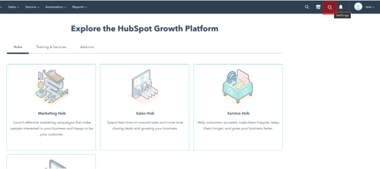
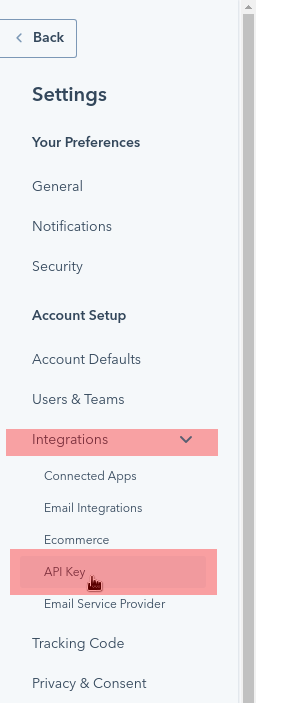
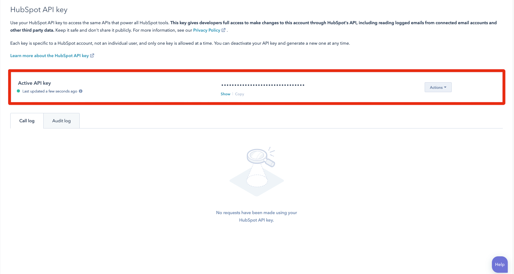

# Hubspot 

[Hubspot](https://www.hubspot.com/) is a CRM platform that includes Live Chat functionality. Enabling integration with Hubspot requires the creation of a live chat and a combination of two values that can be retrieved from your Hubspot account: your Hubspot User Account ID and the Hubspot API Token.

To create and configure a live chat, follow the steps in [Hubspot's Knowledge Base](https://knowledge.hubspot.com/chatflows/create-a-live-chat). 

## Locating Your Hubspot User Account ID

1. Log in to your [Hubspot Account](https://app.hubspot.com/login).

1. Go to your profile in the top right corner.

    Copy the account number that corresponds to the channel you want to use. This number corresponds with the Account ID used when enabling Click to Chat on Liferay Portal.

    

## Getting the Hubspot API Token

While logged in to your Hubspot account:

1. Click the *Settings* button.

    

1. Click on *Integrations* &rarr; *API Key* on the left side of the page.

    

1. Click *Show* to reveal your API token key.

    

## Conclusion

Once you have your User Account ID and your API token, combine them to use as your Chat Provider Account ID when [enabling live chat](../enabling-automated-live-chat-systems.md) with your Liferay instance. The Chat Provider Account ID follows this format: `[Hubspot Account ID]/[Hubspot API Token]`.