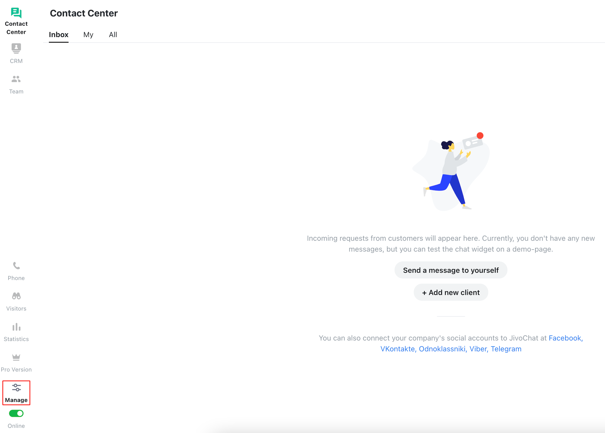
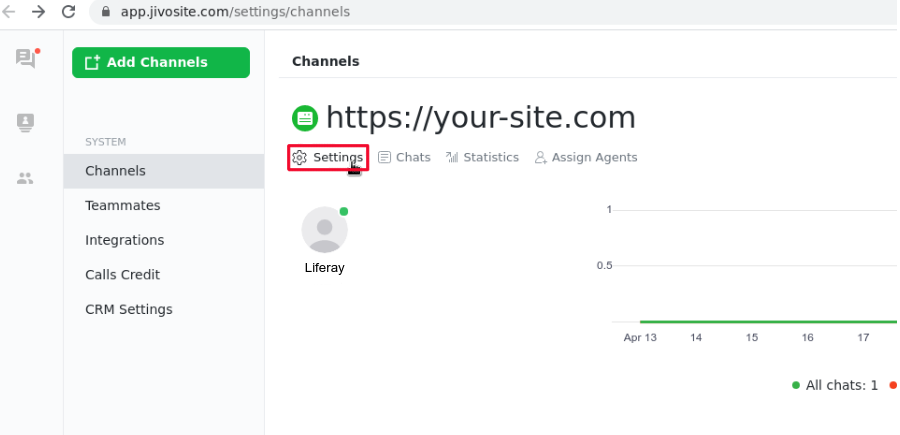
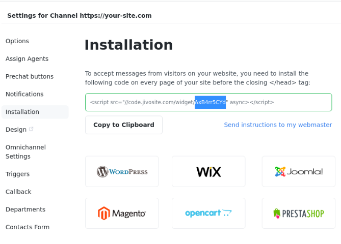

# JivoChat

[JivoChat](https://jivochat.com/) is a messaging platform that connects teams to users across platforms. This article documents how to locate your JivoChat account ID in order to [enable integration](../enabling-automated-live-chat-systems.md) with your Liferay instance.

## Locating Your JivoChat Account ID

1. Log in to your [JivoChat account](https://app.jivosite.com/).

2. Go to configure your channel then click on *Manage* in the bottom left corner. 

    

3. Click on *Channels* &rarr; *Settings*

    

4. Click on *Installation*.

    In the screenshot below, the portion that is highlighted will be used as the Liferay Chat Provider Account ID.  Select and copy this portion and use it as the Chat Provider Account ID to [enable automated live chat integration](./enabling-automated-live-chat-systems.md) with your Liferay instance.

    

