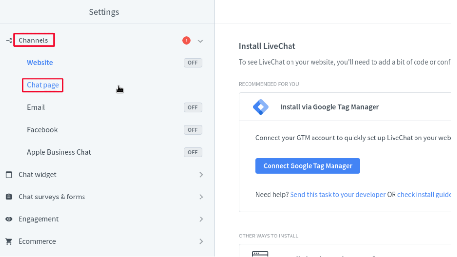
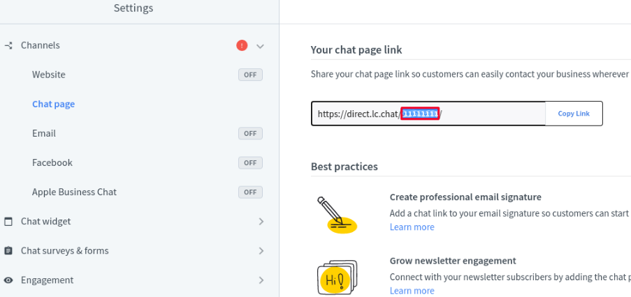

# LiveChat

[LiveChat](https://www.livechat.com/) is a messaging platform that connects teams to users across platforms. This article documents how to locate your LiveChat account ID in order to [enable integration](../enabling-automated-live-chat-systems.md) with your Liferay instance.

## Locating Your LiveChat Account ID

1. Log in to your [LiveChat account](https://my.livechatinc.com/).

1. Click the *Settings Cog* on the bottom left corner. 

    

1. Click *Channels* &rarr; *Chat Page*. 

    

1. In the screenshot below, the portion that is highlighted is used as the Liferay Chat Provider Account ID.  Select and copy this portion and use it as the Chat Provider Account ID to [enable automated live chat integration](../enabling-automated-live-chat-systems.md) with your Liferay instance.

    