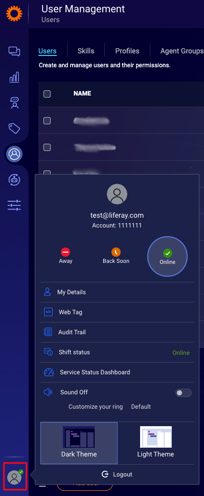
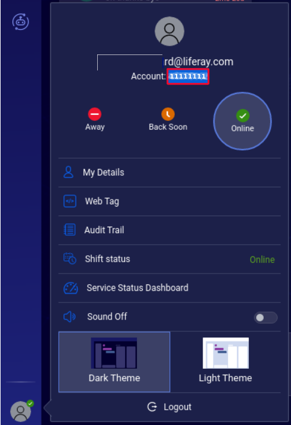

# LivePerson

[LivePerson](https://www.liveperson.com/) is an AI powered chatbot platform. This article documents how to locate your LivePerson account ID in order to [enable integration](../enabling-automated-live-chat-systems.md) with your Liferay instance.

## Locating Your LivePerson Account ID

1. Log in to your [LivePerson account](https://authentication.liveperson.net/login.html).

1. Click on the *User icon* on the left bottom corner.

    

1. In the screenshot below, the portion that is highlighted is used as the Liferay Chat Provider Account ID.  Select and copy this portion and use it as the Chat Provider Account ID to [enable automated live chat integration](../enabling-automated-live-chat-systems.md) with your Liferay instance.

    