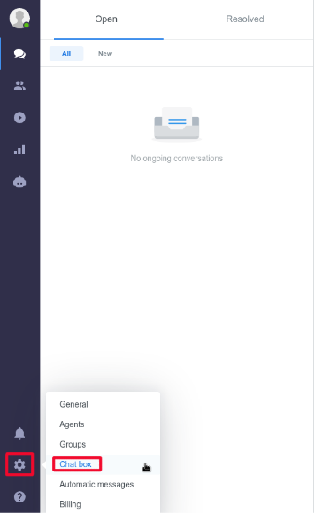
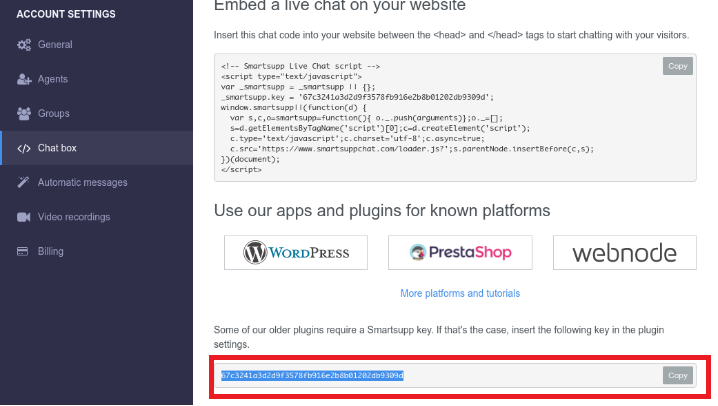

# Smartsupp

[Smartsupp](https://www.smartsupp.com/) is multi-channel customer communication platform. This article documents how to locate your Smartsupp account ID in order to [enable integration](../enabling-automated-live-chat-systems.md) with your Liferay instance.

## Locating Your Smartsupp Account ID

1. Log in to your [Smartsupp account](https://app.smartsupp.com/app/sign/in).

1. Click on the *Gear Icon* &rarr; *Chat box*.

    

1. In the screenshot below, the portion that is highlighted is used as the Liferay Chat Provider Account ID.  Select and copy this portion and use it as the Chat Provider Account ID to [enable automated live chat integration](../enabling-automated-live-chat-systems.md) with your Liferay instance.

    