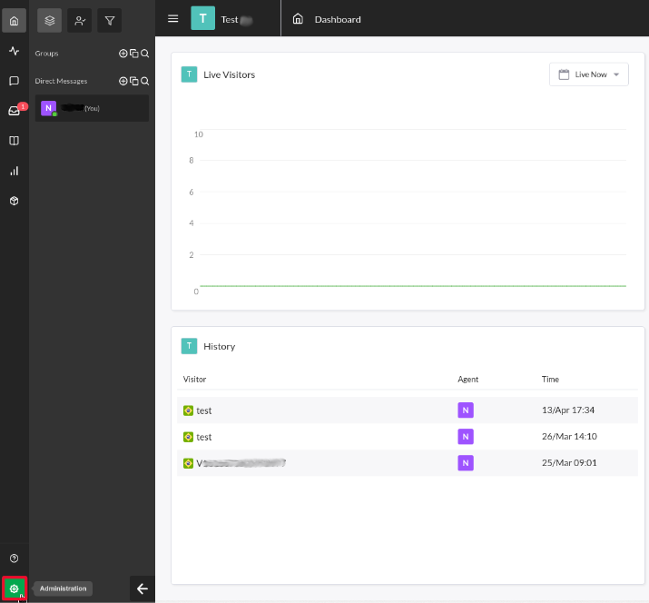
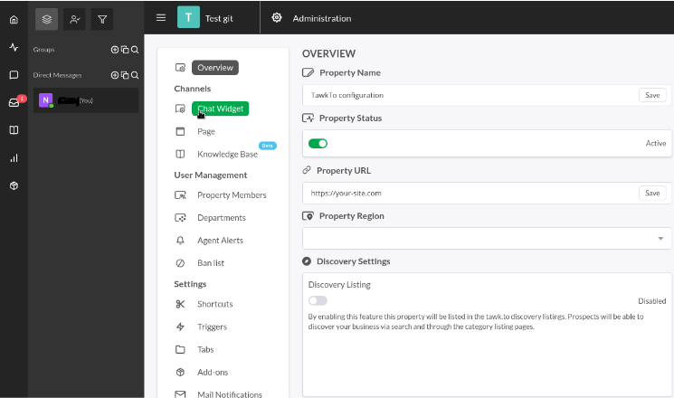
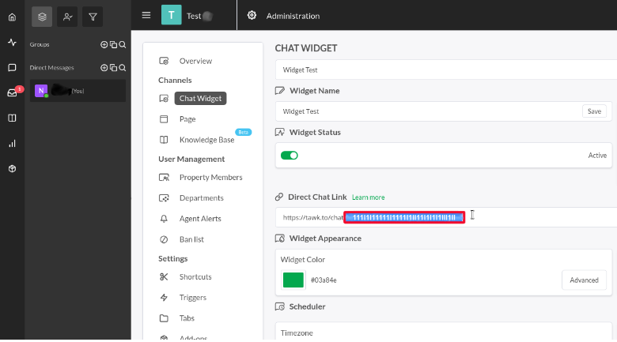

# Tawk.to

[Tawk.to](https://www.tawk.to/) is a live chat and customer support platform. This article documents how to locate your Tawk.to account ID in order to [enable integration](../enabling-automated-live-chat-systems.md) with your Liferay instance.

## Locating your Tawk.to Account ID

1. Log in to your [Tawk.to account](https://dashboard.tawk.to/login).

1. Click on the *Administration* button. 

    

1. Go to *Channels* and click on *Chat Widget*.

    

1. Under the *Direct Chat Link* header, Copy the highlighted portion of the URL use it as the Chat Provider Account ID to [enable automated live chat integration](../enabling-automated-live-chat-systems.md) with your Liferay instance.

    