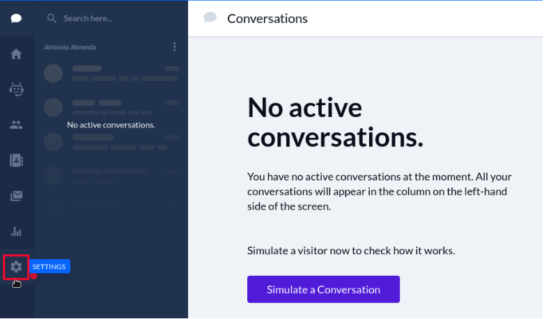
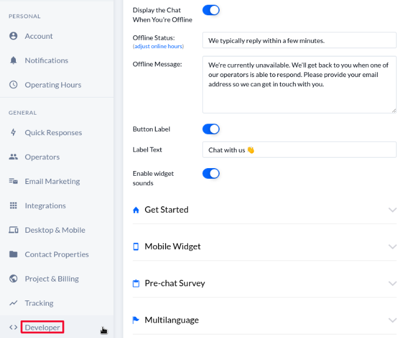
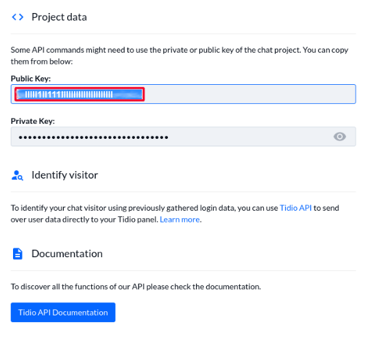

# Tidio

[Tidio](https://www.tidio.com/) is a customer engagement platform. This article documents how to locate your Tidio account ID in order to [enable integration](../enabling-automated-live-chat-systems.md) with your Liferay instance.

## Locating your Tidio Account ID

1. Log in to your [Tidio account](https://www.tidio.com/panel/login).

1. Click the *Gear icon* to enter the Settings menu.

    

1. Go to the *General* section and click the *Developer* menu option.

    

1. Copy the *Public Key* and use it as the Chat Provider Account ID to [enable automated live chat integration](../enabling-automated-live-chat-systems.md) with your Liferay instance.
  
    