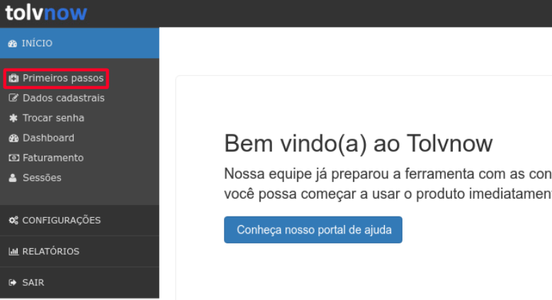
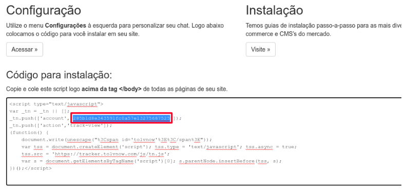

# Tolvnow

[Tolvnow](https://www.tolvnow.com/) is an open-source customer communication platform. This article documents how to locate your Tolvnow account ID in order to [enable integration](../enabling-automated-live-chat-systems.md) with your Liferay instance.

## Locating your Tolvnow Account ID

1. Log in to your [Tolvnow account](https://www.tolvnow.com/login/).

1. Click on *Primeiros passos*.

    

1. The Account ID is highlighted in the screenshot Under Código para Instalação.

    

Use this Account ID to [enable automated live chat integration](../enabling-automated-live-chat-systems.md) with your Liferay instance.
