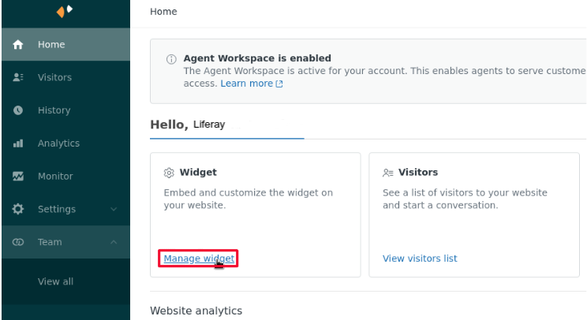
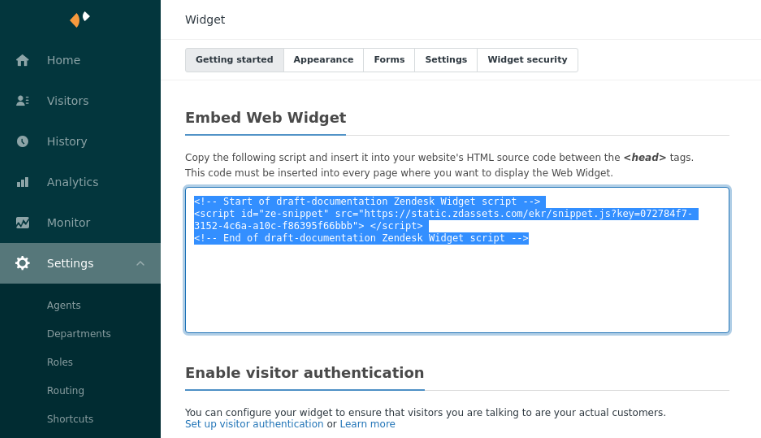
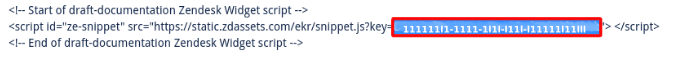

# Zendesk

[Zendesk](https://www.zendesk.com/) is an customer service platform. This article documents how to locate your Zendesk account ID in order to [enable integration](../enabling-automated-live-chat-systems.md) with your Liferay instance.

## Locating your Zendesk Account ID

1. Log in to your [Zendesk account](https://www.zendesk.com/login/#login).

1. On the Dashboard home page, click on the *Manage widget* link. 

    

1. (Optional) Go to *Settings* and follow the instructions in the next step.  

    

1. Zendesk provides a code snippet to embed their web widget. The Account ID is the portion of the snippet after `...snippet.js?key=`. Select and copy that portion of the snippet and use it as the Chat Provider Account ID to [enable automated live chat integration](../enabling-automated-live-chat-systems.md) with your Liferay instance.

   