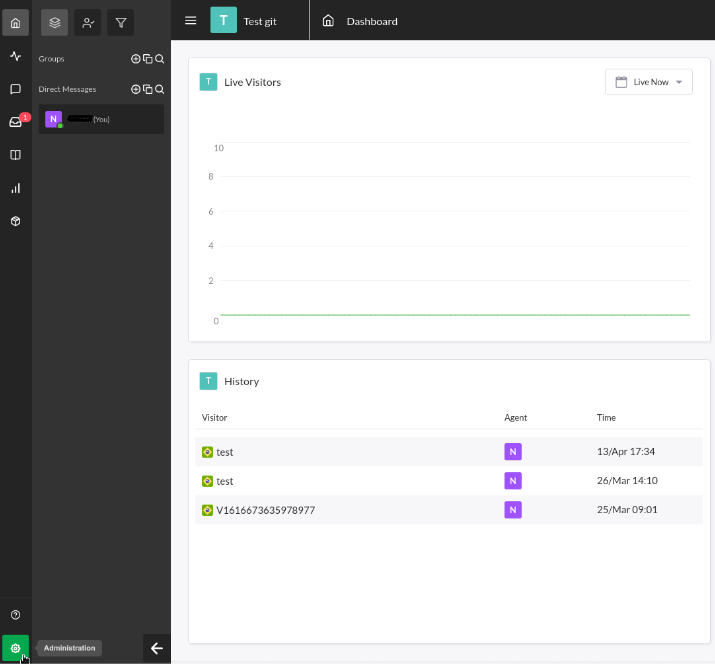

# Tawk.to

1. On your home dashboard, click on the *administration* button on the left button corner.

    

1. After that, click on the *chat widget* option inside the Channels section.

    

1. Last step is to copy all after the Chat on the Direct Chat Link section as you see above.

    

