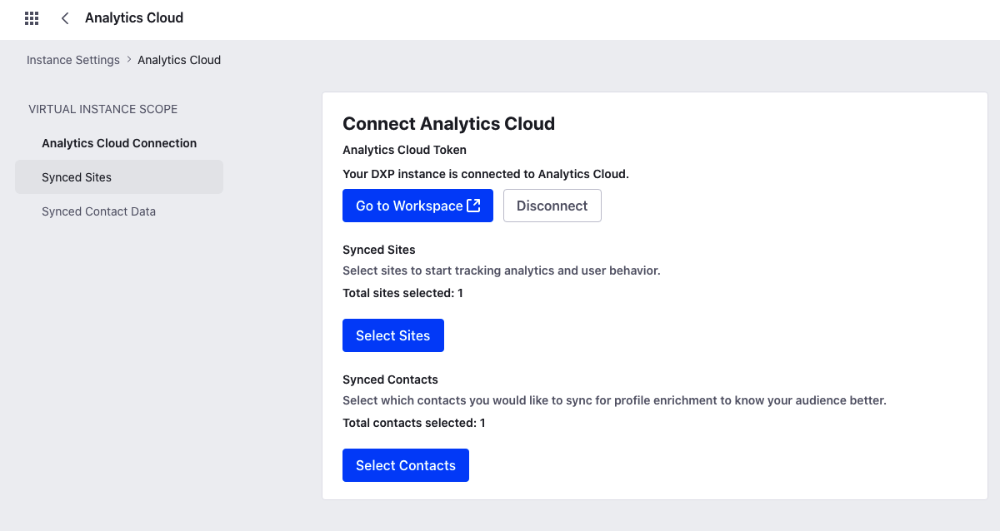
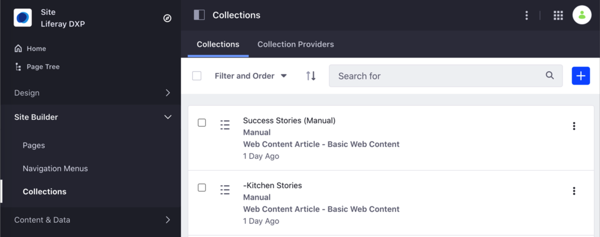
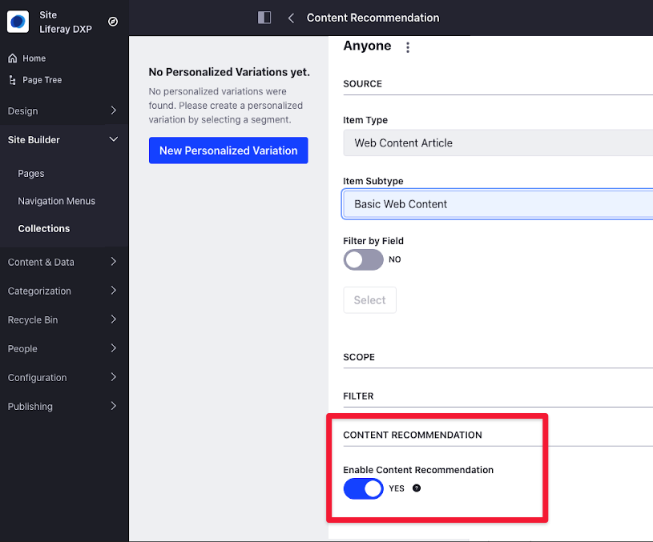
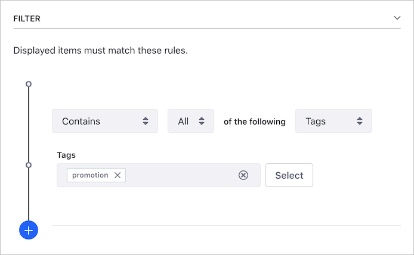

# Configuring Content Recommendations

As users browse your Liferay DXP site and interact with your content, Liferay Analytics Cloud automatically generates and ranks topics of interest based on their browsing behavior. You can use these interests to recommend related content that your users are more likely to buy or consume. For more information about content recommendations, see [Understanding Content Recommendations](./understanding-content-recommendations.md).

Content recommendations work automatically as long as the following elements are in place:

1. [Analytics Cloud is connected to your Liferay DXP instance](#connecting-analytics-cloud-to-your-liferay-dxp-instance) and the Site content is synchronized.
2. You [create a Dynamic Collection](#creating-a-dynamic-collection) in Liferay DXP with different content, and enable the Content Recommendation option.
3. You [display the Dynamic Collection](#displaying-the-dynamic-collection) using an Asset Publisher, a Collection Display Fragment, or a Collection Page.

## Connecting Analytics Cloud to Your Liferay DXP Instance

You must connect Analytics Cloud to your Liferay DXP instance to provide content recommendations to your users.

To learn how to connect Analytics Cloud to Liferay DXP and synchronize the site's content, see [Connecting Liferay DXP to Analytics Cloud](https://learn.liferay.com/analytics-cloud/latest/en/connecting-data-sources/connecting-liferay-dxp-to-analytics-cloud.html).



## Creating a Dynamic Collection

To show users content recommendations based on their browsing behavior, you must use a Dynamic Collection. The Collection is the component that connects the users' interests in Analytics Cloud with the content recommendations in your site. Using a Collection, you define what type of content you want to recommend and, optionally, to what audiences.

To create the Dynamic Collection, follow the instructions in [Creating Collections](../../../content-authoring-and-management/collections-and-collection-pages/creating-collections.md#creating-a-dynamic-collection).



Consider the following information when you create the Dynamic Collection:

- You must enable the *Content Recommendation* option in the Dynamic Collection. When this option is disabled, the Collection doesn't use content recommendations.

    ```note::
        The Content Recommendation option is available when you connect the DXP instance to Analytics Cloud and synchronize the content.
    ```

    

- The Filter in the Dynamic Collection is optional. For example, if you use the "promotion" tag in your content and only want to recommend promotions, you can use this tag as a filter.

    

- If you want to target content recommendations to a specific group of users (for example, "website visitors in Germany"), you can combine the Dynamic Collection with a Segment [using Personalized Variations](./personalizing-collections.md).

    

## Displaying the Dynamic Collection

The way you show Collections or Content Sets depends on your Liferay DXP version. In Liferay DXP 7.2, you [show the Content Sets in a Display Page](#display-the-collection-or-content-set-in-a-display-page-using-the-asset-publisher) using an Asset Publisher. In DXP 7.3+, in addition to the Asset Publisher, you can show the Collection's content [using the Collection Display Fragment or a Collection Page](#display-the-collection-using-a-collection-display-fragment-or-a-collection-page).

```note::
    Collections are named Content Sets in Liferay DXP 7.2.
```

### Display the Collection using a Collection Display Fragment or a Collection Page

> Liferay DXP 7.3+

A Collection Display Fragment is a type of Fragment that shows a Collection. You can use this Fragment to show your Collection on any Content Page, Page Template, or Display Page. To configure the Collection Display Fragment, see the section [Configuring a Collection Display Fragment](../../displaying-content/additional-content-display-options/displaying-collections.md#configuring-a-collection-display-fragment).

A Collection Page is a type of page linked to a Collection. To show the Collection using a Collection page, see the [Displaying Collections on a Collection Page](../../displaying-content/additional-content-display-options/displaying-collections.md#displaying-collections-on-a-collection-page) section in the [Displaying Collections](../../displaying-content/additional-content-display-options/displaying-collections.md) topic.

### Display the Collection or Content Set in a Display Page Using the Asset Publisher

> Liferay DXP 7.2+

To display the Collection using a Display Page and the Asset Publisher, you must complete the following steps:

1. [Create a Display Page Template](../../displaying-content/using-display-page-templates/creating-and-managing-display-page-templates.md).
1. Configure an Asset Publisher with the Collection (Liferay 7.3+) or Content Set (Liferay 7.2). See [Displaying Collections](../../displaying-content/additional-content-display-options/displaying-collections.md) for more information.

## Related Information

- [Understanding Content Recommendations](./understanding-content-recommendations.md)
- [Connecting Liferay DXP to Analytics Cloud](https://learn.liferay.com/analytics-cloud/latest/en/connecting-data-sources/connecting-liferay-dxp-to-analytics-cloud.html)
- [Creating Collections](../../../content-authoring-and-management/collections-and-collection-pages/creating-collections.md#creating-a-dynamic-collection)
- [Creating and Managing Display Page Templates](../../displaying-content/using-display-page-templates/creating-and-managing-display-page-templates.md)
