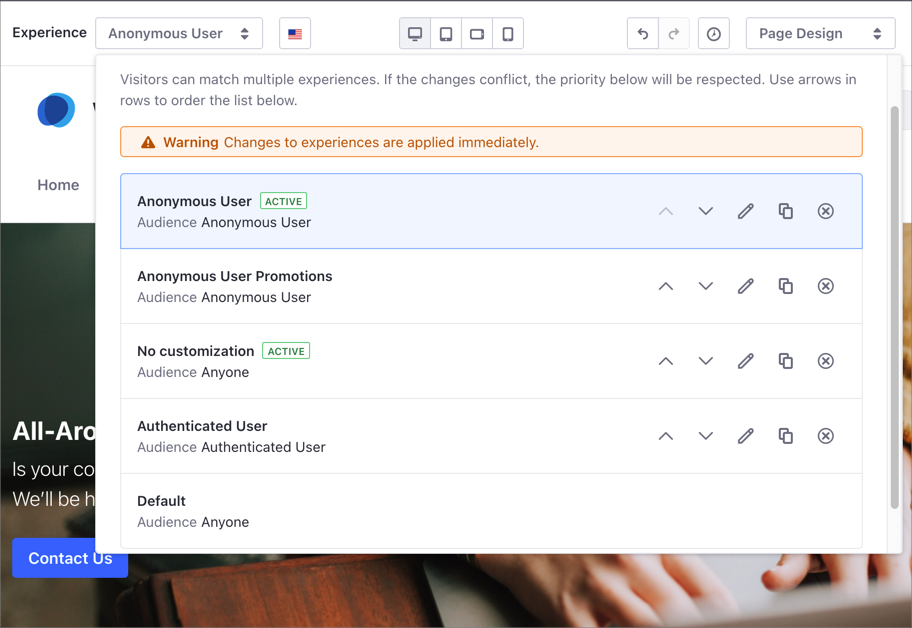

# Content Page Personalization

You can tailor your Content Page to different groups of users, providing each group a personalized experience, rather than a generic one. You can also leverage Content Page personalization to conduct A/B Testing (for more information, see [Content Page Experiences and A/B Testing](#content-page-experiences-and-a-b-testing)).

Personalizing your Content Page for different users is a two-step process:

1. [Define a Segment](../segmentation/creating-and-managing-user-segments.md) for the users you want to provide a personalized experience.
1. [Create an Experience](./creating-and-managing-experiences.md) with customized content for your Segment.

## Understanding How Experiences Work

> Some Experiences functionality is available in Liferay 7.4+, 7.3 Fix Pack 1+, and 7.2 Fix Pack 11+ only.

You can create multiple experiences for the same Content Page, each Experience covering a particular need. For example, you can create different experiences for those who log in and for those who browse anonymously. Each Experience contains the content and layout that is most appropriate for each Segment.

Consider the following information when you create multiple experiences for the same Content Page:

- Every Content Page includes a *Default* experience. When you create a new Experience, *Default* is used as a template.
- You can modify the Default experience, but existing experiences based on Default don't change.
- You can duplicate any experience except Default.
- You can reorder Experiences in the selection dialog using the Up () and Down () controls.
- When you have multiple experiences in the same Content Page, their order determines their preference:
  
  - Experiences at the top of the list take precedence over the ones below.
  - When a user meets the criteria for more than one Experience, the Experience listed first is the active one.
  - An Experience is inactive when placed below an experience targeted to the *Anyone* Segment.
  - New Experiences are listed below the *Default* experience and inactive by default.
  
  ```{tip}
  When multiple Experiences target the same Segment, Liferay DXP shows the active one next to the Experience's name.
  ```

To better understand how the Experiences' preference works, consider this example of a Content Page with four custom Experiences:

- *Anonymous User* and *Anonymous User Promotions*, which apply to the non-authenticated user Segment.
- *Authenticated User*: Applies to the *Authenticated User* Segment.
- *No Customization*: Applies to the *Anyone* Segment.

  

In this example:

- A non-authenticated user sees the Experience *Anonymous User* (the one with the _Active_ label). This user doesn't see the *Anonymous User Promotions* Experience because it appears below *Anonymous User*.
- Authenticated users don't see the *Authenticated user* Experience, because the *No customization* Experience applies to the *Anyone* Segment and it's listed first.
- Anyone not in the *Anonymous User* or *Authenticated User* Segments sees the *No customization* Experience because it targets *Anyone*.

## Content Page Experiences and A/B Testing

When you [create an A/B Test](../../optimizing-sites/ab-testing/creating-ab-tests.md) in Liferay DXP, you choose an Experience for the test. This Experience can be the Default one or any other you have created.

To avoid changes in the Experience that can interfere with the A/B Test results, you cannot edit an Experience that is part of a running A/B Test. In this situation, the Experience shows a locker icon () next to its name.

For more information about A/B Testing in Liferay DXP and Liferay Analytics, see [A/B Testing](../../optimizing-sites/ab-testing/ab-testing.md).

## Related Information

* [Personalizing Collections](./personalizing-collections.md)
* [Getting Analytics for User Segments](../segmentation/getting-analytics-for-user-segments.md)
* [Creating and Managing User Segments](../segmentation/creating-and-managing-user-segments.md)
