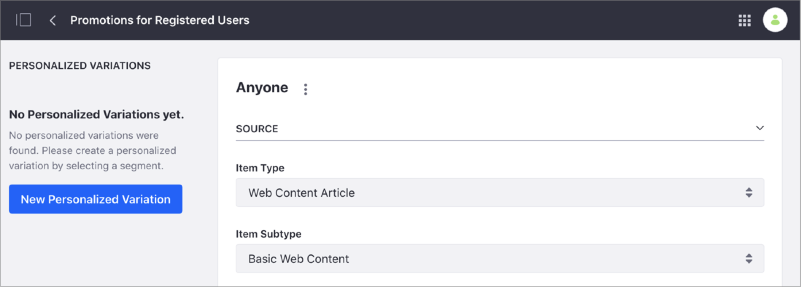
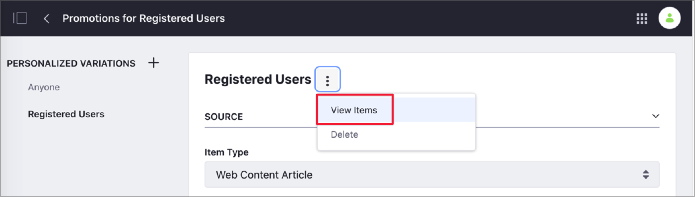
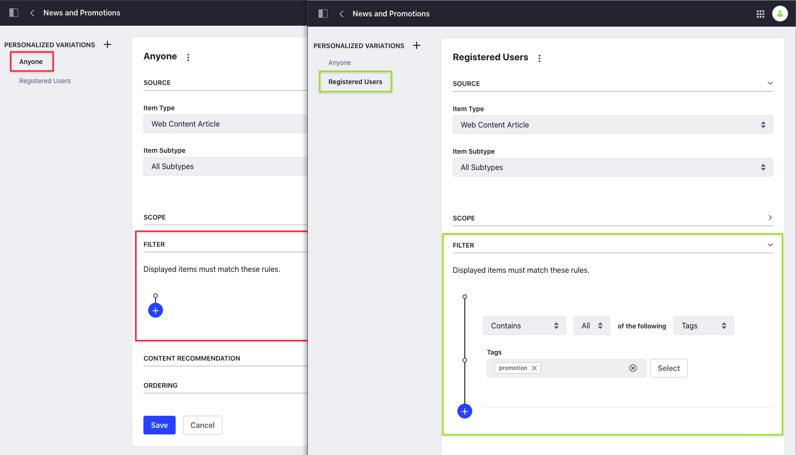

# Personalizing Collections

> Availability: Liferay Portal 7.3 GA6, Liferay DXP 7.3+

By default, any user can see all the Collection's content and is part of *Anyone* group. You can create a *Personalized Variation* of the Collection's items using [Segments](../segmentation/creating-and-managing-user-segments.md). When you use a Personalized Variation, the items that are part of your Collection don't change, but the Collection Page or Collection Display Fragment show the items filtered for the Segment.

```{note}
To customize a Collection using Segments, you must define the Segments first. For more information, see [Creating and Managing User Segments](../segmentation/creating-and-managing-user-segments.md).
```


Consider the following example. You want to increase sales in your online Kitchenware Store by offering exclusive promotions to registered users. You create a Collection including promotions for registered users and news about your products. You want all users to see the news about your products, but you want to restrict the promotions to registered users. In this example, you can create a new Segment for registered users, and link the Segment to a new Personalized Variation that filters the promotional content.

```{tip}
You can create multiple Personalized Variations for a Collection, and edit or delete them as needed. You can also edit the *Anyone* Personalized Variation, but you cannot delete it.
```

## Prioritizing Variations

> {bdg-secondary}`Available for Liferay DXP 7.4+`

You can prioritize Collections variations to determine which variation is displayed for users belonging to multiple segments. When editing a Collection, you can access a sortable list for the Personalized Variations. You can change the rank of a variation by clicking its *Actions* button () and selecting Prioritize or Deprioritize. Alternatively, you can drag and drop variations to create the desired hierarchy.

```{note}
Priority is assigned according to the position of each item in the list. The highest priority is the position at the top of the list.
```



## Creating a Personalized Variation

1. Go to *Site Administration* &rarr; *Site Builder* &rarr; *Collections*.
1. From the *Collections* tab, click the *Options* menu () next to the Collection you want to customize and select *Edit*.

    

1. Under *Personalized Variations*, click *New Personalized Variation* or click the New button ().
1. In the *New Personalized Variation* dialog, click the Segment you want to associate to this Collection.
1. Configure the properties for the Personalized Variation. For more information, see [Creating Collections](../../../content-authoring-and-management/collections-and-collection-pages/creating-collections.md).

    For example, if this is Manual Collection, you can select the items you want to display in the Personalized Variation. If this is a Dynamic Collection, you can add a filter to customize the content.

    

1. If you are customizing a Dynamic Collection, click *Save*.
1. To preview the items that are part of this Collection:
    - In the Manual Collection, click on the Personalized Variation's name to see the items.
    - In the Dynamic Collection, click the *Options* menu () next to the Personalized Variation's name and select *View Items*.

        

## Liferay DXP 7.2

### Content Set Personalization

Now, you'll use [Segments](../segmentation/creating-and-managing-user-segments.md) to demonstrate Content Set Personalization. For this example, create a Content Set to be the default displayed on the *Home* page. Then you'll modify it to create a personalized variation containing technical articles for members of the *American Engineers* segment.

If you're not familiar with Content Set, see the [Creating Content Sets](../../../content-authoring-and-management/collections-and-collection-pages/creating-collections.md#creating-content-sets) article before you get started here. 

#### Creating and Setting the Default Content Set

First create the default Content Set and configure it on the Home page using the Asset Publisher.

1. Go to *Site Administration* &rarr; *Content & Data* &rarr; *Content Sets*.
2. Click the Add button () and choose *Manual Selection*.
3. Name it *Home Page Content*.
4. For the new Content Set, click *Select* next to *Asset Entries* and select *Basic Web Content*.

    

5. On the *Select Basic Web Content* page, check the boxes next to the content you want to add and click *Add*.
6. Navigate to the *Home* page and add an Asset Publisher to the page.
7. Open *Configuration* for the Asset Publisher.
8. Under *Asset Selection* select *Content Set*.
9. Under *Select Content Set* click *Select*, choose *Home Page Content*, and click *Save*.

Now the Content Set that you configured appears in the Asset Publisher on the *Home Page*. Next configure the Content Set for Personalization.

#### Personalizing the Content Set

Now create the content set for engineers and configure its display.

1. Go back to the Content Set from *Site Administration*.
2. Click *New Personalized Variation* and select the *American Engineers* segment

    

3. Click *Select* next to *Asset Entries* and select *Basic Web Content*.
4. Select articles appropriate to an engineering audience and click *Add*.

Now anytime a member of the *American Engineers* segment views this Content Set being displayed, they see the personalized version and not the default. Test this now, using the *Simulator*.

## Related Information

- [Content Page Personalization](./content-page-personalization.md)
- [About Collections and Collection Pages](../../../content-authoring-and-management/collections-and-collection-pages/about-collections-and-collection-pages.md)
- [Creating User Segments](../segmentation/creating-and-managing-user-segments.md)
- [Assigning Roles to User Segments](../../../users-and-permissions/roles-and-permissions/assigning-roles-to-user-segments.md)
