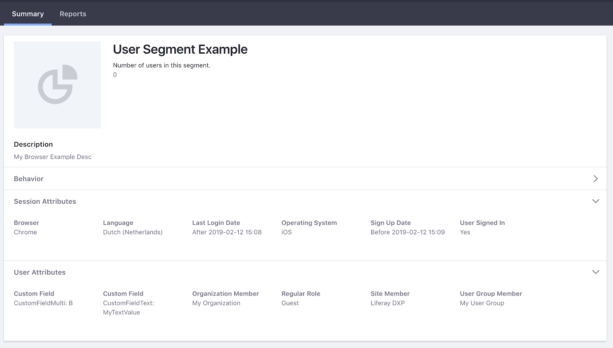
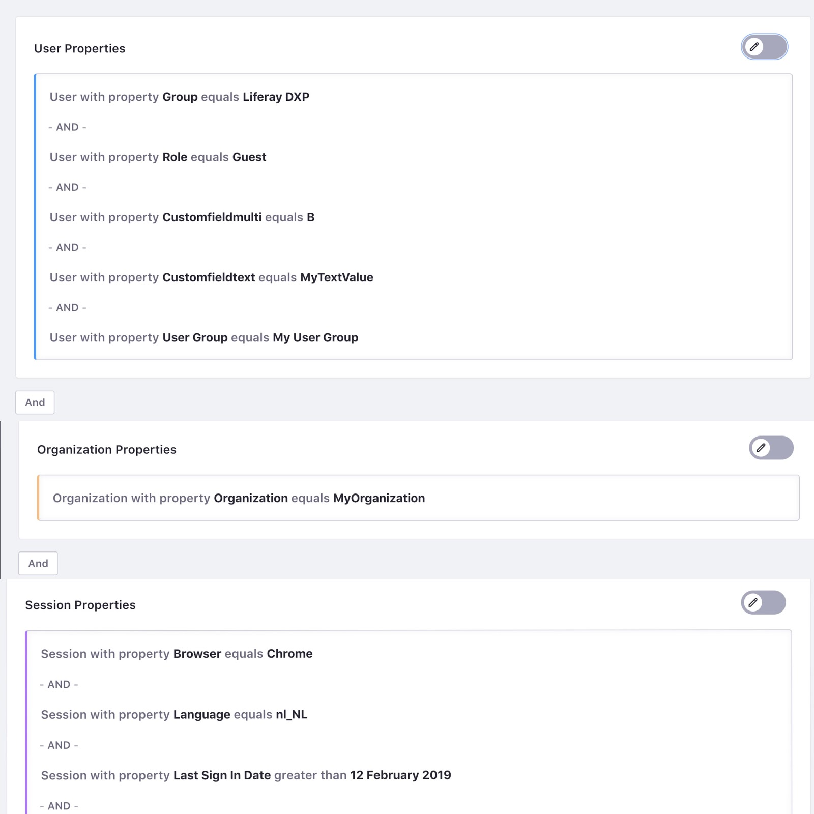

# Migrating User Segments

A user segment represents a subset of users with a common set of properties. [Segmentation](../segmentation/creating-and-managing-user-segments.md) in Liferay 7.2+ works similarly to Audience Targeting in previous Liferay DXP versions. In Audience Targeting, you create *rules* that users must match in order to belong to a user segment. In Segmentation, you create *conditions* that can be combined in different ways to define complex filters. For more information on how to create user Segments, see [Creating and Managing User Segments](../segmentation/creating-and-managing-user-segments.md).

## Upgrade Paths for Audience Targeting Rules

Due to the similarities between Audience Targeting user segments and Liferay DXP 7.2+ Segments, most of your configuration is automatically transferred into Liferay Segmentation during the upgrade. The following table shows the upgrade path for Audience Targeting rules when migrating to Liferay Segments conditions:

| Audience Targeting Rule | Segment Condition | Upgrade Path |
| ---                     | ---                     | --- |
| Browser                 | Browser                 | Automated. Use user agent field with `contains` operation as an alternative |
| Custom Field            | Custom Field            | Automated |
| Language                | Language                | Automated |
| Last Login Date         | Last Sign In Date       | Automated |
| Organization Member     | Organization            | Automated |
| OS                      | User Agent              | Automated |
| Previous Visited Site   | Not Available           | Automated |
| Regular Role            | Role                    | Automated |
| Site Member             | Site                    | Automated |
| User Group Member       | User Group              | Automated |
| Age                     | Not Available           | Suggested: custom field |
| Facebook (various)      | Not Available           | Suggested: custom field |
| Gender                  | Not Available           | Suggested: custom field |
| Score Points            | Not Available           | Suggested: cookie |
| Visited Page/Content    | Not Available           | Suggested: cookie |

## Upgrade Example for an Audience Targeting Segment

The following image shows an example of a user segment as it would appear in Audience Targeting for Liferay DXP 7.1:

This image shows the same user Segment after migrating to Liferay DXP 7.2:

## Related Information

- [Migrating from Audience Targeting to Segmentation and Personalization](./migrating-to-segmentation-and-personalization.md)
- [Manually Migrating from Audience Targeting](./manually-migrating-from-audience-targeting.md)
- [Creating and Managing User Segments](../segmentation/creating-and-managing-user-segments.md)
