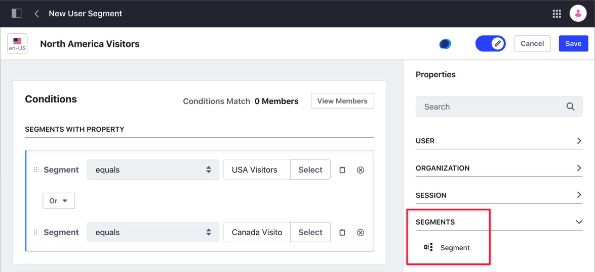
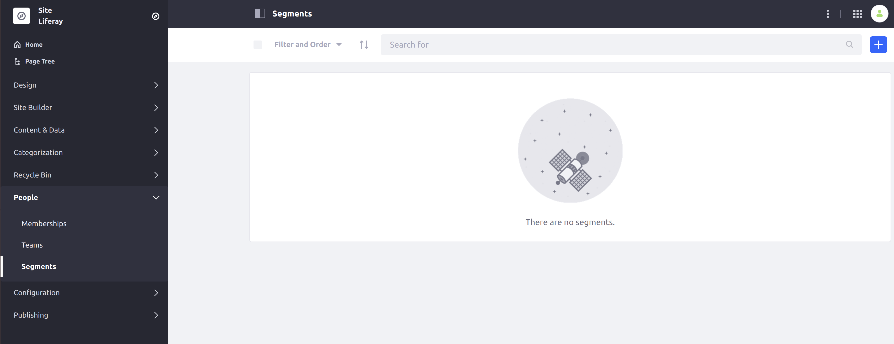
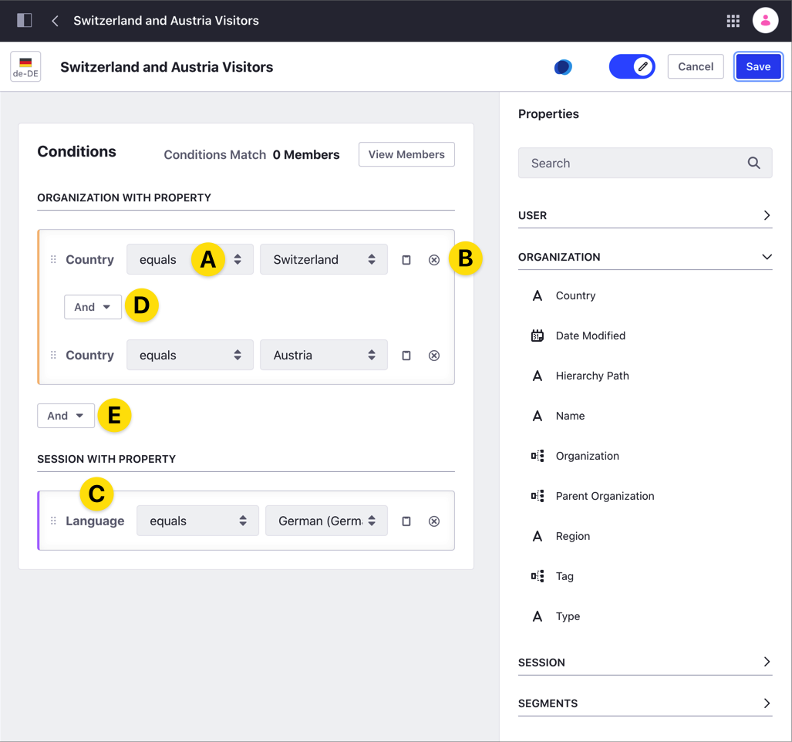
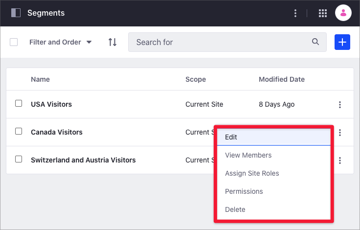

# Creating and Managing User Segments

Using *Segments* you can create different groups of users based on a common set of properties, like user *Job Title*, or user *Language*. For a list of the properties you can use to define Segments, see [Segments Editor UI Reference](./segments-editor-ui-reference.md). In addition to the exiting properties, you can add [Custom Fields](../../../system-administration/configuring-liferay/adding-custom-fields.md) for User and Organization groups and use these fields on you Segment criteria.

## Compound Segments

> Available: Liferay 7.3+.

You can combine existing Segments to create a new _Compound Segment_. The Compound Segment inherits the properties from the Segments it's based on and updates the members automatically. You can add additional properties to further customize the Compound Segment. 

To understand how Compound Segments work, consider the following example. Visitors from the USA and Canada have different needs, so you create two Segments with different properties, one Segment for each country. Later, you create a new standard Segment for North America visitors, where you manually copy the properties of the USA and Canada Segments. When you change the properties of the USA or Canada Segments, the North America Segment doesn't inherit the changes. You must manually update the North America segment to reflect these changes. However, if you create the North America segment as a Compound Segment, this Compound Segment automatically updates its definition and members when you change the USA or Canada Segments.

```important::
   You cannot use an existing Compound Segment to create a new one.
```



## Creating User Segments

These steps describe how to create a new Segment:

1. From the Site Menu on the left side of the screen, go to *People* &rarr; *Segments*.

    

1. Click the *Add* button ().

1. Click in the top text area and enter a name for your User Segment.

   ```tip::
      You can use the flag selector next to the Segment's name to translate the name of your Segment.
   ```

1. From the *Properties* area, select the group and property to define your Segment. Drag and drop the *Property* to the *Conditions* area.

1. Configure the Conditions for your segment (see [Configuring Segment's Conditions](#configuring-segment-conditions) below). 

1. Click *Save*.

### Configuring Segment Conditions

From the *Condition* area you have these options:

- Edit the comparison criteria using the comparison drop-down menu (A).
- Add or remove *Conditions* from the same *Properties* group, using the buttons next to the condition's name (B).
- Add conditions using a different *Properties* group, by dragging and dropping the *Property* (C).
- Combine the *Conditions* with *AND* and *OR* operators (D and E).

   

For the [Session Properties](./segments-editor-ui-reference.md#session-properties), you can configure a list of predefined values using [Session Property Vocabularies](../../../content-authoring-and-management/tags-and-categories/session-property-vocabularies.md). This option facilitates the task of defining the segments and eliminates manual entry errors.

As you edit, a count of members meeting the criteria appears at the top of the Conditions area. You can click on *View Members* to see the list. This helps you determine if you are correctly defining the Segment.


After you create your User Segment, you can see it in the list of User Segments on the *Segments* page. From here, you can manage the User Segment (edit it, delete it, [assign Site Roles](../../../users-and-permissions/roles-and-permissions/assigning-roles-to-user-segments.md), or change the permissions (who can access the User Segment) for it through its Actions Menu (). You can also click on the User Segment's name to edit it.



```note::
  You can't delete a User Segment if it's used in an experience.
```

## Related Information

- [Assigning Roles to User Segments](../../../users-and-permissions/roles-and-permissions/assigning-roles-to-user-segments.md)
- [Getting Analytics for User Segments](./getting-analytics-for-user-segments.md)
- [Content Page Personalization](../experience-personalization/content-page-personalization.md)
- [Session Property Vocabularies](../../../content-authoring-and-management/tags-and-categories/session-property-vocabularies.md)
