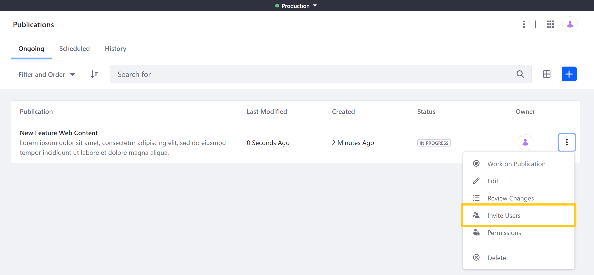
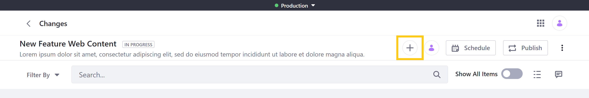
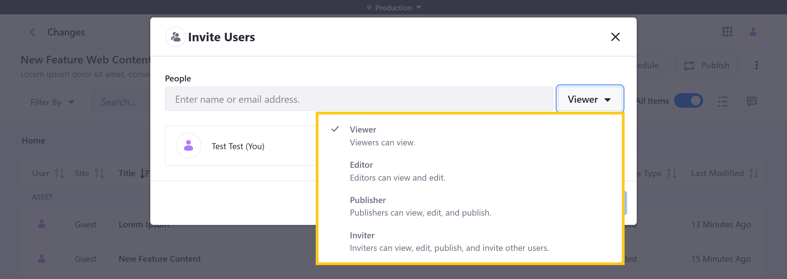
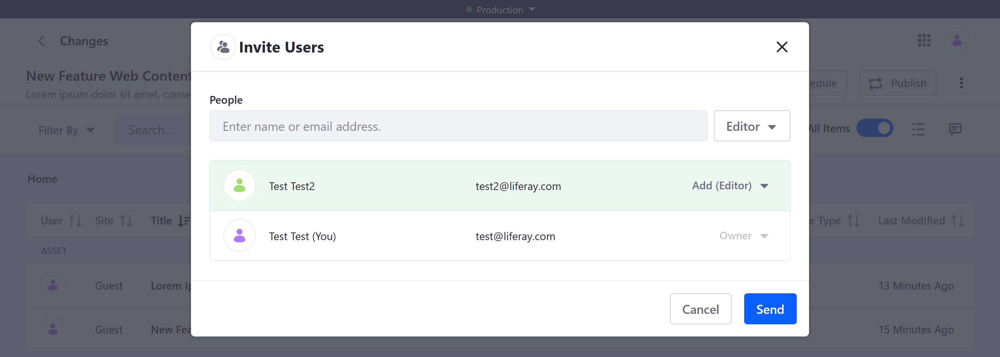
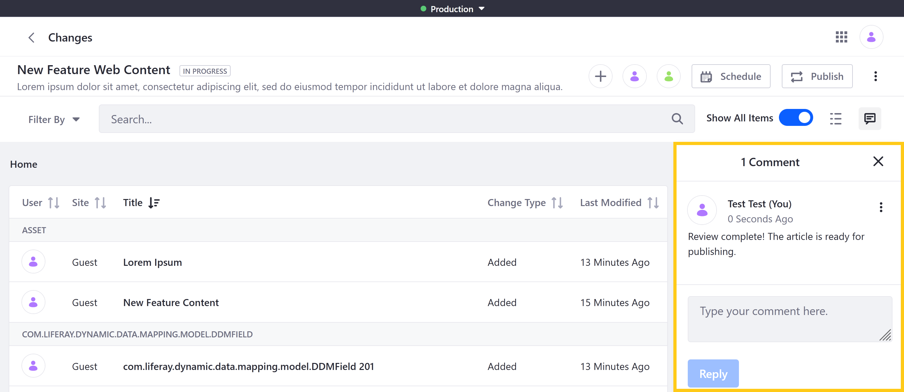
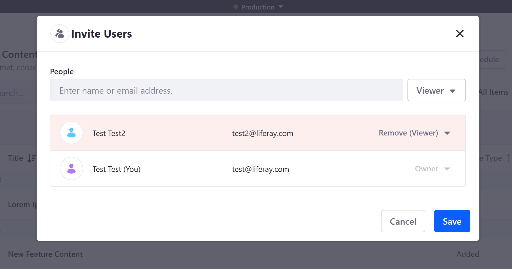

# Collaborating on Publications

> Available for Liferay DXP 7.4+

By default, a publication can only be accessed by its creator. However, publication creators can invite other users to view, edit, and publish their publications. Users can be added to any ongoing, scheduled, and published publications.

Once users are invited to a publication, you can use the integrated comments feature to facilitate collaboration between contributors.

## Inviting Users to a Publication

Follow these steps to invite user to collaborate on a publication.

1. Open the *Global Menu* , click on the *Applications* tab, and go to *Publications*.

1. Click on the *Actions* button  for the desired publication, and select *Invite Users*.

   

   Alternatively, click on the desired publication, and then click on the *Invite Users* button.

   

   ```{note}
   This is the only way to invite users to a published publication.
   ```

1. Use the drop-down menu grant *view*, *edit*, *publish*, and *invite* permissions.

   

1. Search for and select the desired *users*.

   Each user is assigned the selected permissions, though you can edit their permissions before and after sending invitations.

   

1. Click on *Send* to add the users to the publication.

Invited users are notified and can begin collaborating on the publication.

## Commenting on a Publication

Collaborating users can add comments to a publication via its Changes page. Each comment is scoped to the publication in which they're made.

1. Open the *Global Menu* , click on the *Applications* tab, and go to *Publications*.

1. Click on the desired Publication.

1. Click on the Comments button (  ).

1. In the chat window, type your comment, and click on *Reply*.

   

All collaborating users are notified of your comment and can reply as well.

## Removing Users from a Publication

Follow these steps to remove a collaborator from a publication.

1. Open the *Invite User* modal window for the desired publication.

1. Click on the drop-down menu for the desired user, and select *Remove*.

   

1. Click on *Save*.

## Additional Information

* [Creating and Managing Publications](./creating-and-managing-publications.md)
* [Making and Publishing Changes](./making-and-publishing-changes.md)
* [Resolving Conflicts](./resolving-conflicts.md)
