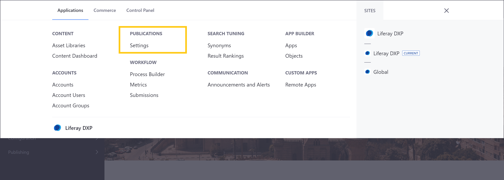
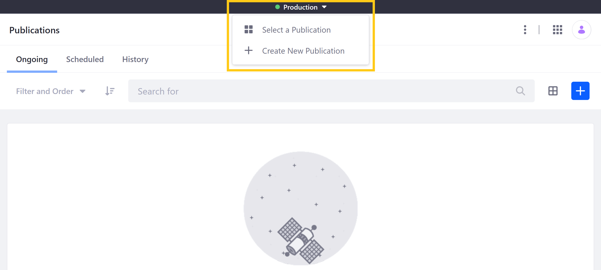
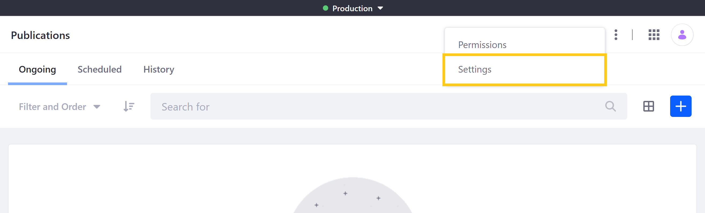

# Enabling Publications

Publications provides a convenient and flexible way for you and your teams to develop, track, and publish changes to your DXP instance. When enabled, Publications is activated globally and can be accessed anywhere to edit supported entities.

```{important}
Staging and Publications cannot be enabled at the same time. If Staging is enabled on any of your Sites, you must first disable Staging before enabling Publications. See [Disabling Local Live Staging](../staging/configuring-local-live-staging.md#disabling-local-live-staging) and [Disabling Remote Live Staging](../staging/configuring-remote-live-staging.md#disabling-remote-live-staging) for more information.
```

## How to Enable Publications

Follow these steps to enable Publications:

1. Open the *Global Menu* (), click on the *Applications* tab, and go to *Publications*.

1. Toggle the switch to enable Publications.

   

1. Click on *Save* to save your configuration. This redirects you to the Publications application page.

Once enabled, you can access the drop-down Publications bar menu from anywhere in your DXP instance.



You can use this menu to create new publications, select which publication you want to work on, switch between edit and production modes, and review and publish the current publication's changes. See [Creating and Managing Publications](./creating-and-managing-publications.md) to learn about creating, editing, and removing individual publications.

## How to Disable Publications

If desired, you can disable Publications at any time via the Publications application page.

1. Open the *Global Menu* (), click on the *Applications* tab, and go to *Publications*.

1. Click on the *Actions* button () in the Application Bar, and select *Settings*.

   

1. Toggle the switch to disable Publications.

1. Click on *Save*.

```{important}
Once disabled, all active publications are deactivated, scheduled publications are canceled, and you can no longer access your publication history. DXP, however, retains your instance's publication history, so you can access it again if you re-enable Publications.
```

## Enabling Publications for 7.3.x

Follow these steps to enable Publications:

1. Open the *Global Menu* (), click on the Applications tab, and click on *Settings* under *Publications*.

   

1. Toggle the switch to *Yes*.

1. Click on *Submit* to save your configuration.

   Alternatively, you can click on *Save and Go to Overview*, which saves your configuration and redirects you to the Publications overview page.

   

## Disabling Publications for 7.3.x

If desired, you can disable Publications at any time via the Publications *Settings* page.

1. Open the *Global Menu* (), click on the Applications tab, and click on *Settings* under *Publications*.

1. Toggle the switch to *No*.

1. Click on *Submit*.

```{important}
Once disabled, all active publications are deactivated, scheduled publications are canceled, and you can no longer access your publication history. DXP, however, retains your instance's publication history, so you can access it again if you re-enable Publications.
```

## Additional Information

* [Publications Overview](../publications.md)
* [Creating and Managing Publications](./creating-and-managing-publications.md)
* [Making and Publishing Changes](./making-and-publishing-changes.md)
