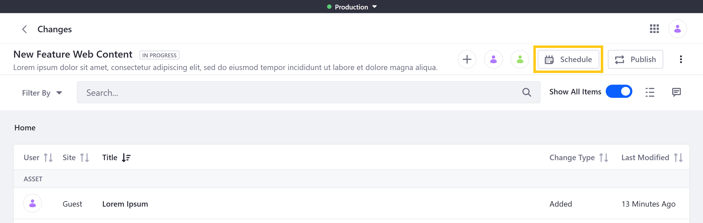
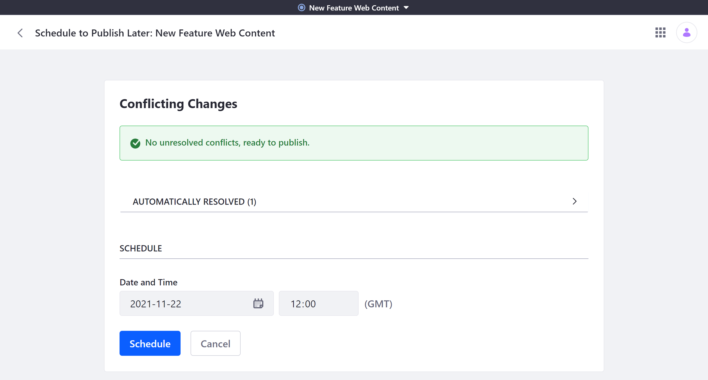

# Making and Publishing Changes

Publications provides a convenient way to manage changes to your Liferay instance. With it, you and your team can create and collaborate on blocks of changes called 'publications'. You can then publish those changes to production when ready.

```{note}
By default, users can only use the publications they've created. However, they can invite other users to collaborate on their publications. See [Collaborating on Publications](./collaborating-on-publications.md) for more information.
```

If you haven't already created a publication to track your changes, see [Creating a New Publication](./creating-and-managing-publications.md#creating-a-new-publication) for more information.

```{note}
Once created, a publication is automatically updated with changes made to production, provided they don't conflict with changes made in the publication. This ensures you and your team are working on the latest version of production.
```

## Making Changes in a Publication

Before making changes to your instance, ensure you're working on the correct publication and not on production or a different publication. You can confirm this via the Publications bar.

If you're not currently in the desired publication, click on *Select a Publication* and choose the correct one.


While working on a publication, any changes made to supported Liferay components are tracked in the publication. This can include changes across multiple Sites.

```{important}
When editing different Sites in the same publication, keep in mind that all tracked changes are applied to production when the publication is published.
```

When you add, edit, or remove assets in a publication, your changes are only visible in the publication where they're made.

Each application controls which parts of an asset are trackable by publications. However, even widgets related to applications and content types that don't support Publications can be added to your publication as part of a Page.

```{note}
When you delete an asset in a publication, DXP marks it for deletion and hides it when viewing the publication. The asset remains viewable to production and any other publications, since its removal in a publication is only a logical deletion.
```

## Making Changes in Parallel Publications

Users can have multiple active publications at the same time. Changes made in these parallel publications create alternative edit histories for your instance's entities. These changes can be compatible or conflicting, depending on whether they modify the same or related content.

### Compatible Changes

If parallel publications include compatible changes, they can be published without issue. In this case, the tracked changes of both publications are applied to production.

### Conflicting Changes

If parallel publications include incompatible changes and one of the publications is applied to production first, then the other publication will encounter publishing conflicts. These conflicts can also be caused when production is updated directly. See [Resolving Conflicts](./resolving-conflicts.md) for more information on this process.

## Reviewing Publication Changes

Before publishing, you can review a publication's tracked changes to ensure it only includes the desired edits. To do this, open the Publications drop-down menu and select *Review Changes*.


Alternatively, you can review any publication's tracked changes via the Publications application. Simply navigate to the *Ongoing* tab, click on the *Actions* button (  ) for the desired Publication, and select *Review Changes*.

### Display Styles

When reviewing changes, you can also switch between two display styles: *Changes* and *Context*.

* **Changes**: This displays all tracked changes in a list that you can order by *Change Type*, *Modified Date*, *Site*, *Title*, or *User*.

    

* **Context**: This displays all tracked changes in a tree, so you can view them in context with their associated changes.

    

### Simple and Advanced Change Summaries

By default, DXP displays a simple summary of tracked changes, but you can toggle the switch to *Show All Items*. This includes all background processes related to your changes.


Click on an individual change to view more details. From here, you can also click on the *Actions* button (  ) for the tracked change to *Edit* or *Discard* it. Available actions depend on the type of change.


## Publishing Your Changes

When you've finished making your changes, you can publish them immediately or schedule them to be published at a later time. Once published, a publication is listed in the *History* tab of the Publications application. This maintains a clear audit trail that you can use review and revert Site changes when needed. See [Reverting Changes](./reverting-changes.md) for more information.

When you begin the publishing process, Liferay performs a compatibility check to determine if there are any conflicts between the publication and production. If there are conflicts, DXP notifies you. While some conflicts are resolved automatically, others require manual resolution. Resolving all conflicts is necessary for publishing changes. See [Resolving Conflicts](./resolving-conflicts.md) for more information.

### Publishing Now

Follow these steps to publish changes immediately:

1. Open the Publications *drop-down menu*, and select *Review Changes*.

   Alternatively, open the Publications application, and click on the desired publication.

1. Click on *Publish*.

   

1. If necessary, manually resolve any detected conflicts. Once all conflicts are resolved, you can proceed.

   

1. Click on *Publish*.

The publication's changes are immediately applied to production, and you are redirected to the *History* tab. From here, you can view publishing details (e.g., date, publisher, status) and [revert](./reverting-changes.md) a publication's changes if desired..

### Scheduling for Later

Follow these steps to schedule publishing for a later time.

1. Open the Publications *drop-down menu*, and select *Review Changes*.

   Alternatively, open the Publications application, and click on the desired publication.

1. Click on *Schedule*.

   

1. If necessary, manually resolve any detected conflicts. Once all conflicts are resolved, you can proceed.

   ```{important}
   At the time of the publication, DXP performs a second conflict detection to ensure there are no new conflicting changes. The publish fails if DXP detects new conflicts that cannot be automatically resolved. If the conflicts can be resolved automatically, DXP proceeds with publishing.
   ```

1. Enter a *date* and *time* to determine when the changes are published to production.

   

1. Click on *Schedule* to complete the process.

This redirects you to the *Scheduled* tab where you can view and [manage scheduled publications](./creating-and-managing-publications.md#managing-scheduled-publications).

## Additional Information

* [Publications Overview](../publications.md)
* [Enabling Publications](./enabling-publications.md)
* [Creating and Managing Publications](./creating-and-managing-publications.md)
