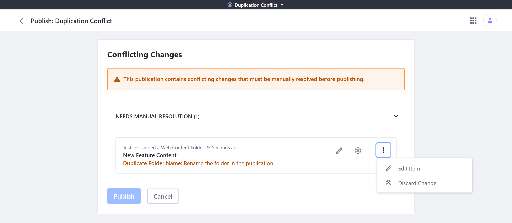
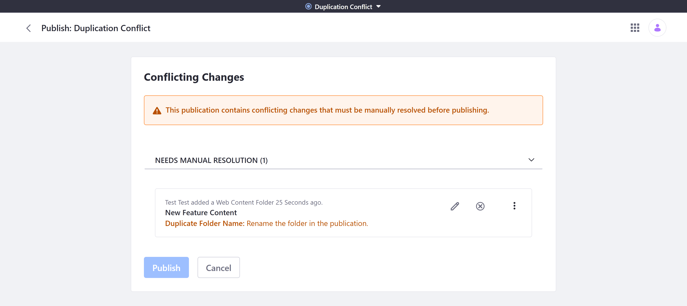
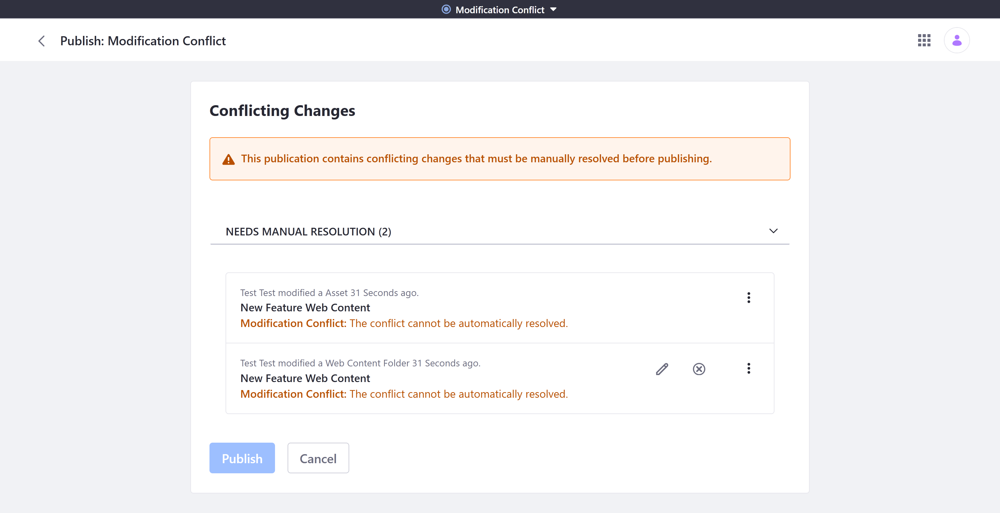
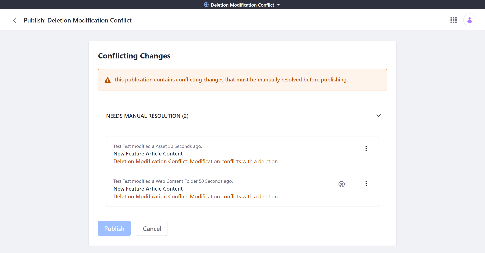
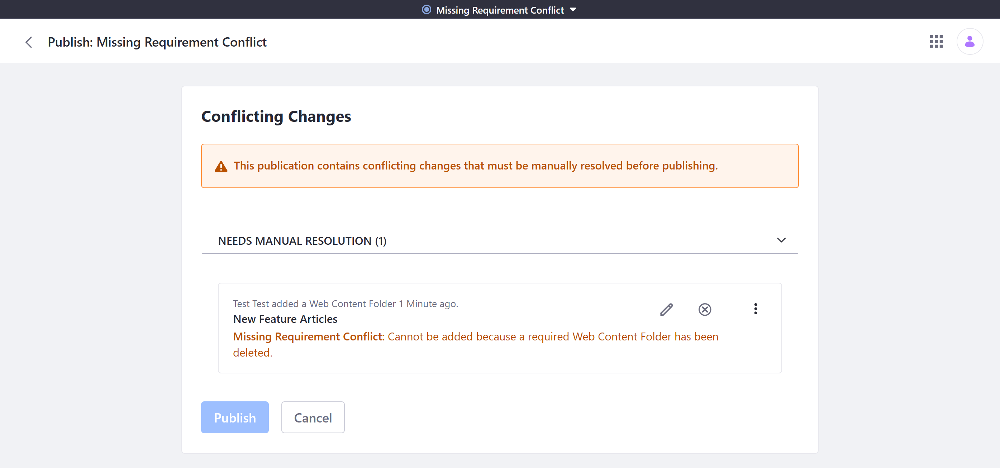
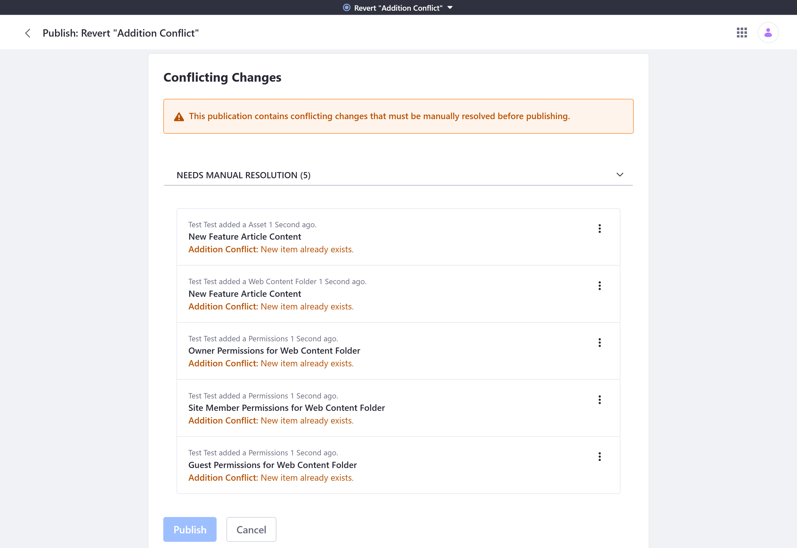

# Resolving Conflicts

When you begin the publishing process, Liferay performs a compatibility check to determine if there are any conflicts between your publication and production. While some conflicts can be resolved automatically, others require manual resolution. Resolving all conflicts is necessary for publishing changes.

```{note}
Publishing conflicts only occur when changes are made to production *after* changes have already been made in a publication. This is because each publication is automatically updated with changes made to production, provided those changes don't conflict with changes made in the publication.
```

## Automatically Resolving Conflicts

For some conflicts, Liferay can provide an automatic resolution. Essentially, an automatic resolution is a pre-configured solution to certain kinds of conflicts, so you can publish your changes without further action. These solutions may include adding, modifying, or removing content from the current publication, or replacing the version of content in production with your publication's version.

When an automatic solution is available, you'll be notified during publishing. You can then click on *View* to review the solution's details. To implement an automatic solution, simply click on *Publish*.


## Manually Resolving Conflicts

For some conflicts, Liferay cannot provide an automatic resolution. This means you must perform an additional action to resolve the conflict before you can finish publishing. When a manual resolution is necessary, Publications identifies the conflict type and prompts you to resolve it.



Depending on the [conflict type](#understanding-conflict-types), Publications may prompt you to perform one of the following actions.

* **Edit**: This redirects you to the cause of the conflict in the current publication. From there, you can make the changes necessary to resolve the conflict.

* **Discard**: This displays a list of all changes that will be discarded. You can then click on *Discard* to permanently remove them from your publication.

```{warning}
Discarding is permanent and cannot be reversed. Ensure you've saved any changes you want to keep before discarding them from your publication.
```

## Understanding Conflict Types

Users can encounter six general types of conflicts: *Duplication*, *Modification*, *Deletion Modification*, *Modification Deletion*, *Missing Requirement*, and *Addition*.

### Duplication Conflicts



These conflicts occur when something in production uses the same unique value of a change made in the publication. This can be caused by any type of component that requires a unique value (e.g., a folder, url, role name).

Consider the following example. Suppose you've added a new folder named 'Marketing' to a publication, while a user in production creates a folder using the same name. Since folders in the same repo must have a unique name, attempting to publish your change will result in a duplication conflict.

To resolve duplication conflicts, users can either edit the value in their publication, or discard their change.

### Modification Conflicts



These conflicts occur when an entity you've modified in a publication is then modified in production (e.g., when an edited Web Content article is moved). While some modification conflicts can be automatically resolved, others require manual resolution.

To resolve modification conflicts, you can edit the conflicting material, discard the conflicting changes in your publication, or replace the version in production.

### Deletion Modification and Modification Deletion Conflicts



These conflicts occur when an entity is modified in a publication and then deleted in production (Deletion Modification), or vice versa (Modification Deletion). The only provided resolution for this conflict is to discard the publication's conflicting change.

### Missing Requirement Conflicts



These conflicts occur when a child entity is created or edited in your publication, while its parent has been removed from production. Examples include deleting a folder from production when your publication adds or modifies a sub-folder.

To resolve Missing Requirement conflicts, you can discard the conflicting changes from your publication or revert the deletion in production. See [Reverting Changes](./reverting-changes.md) for how to revert changes published to production.

### Addition Conflict



These conflicts only occur when users attempt to revert a publication including a deletion that has already been reverted. Users cannot revert the same publication twice if it included a deletion, since the system cannot add back what has already been added back.

## Additional Information

* [Creating and Managing Publications](./creating-and-managing-publications.md)
* [Making and Publishing Changes](./making-and-publishing-changes.md)
* [Resolving Conflicts](./resolving-conflicts.md)
