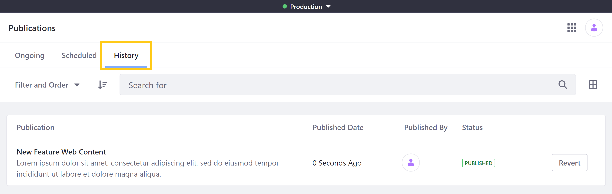
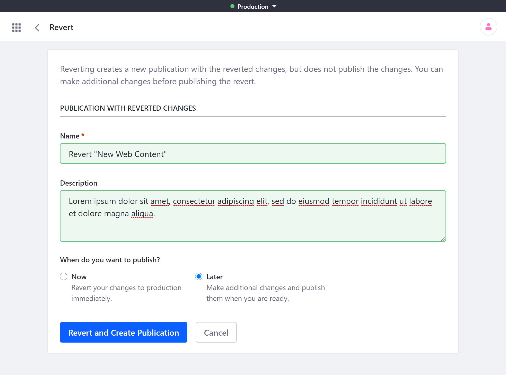
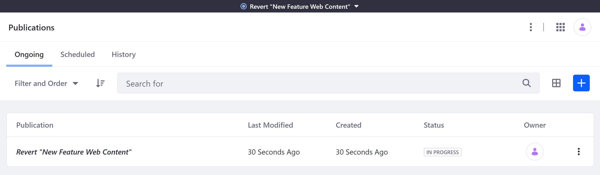

# Reverting Changes

Liferay Publications maintains a history of all published changes. You can use this publishing history to easily create publications that revert earlier changes to production. While reverting a publication, you can also make additional changes.

```{important}
After upgrading your Liferay version, you cannot revert publications published before your upgrade. The *Revert* option is removed for these publications.

Also, users cannot revert the same publication twice. Attempting this results in an *Addition Conflict*. See [Resolving Conflicts](./resolving-conflicts.md) to learn more about conflict types.
```

Follow these steps to revert published changes.

1. Go to the *Publications* overview page and click on the *History* tab.

   

1. Click *Revert* for the desired publication.

1. Set a *name* and *description* for the new publication. The default name is `Revert "[Publication Name]"`.

   

1. Determine when to publish the publication: *Now* or *Later*.

   **Now**: This publishes the reversion immediately.

   **Later**: This creates the publication and allows users to make additional changes to the publication before publishing.

1. Click *Revert and Create Publication*.

This creates a new publication that includes all necessary changes for reverting the selected publication.



If you've selected to publish *Now*, you are redirected to the publishing page. If there are no conflicts, you can click *Publish* to revert the original publication's changes to production.

If you've selected to publish *Later*, you are redirected to the Review Changes page for your new publication. At this point, you can make further changes to your publication, and then publish when ready.

## Additional Information

* [Creating and Managing Publications](./creating-and-managing-publications.md)
* [Making and Publishing Changes](./making-and-publishing-changes.md)
* [Resolving Conflicts](resolving-conflicts.md)
