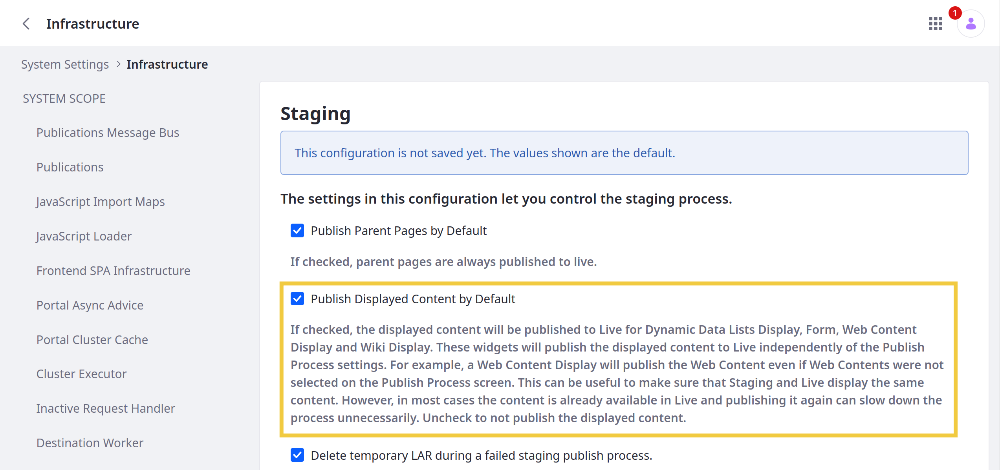

# Configuring Automatic Publishing of Displayed Content

> Available: Liferay DXP/Portal 7.4+

By default, all publishing processes automatically republish content displayed using the following widgets: Dynamic Data Lists Display, Form, Web Content Display, and Wiki Display. This happens regardless of the publishing process's configuration to ensure your displayed content in Live stays up to date.

However, always republishing displayed content to Live can be unnecessary and slow down publishing. If desired, you can disable this default behavior in System Settings to improve publishing speeds. When disabled, only content included in the publishing process's configuration is published.

Follow these steps to configure this Staging behavior:

1. Open the *Global Menu* (), click the *Control Panel*, and go to *System Settings* &rarr; *Infrastructure*.

1. Click *Staging* under Virtual Instance Scope in the left menu.

1. Check or uncheck *Publish Displayed Content by Default*.

   * When enabled, displayed content is republished for the following widgets, regardless of the publishing process's configuration: Dynamic Data Lists Display, Form, Web Content Display, and Wiki Display.

   * When disabled, only content included in the publishing process's configuration is published.

1. Click *Save*.

## Additional Information

* [Staging](../staging.md)
* [Understanding the Publishing Process](./understanding-the-publishing-process.md)
* [Site Staging UI Reference](./site-staging-ui-reference.md)
