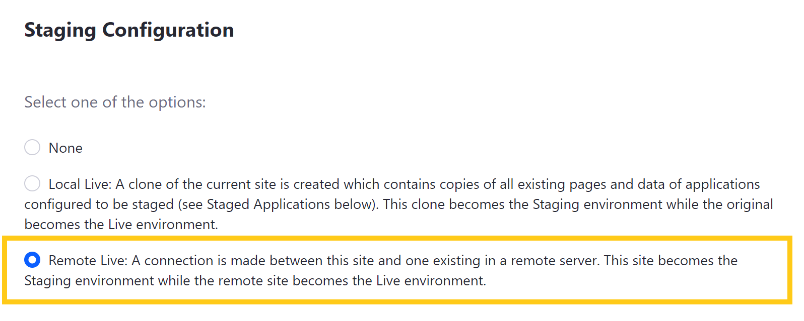
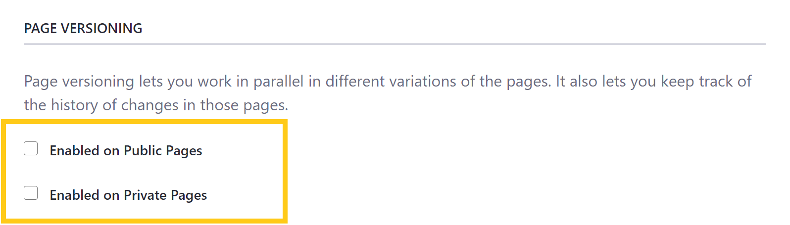

# Configuring Remote Live Staging

With *Remote Live Staging*, your Staging and Live environments are hosted on separate Liferay servers. When enabled, the Site used to configure Staging becomes your Staging environment, while the configured remote server becomes your Live environment.

Before enabling Remote Live Staging, you must configure the Liferay servers you want to use for your Staging and Live environments. You must also create a new blank Site on your Remote server and use its ID during Staging configuration. You can find any Site's ID by selecting the Site's name on the *Sites Page* of the Control Panel.

* [Preparing Your Liferay Servers](#preparing-your-liferay-servers)
* [Setting Up Remote Live Staging](#setting-up-remote-live-staging)
* [Remote Live Staging Permissions](#remote-live-staging-permissions)
* [Configuring Remote Staging's Buffer Size](#configuring-remote-stagings-buffer-size)
* [Disabling Remote Live Staging](#disabling-remote-live-staging)

## Preparing Your Liferay Servers

If you haven't already, follow these steps to configure your Liferay servers for Remote Live Staging:

1. Specify a shared authentication key for your servers by adding the following properties to the `portal-ext.properties` file for both Liferay servers:

   ```
   tunneling.servlet.shared.secret=[secret]
   tunneling.servlet.shared.secret.hex=[value]
   ```

   Each property value depends on your chosen encryption algorithm and whether you use hexadecimal encoding (recommended) or printable ASCII characters (less secure). If you decide to not use hexadecimal encoding, the value for `tunneling.servlet.shared.secret` must be ASCII compliant.

   The following key lengths are supported by the available encryption algorithms:

   **AES**: 128, 192, and 256 bit keys

   **Blowfish**: 32 - 448 bit keys

   **DESede (Triple DES)**: 112 or 168 bit keys. Liferay's minimum key length does not support 56 bit keys. <!--Does this limit apply to Blowfish?-->

1. Add each server to the other's list of allowed servers by adding the following property to each server's `portal-ext.properties` file:

   ```
   tunnel.servlet.hosts.allowed=127.0.0.1,SERVER_IP,[OTHER_SERVER_IP]
   ```

   If the server has multiple IP addresses, each IP address must also be added.

   ```important::
      If you're validating IPv6 addresses, you must configure the app server's JVM to not force the usage of IPv4 addresses. For example, if you're using Tomcat, add the ``-Djava.net.preferIPv4Stack=false`` attribute in the ``$TOMCAT_HOME\bin\setenv.[bat|sh]`` file.
   ```

1. Update the remote instance's *Tunnel Authentication Verifier Configuration*.

   To do this, go to the *Control Panel* &rarr; *Configuration* &rarr; *System Settings* &rarr; *API Authentication* &rarr; *Tunnel Authentication*.

   Click */api/liferay/do* and insert the additional IP addresses you're using in the *Hosts Allowed* field. When finished, click on *Update*.

   

   ```note::
      While it is enabled by default, ensure each Liferay server's tunneling servlet `authentication verifier <../../installation-and-upgrades/securing-liferay/securing-web-services/using-authentication-verifiers.md>`_ is enabled.
   ```

   Alternatively, you can write this configuration into an OSGi file in your Liferay instance (e.g., `osgi/configs/com.liferay.portal.security.auth.verifier.tunnel.module.configuration.TunnelAuthVerifierConfiguration-default.config`):

   ```
   enabled=true
   hostsAllowed=127.0.0.1,SERVER_IP,[Local server IP address]
   serviceAccessPolicyName=SYSTEM_User_PASSWORD
   urlsIncludes=/api/liferay/do
   ```

1. Restart both Liferay servers to implement your changes.

Once restarted, both servers are ready for Staging configuration.

```important::
   When applying patches to a remote Staging environment, you must apply them to all your servers. Having servers on different patch levels is not a good practice and can lead to import failures and data corruption. It is essential that all servers are updated to the same patch level to ensure remote staging works correctly.
```

## Setting Up Remote Live Staging

Once you've prepared your Liferay servers, follow these steps to set up Remote Live Staging for your DXP instance:

1. Go to *Product Menu* &rarr; *Publishing* &rarr; *Staging*.

   

1. Select *Remote Live*, which reveals additional fields for *Remote Live Connection Settings*, *Page Versioning*, and *Staged Content*.

   

1. Use the following fields to enter information for your remote DXP instance:

   **Remote Host/IP**: Enter your Remote server's IP address into the *Remote Host/IP* field. This should match the `tunnel.servlet.hosts.allowed` property specified in your `portal-ext.properties` file.

   **Remote Port**: Enter the port for your remote DXP instance into the *Remote Port* field.

   **Remote Path Context**: Enter the *Remote Path Context*. This is only required if a non-root portal servlet context path is used on the remote Liferay server. Access to this context must not be blocked by a proxy or firewall.

   **Remote Site ID**: Enter the *Site ID* for your Remote Liferay DXP instance.

   

   ```note::
      If you're configuring an IPv6 address, it must contain brackets when entered into the *Remote Host/IP* field (e.g., [0:0:0:0:0:0:0:1]).

      If the Remote server is a cluster, you can set the Remote Host/IP to the cluster's load balanced IP address to increase the availability of the publishing process. See the `Configuring Remote Staging in a Clustered Environment <https://help.liferay.com/hc/en-us/articles/360018175251-Configuring-Remote-Staging-in-a-Clustered-Environment>`_ for details.
   ```

1. Select whether to use a secure network connection (i.e., HTTPS) for publishing Pages from Staging to Live.

1. Select whether to manually define the remote Site URL.

1. Select whether you want *Page Versioning* enabled on Public and/or Private Pages.

   

1. Select the *data* and *content* types you want to stage.

   

   ```warning::
       When applications are checked, their data is copied, and it may not be possible to edit them directly on the live Site. When unchecking an application, first make sure that any changes in Staging are published, since they may be lost. See `Managing Data and Content Types in Staging <./managing-data-and-content-types-in-staging.md>`_ for more information.
   ```

1. Click on *Save* to initiate the Staging process. The duration of this process depends on the size of your Site.

   ```note::
      If your attempt to enable Remote Live Staging fails, please verify that you've properly prepared your servers.
   ```

Once the process is complete, you are ready to use Remote Live Staging. See [Staging UI Reference](./staging-ui-reference.md) for information about navigating the Staging environment's publishing features.

```warning::
   Never clone your Liferay DXP database. Doing this can duplicate important data used by Staging (e.g., UUID), causing the remote publishing process to fail.
```

## Remote Live Staging Permissions

When a User attempts to publish changes from Staging to Live, Liferay passes the User's email address, screen name, or User ID to the remote server to perform a permission check. To succeed, the publishing User must have identical credentials and permissions on both servers.

To give a local User permission to publish changes from staging to production/live, create an identical User account with identical permissions for the User on the remote server.

To simplify this process, you can use LDAP to copy selected User accounts from your local server to your remote server. See [Connecting to an LDAP Directory](../../../users-and-permissions/devops/connecting-to-a-user-directory/connecting-to-an-ldap-directory.md) for more information.

## Configuring Remote Staging's Buffer Size

When you're using Remote Live staging and you are publishing a large amount of content, this process can be slow and cause a large amount of network traffic. To help with this, Liferay DXP transfers data piecemeal, instead of one large data dump. You can control the size of data transactions by setting the following portal property in your `portal-ext.properties` file:

```
staging.remote.transfer.buffer.size
```

This property sets the file block sizes for remote staging. If a LAR file used for remote staging exceeds this size, the file is split into multiple files prior to transmission and then reassembled on the remote server. The default buffer size is 10 megabytes.

## Disabling Remote Live Staging

1. Go to *Publishing* &rarr; *Staging*, which is only available from your Staging environment.

1. Click on the *Actions* button (  ) located in the *Application* bar, and select *Staging Configuration*.

1. Select *None* for your Staging configuration and click on *Save*.

Disabling Remote Live Staging disables the connection between your environments without deleting any data. Since no data is erased and no processes are started, disabling Remote Live Staging is almost instantaneous.

When you disable remote staging, you must ensure the Live Site is still accessible so both sides can communicate that it's disabled. Do not shut down your Live Site and then attempt to disable remote staging from your staged Site. If the network connection is ever lost between environments, an error message appears and instructs you to forcibly disable staging.

Forcibly disabling staging erases your staging information from your staging server, not the content. The Live site remains in a locked state. A possible workaround is to create a new Live site and import content to it, if necessary.

## Additional Information

* [Staging Overview](./staging-overview.md)
* [Staging UI Reference](./staging-ui-reference.md)
* [Managing Staging Permissions](./managing-staging-permissions.md)
* [Managing Data and Content Types in Staging](./managing-data-and-content-types-in-staging.md)
