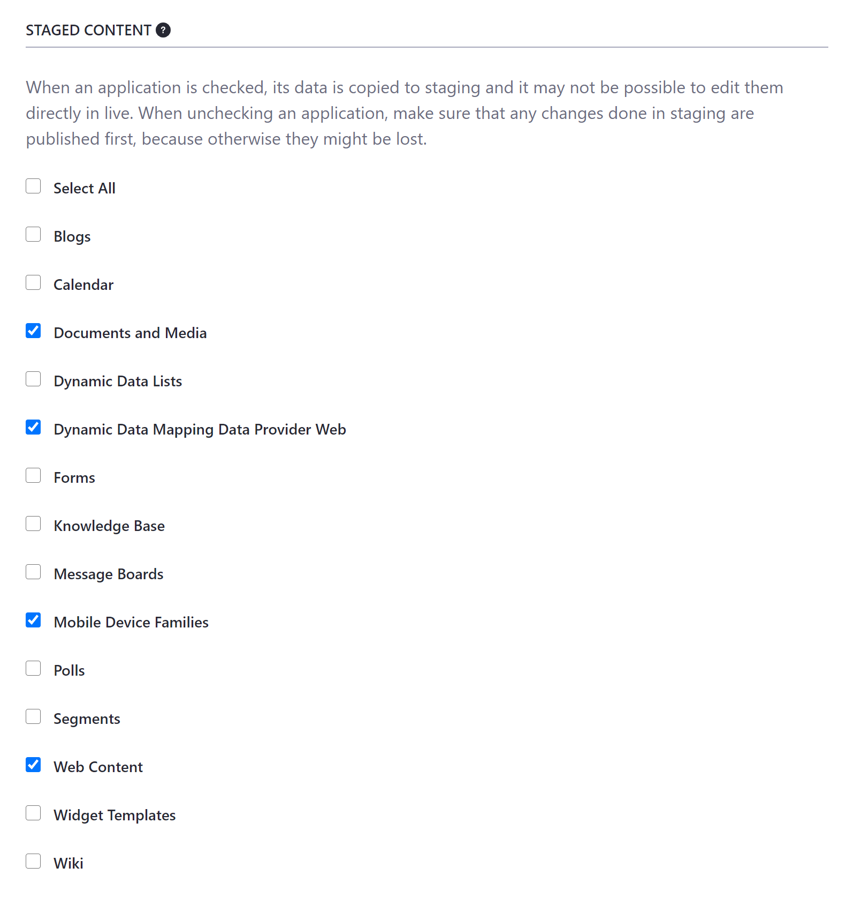
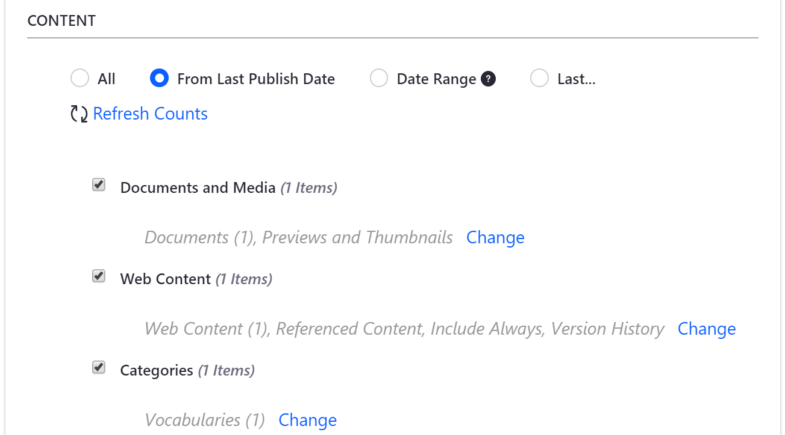

# Managing Data and Content Types in Staging

Liferay DXP's Staging tool provides ways to manage available application data and content types both during initial configuration and the publishing process. Because there can be so many relationships between applications and types of content, be sure to consider how they reference each other in your database before deciding to stage or unstage any categories.

* [Staging Data and Content Types](#staging-data-and-content-types)
* [Publishing Data and Content Types](#publishing-data-and-content-types)

## Staging Data and Content Types

As part of Staging configuration, you can select which application data and content types are staged. If staged, the selected data and content is managed by your Staging environment, along with all contained entities, and it may not be possible to edit them directly in Live.


When working with Staging, you must think about the applications you're using on your Site and whether they're appropriate to be staged:

* Unstaged data only exists in the Site's live environment. Staged data exists in both environments.
* Collaborative applications, such as Blogs, Message Boards, and Wikis should not be staged, because posts would not appear on the live Site until you publish.
* You can only stage Site-scoped content.
* Page-scoped data can only be staged on published Pages; its data is published with the Page.
* If you have disabled/removed an application from your Site but it's still selected in your Staging configuration, it's still published and may appear in aggregation apps like Asset Publisher.
* Asset Publisher on the Staged Site cannot access data from unstaged apps, because their data exists only on the Live Site. If your Asset Publisher's configuration shows data from both staged and unstaged apps, it won't look the same on both your Staged and your Live Sites.

**Content Origin for Staged and Unstaged Applications**

| Content Type | Staged | Unstaged | Data Origin Staged | Data Origin Live |
| ------------ | -------| -----------| ------------- | ----------- |
| Collaborative |  | &#10004; | | &#10004; |
| Site Scoped | &#10004; | |&#10004; |  | 
| Page Scoped Apps | &#10004;* | | &#10004; | |
| Unselected Apps in Staging Config | | &#10004; | | &#10004; |
| Selected Apps in Staging Config | &#10004; | | &#10004; | |

\* *Only published when the Page is published*

```important::
   After configuration, users can't change whether or not an application data or content type is staged. This is because staging and unstaging this data and content could cause inconsistencies between Staging and Live environments. To change these settings, you must turn staging off and re-enable it with your new configuration.
```

## Publishing Data and Content Types

During the publishing process, you can also configure which application data and content types are published from Staging to Live. From the *Advanced* tab of the *Publish to Live* menu, you can view each type with any related data and content it may have.



Here, you can exclude some data and content types during publishing or export to speed up the process.

### Version History

Web content tends to be updated frequently, which can result in a high number of versions and lengthy publishing times. You can choose to not publish the *Version History*. If you disable this, only the last approved version of each web content article is published to Live. This can significantly speed up the publishing process.

By default, Version History is selected for publishing, so you must manually disable this setting to publish only the latest approved version of your web content. To do this, go to *Control Panel* &rarr; *Configuration* &rarr; *System Settings* &rarr; *Web Content* &rarr; *Virtual Instance Scope* &rarr; *Web Content*, and toggle the *Version History by Default Enabled* checkbox.

### Previews and Thumbnails

Previews and thumbnails are generated automatically for documents. However, if your Site contains a large number of images or documents, it may be best to disable this feature to increase your publishing speed and limit the amount of disk space used.

Whether you'll want to publish file previews and thumbnails depends on your environment. Publishing them is a heavy operation, and if you're using remote staging, you must also transfer the LAR file over the network. If you decide to generate previews on the Live Site, understand that this could take some time, since it's a CPU- intensive operation.

### Vocabularies

When working within a Site, you can select vocabularies from both the current Site as well as the global Site. While this doesn't pose an issue when creating content, it can cause issues when publishing.

For environments that use both global and local vocabularies, note that global vocabularies must be published to the Live Site through global Site Staging. One way to avoid vocabulary confusion is to keep all vocabularies local or global. If both must be used, you can resolve the issue by ensuring that dependencies (e.g., categories and vocabularies) are published before publishing the Site that depends on them, whether the dependencies are local or global.

```note::
   Assets like tags, categories, structures, templates, widget templates, document types, and dynamic data lists can also be shared by a parent to its child Sites. In this case, ensure that the parent's dependencies are published before the Site in question.
```

### Deletions

The Staging framework gathers deletions (including trashed entities) in a Site. These deletions can be published to clean up the Live Site. If you plan to process it later, or if it's not a problem to have lingering data on Live, this can be turned off as well to save execution time during the process.

## Additional Information

* [Staging Overview](./staging-overview.md)
* [Understanding the Publishing Process](./understanding-the-publishing-process.md)
* [Site Staging UI Reference](./site-staging-ui-reference)
