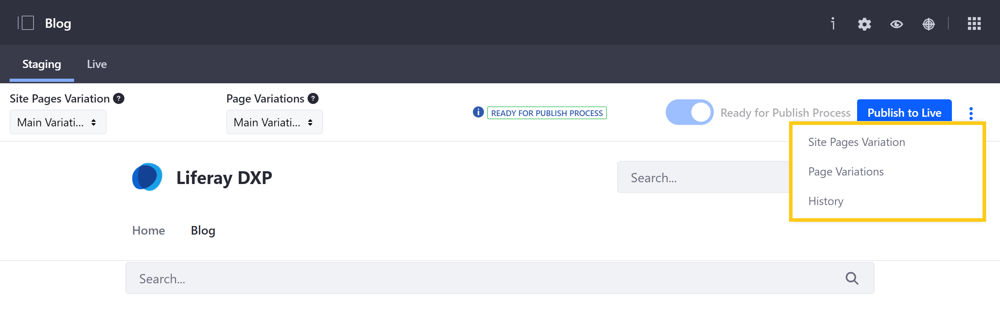
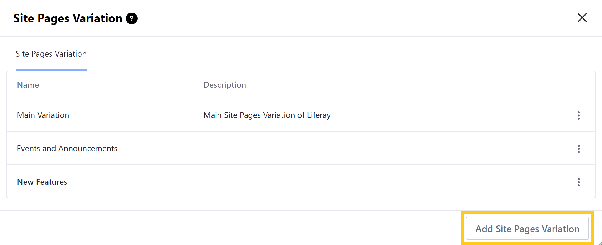
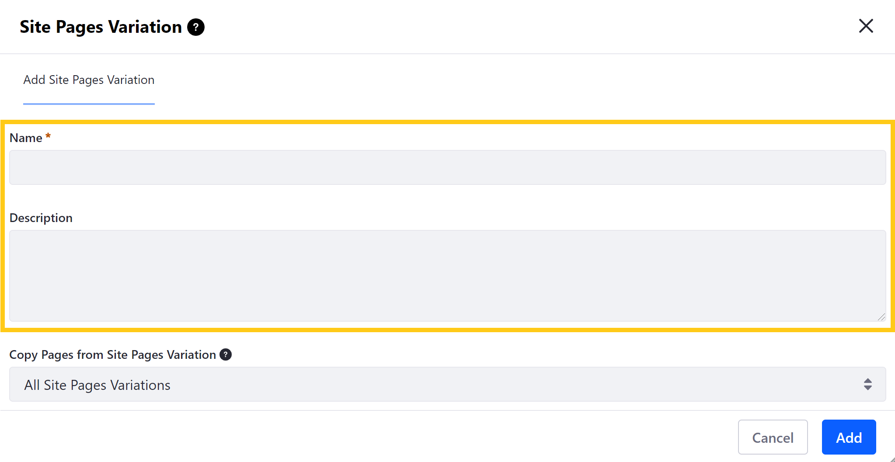
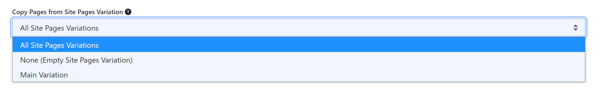
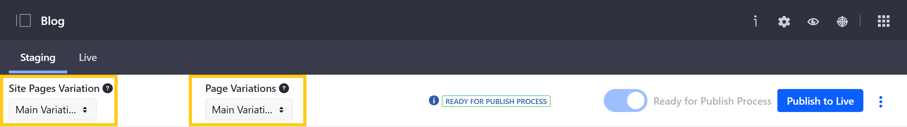
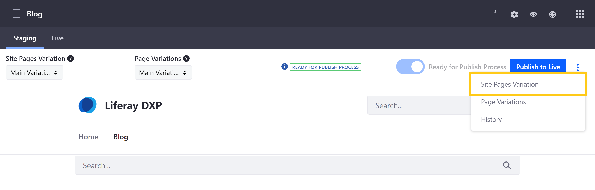
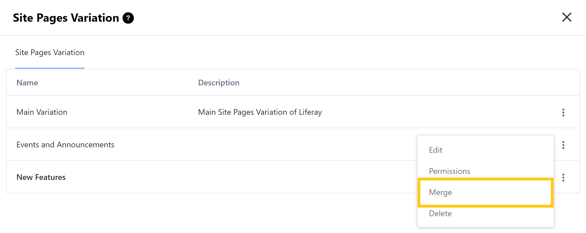
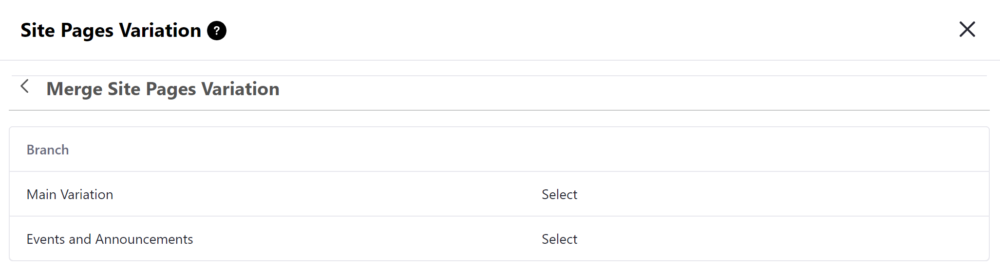

# Page Versioning

With Page Versioning enabled, you and your team can work in parallel on multiple versions of your Site's Pages. Different versions are called *variations*, which you can create and manage for Widget Pages and Content Pages via the Staging bar. Page versioning maintains a history that you can use to revert changes made to your staged Pages to earlier versions if needed.

```{note}
Starting with Liferay DXP 7.4, 7.3 Fix Pack 1, and 7.2 Fix Pack 11, you can create variations in Widget Pages and Content Pages. In previous Liferay DXP versions, you could create variations only on Widget Pages. To learn more about variations in these types of pages, see [Types of Variations](#types-of-variations).
```

You can enable Page versioning for your Pages during initial setup or anytime afterward via the *Staging Configuration* page. Once enabled, you can create, merge, and publish variations for individual Pages or groups of Pages. You can also manage variation permissions for different User Roles.

## Types of Variations

Staging provides two types of variations:

* **Site Pages Variation**: This type groups changes for multiple Site Pages into a single variation. They can include both Widget Pages and Content Pages.

* **Page Variations**: This type is for creating variations of an individual Page. They are created within Site Pages Variations and are only available for Widget Pages.

   ```{note}
   Use [Experiences](../../../site-building/personalizing-site-experience/experience-personalization/content-page-personalization.md) to create different versions of a Content Page.
   ```

Both variation types only affect Pages and do not affect your Site's content, since all variations in your staging Site share the same content. That said, each variation can use and configure the same content or applications in different ways, and each Site Pages Variation can include different Pages.

Also, Page metadata is not versioned (e.g., layout type, friendly URL). This means changes to metadata are applied to all variations. For example, if a Page template is modified, those modifications are propagated to all Pages configured to inherit changes from the template.

```{note}
Page templates are not recognized by the Staging framework. This means that existing Page templates are not viewable or editable on a staged Site. If they're created on a staged Site, they are lost if staging is disabled.
```

## Creating Variations

Follow these steps to create new variations of a Page or group of Pages:

1. Click the *Actions* button (  ) in the Staging bar, and select *Site Pages Variation* (for Widget Pages or Content Pages) or *Page Variations* (for Widget Pages only).

   

1. Click the *Add* button at the bottom right of the modal window.

   

1. Enter a *name* and *description* for your new variation. You can modify these fields for your variation at any time.

   

   For Site Pages Variations, you can select from the following options to determine if your new variation copies Pages from existing variations:

   * **All Site Pages Variations**: Copy all Pages from existing Site Pages Variations.

   * **None (Empty Site Pages Variation)**: Create a new, empty Site Pages Variation.

   * **[Existing Variations]**: Copy all Pages from a single Site Pages Variation.

   

   ```{note}
   If you decide to copy Pages from an existing variation, only the latest version marked as ready for publishing is copied.
   ```

1. Click *Add* to create your new variation.

Once created, you can switch between each version of a Page or group of Pages via the drop-down menus in the Staging bar. For more information, see [Site Staging UI Reference](./site-staging-ui-reference.md).



## Merging Variations

You can merge two Site Pages Variations. This adds all Pages and Page Variations into a Site Pages Variation without affecting or overwriting its content.

1. Click the *Actions* button (  ) in the Staging bar, and select Site Pages Variation.

   

1. Click the *Actions* button (  ) for the variation you want to use as the base for merging, and select *Merge*.

   

1. Select the variation you want to merge on top of the base variation.

   

When two variations of Site Pages are merged, new Pages that don't exist in the base variation are added to it. And if a Page exists in both variations, and at least one version of the Page is marked as ready for publishing, the latest version marked as ready is added as a new variation for its corresponding Page in the base variation. Older variations not marked as ready for publishing are not copied.

## Managing Variation Permissions

You can use permissions to manage user access to variations. See [Managing Staging Permissions](./managing-staging-permissions.md) for more information.

## Additional Information

* [Staging Overview](../staging.md)
* [Configuring Local Live Staging](./configuring-local-live-staging.md)
* [Configuring Remote Live Staging](./configuring-remote-live-staging.md)
* [Site Staging UI Reference](./site-staging-ui-reference.md)
