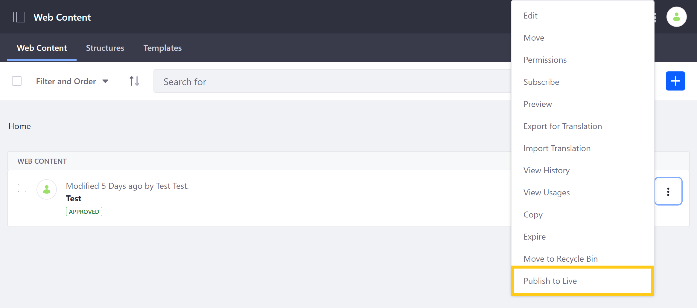

# Publishing Single Assets and Widgets

You can publish single assets and widgets when needed without going through the entire publishing process. This is much faster than publishing all content at once.

## Publishing Single Assets

To publish assets in this way, Users must have the following permissions: *Export/Import Application Info* and *Publish Staging*. See [Managing Staging Permissions](./managing-staging-permissions.md) for more information.

1. Go to *Content & Data* in the *Product* menu and select the content or data type you want to publish.

1. Click on the *Actions* button (  ) for the asset you want to publish and select *Publish to Live*.

   

Once you confirm, you're directed to a process page where you can see the publishing status.

Similar to the standard process, single asset publishing includes associated dependencies: images, custom templates, or folders.

```note::
   Single asset publishing is not supported for page-scoped content.
```

## Publishing Single Widgets

Although Staging is typically used to publish content, you can also publish widgets. For example, you can modify a widget's title and publish the change to Live. This is possible because widget configurations are always staged. To publish a widget that is on a Page, you must publish the Page first.

After changing a widget, you can publish the widget by clicking on the *Actions* button (  ) for the widget and selecting *Staging*.


## Additional Information

* [Staging Overview](./staging-overview.md)
* [Managing Staging Permissions](./managing-staging-permissions.md)
* [Page Versioning](./page-versioning.md)
* [Site Staging UI Reference](./site-staging-ui-reference.md)
