# Site Staging UI Reference

After enabling Local or Remote Live Staging for your Site, most Page configuration options are only accessible in your Staging environment. This prevents Users from directly editing Live Pages.

Also, once staging is enabled, you can access additional options in your Staging environment. These options are in the *Staging bar*, *Publish to Live* menu, and *Staging Page*.

* [Staging Bar](#staging-bar)
* [Publish to Live](#publish-to-live)
* [Staging Page](#staging-page)

## Staging Bar and Editing Tools

When Staging is enabled for a Site, you can access additional options via the Staging bar on each of your Site's Pages. In this bar you can toggle between Staging and Live environments, as well as click on *Publish to Live* for your staged Pages.

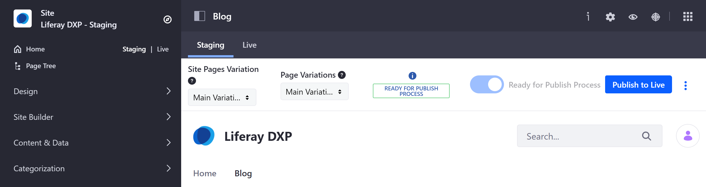

```tip::
   There are differences in the way you work with Widget Pages and Content Pages in a staged Site. To simplify your workflow with Staging, use either Widget Pages or Content Pages.
```

The following table and pictures describe the staging bar options and editing tools:

| Option | Widget Page | Content Page | # |
| --- | --- | --- | --- |
| _Site Pages Variation_ | <ul><li>Toggle between variations of Page sets in your staged Site using the drop-down menu.</li><li>Manage and create Page set variations by clicking on the *Actions* button in the Staging bar and selecting *Site Pages Variation*. See [Page Versioning](./page-versioning.md) for more information.</li></ul> | Same as Widget Pages | 1 |
| _Page Variations_ | <ul><li>Toggle between variations of a single Page in your staged Site using the drop-down menu.</li><li>Manage and create Page variations by clicking on the *Actions* button in the Staging bar and selecting *Page Variations*. See [Page Versioning](./page-versioning.md) for more information.</li></ul> | Not available. To create different versions of a Content Page, use [Experiences](../../../site-building/personalizing-site-experience/experience-personalization/content-page-personalization.md). | 2 |
| _Undo/Redo_ | <ul><li>Click on the *Actions* button  in the Staging bar and select *Undo*/*Redo*.</li><li>Once you've marked a Page as *Ready for Publish Process*, you can't undo or redo recent changes.</li></ul> | <ul><li>From the Content Page editor, revert any action using the *Undo* or *Redo* buttons.</li><li>Once you publish a Page, you can't undo or redo recent changes.</li></ul> | 3 |
| _History_ | <ul><li>Manage the Page revision history by clicking on the *Actions* button in the Staging bar and selecting *History*.</li><li>Revert a Page to an earlier version by clicking on the *Actions* button for the Page version you want to restore and selecting *Mark as Ready for Publishing Process*.</li></ul> | Return to a previous version of your edits using the *History* button. | 4 |
| _Ready for Publish Process_ | <ul><li>Click on *Ready for Publish Process* to change the Page's status from *Draft* to *Ready for Publish Process*.</li><li>Click *Publish to Live* to configure and initiate publishing for your changes.</li><li>When you publish a Page to Live, only the version marked as *Ready for Publish Process* is published.</li></ul> | <ul><li>Not available. Use the Content Page editor's *Publish* button.</li><li>Click *Publish to Live* to configure and initiate publishing for your changes.</li><li>When you publish a Page to Live, the last published version becomes active.</li></ul> | 5 |
| Edit Content | Use the *Add* button in the Liferay application bar to edit your Widgets. | Use the *Edit* button in the Liferay application bar to open the Content Page editor. | 6 |

- Staging Bar and Editing Tools in Widget Pages:

   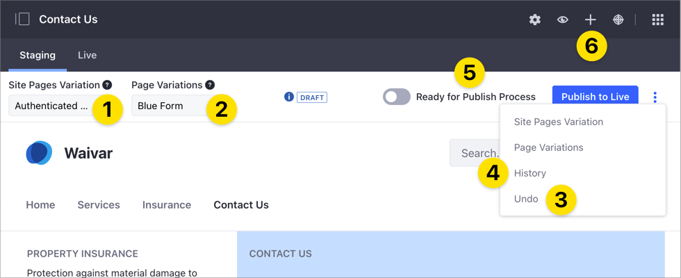

- Staging Bar and Editing Tools in Content Pages:

   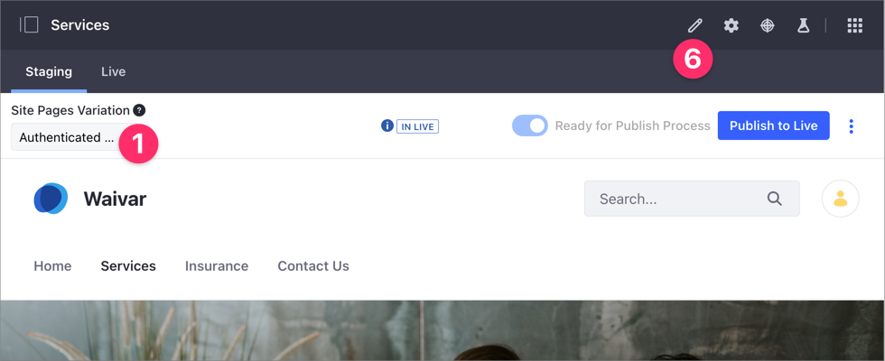

   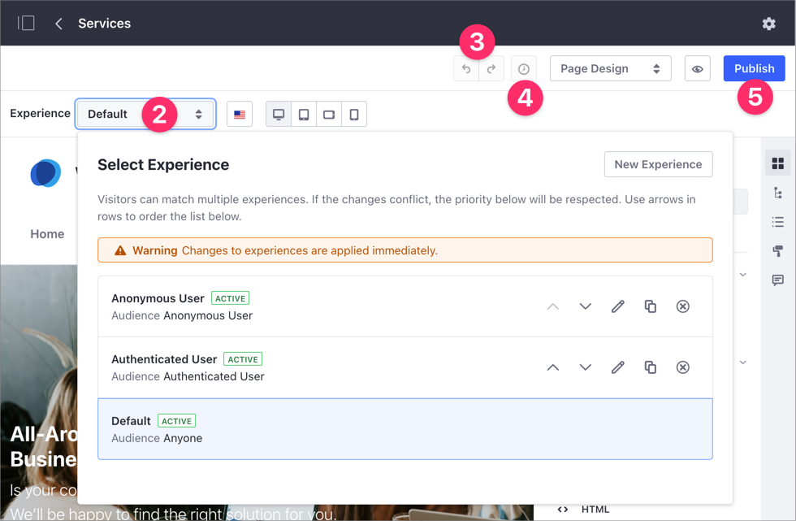

## Publish to Live

When you click on *Publish to Live*, a modal window appears with additional options for configuring your publish process. You can publish using *Simple* or *Advanced* settings.

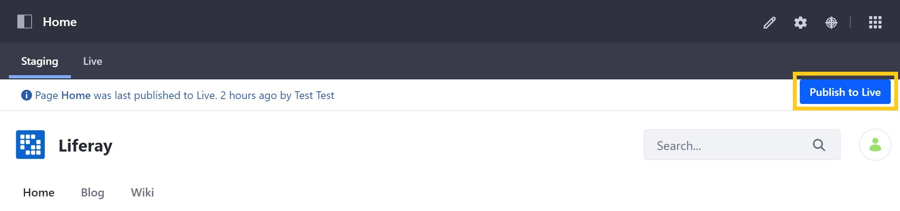

## Simple Publishing

**Name**: Enter a descriptive name for your publish process into the *Name* field.

**Changes Since Last Publish Process**: View staged changes made since your last publish process.

**Pages to Publish**: View the number of Pages included in your current publish process.

```note::
   This displays the number of Page deletions tracked by the Staging framework. Keep in mind that this number counts the Page deletions on the Staging Site, not how many Pages will be deleted on the on the Live Site. There could be an inconsistency between the number of Page deletions to be published and the actual number of Pages present on either of the Staging and Live Sites.
```

When ready, click on *Publish to Live* to initiate publishing.

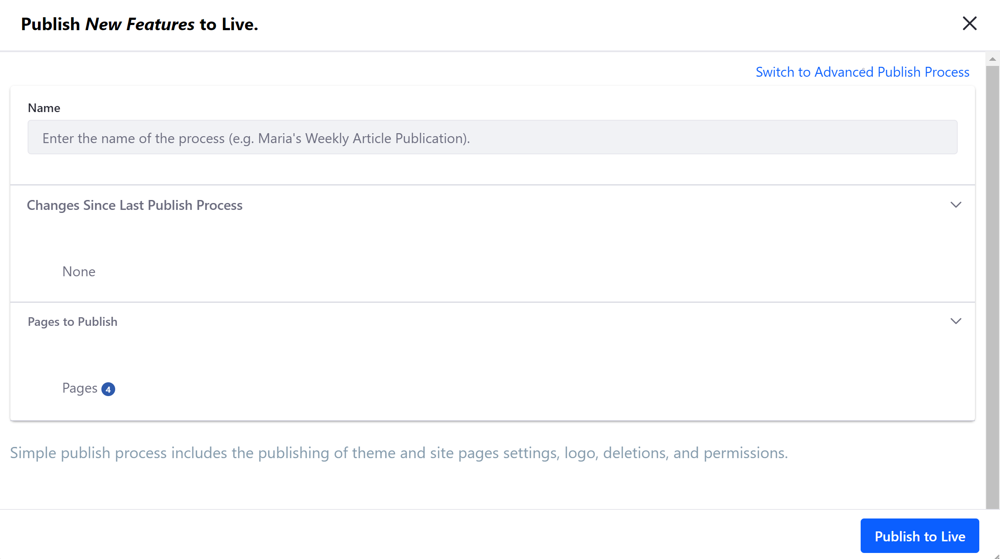

## Advanced Publishing

With Advanced publishing, you can access information and settings that you can use to customize your publish process. In the *Custom* tab, you can specify content, dates, Pages, and more. Alternatively, you click on the *Publish Template* tab to select a pre-configured template for your publish process. To access advanced settings, click on *Switch to Advanced Publish Process* in the modal window.

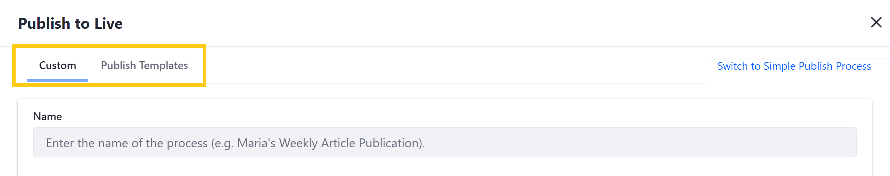

Custom advanced settings are divided into the following sections:

**Name**: Enter a descriptive name for your publish process into the *Name* field.

**Date**: Select whether to publish your changes immediately, or *schedule* your changes to be published at a later date and time. You can also determine whether and how frequently the publish process is repeated.

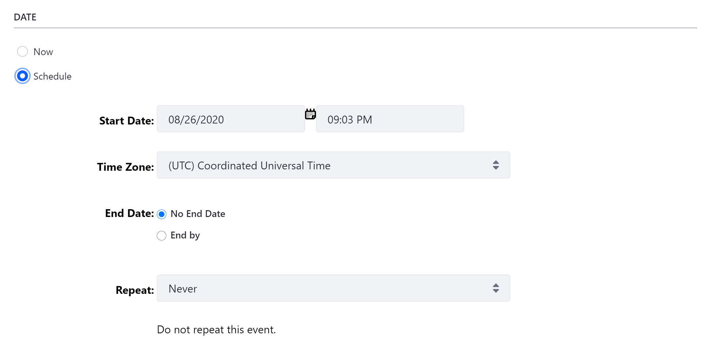

**Deletions**: Select whether you want to *Delete Application Data Before Importing*, and whether you want to *Replicate Individual Deletions*.

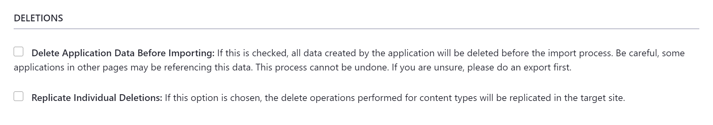

**Pages**: Select which Page set variation and individual Pages you want to publish, as well as the look and feel of your selected Pages. You can also select whether to *Delete Missing Pages*, which deletes all Pages from the Live Site that are not present on the Staging Site. If you choose a Page to be published from the Pages menu, the widgets and their references are always published.

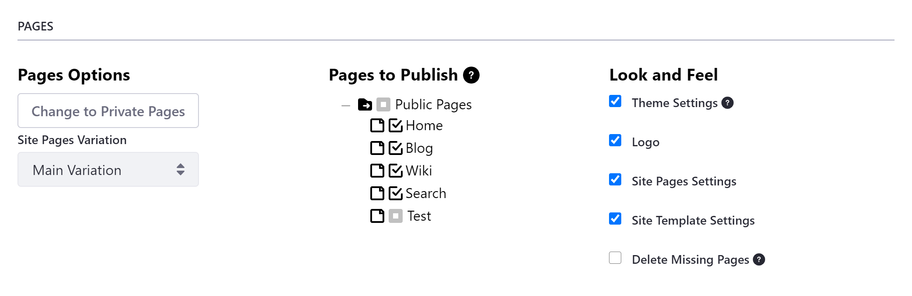

If you want to publish pages with a custom theme, you must check the Theme Settings option under the *Look and Feel* heading for your staging configuration. Otherwise, the default theme is applied.

**Content**: Select the content you want to include in your publish process. Using the radio buttons, you can publish *all* content of the selected types, or specify a date and time parameter to limit the content published. You can also use this option to check the content that changed in Staging and is awaiting publication.

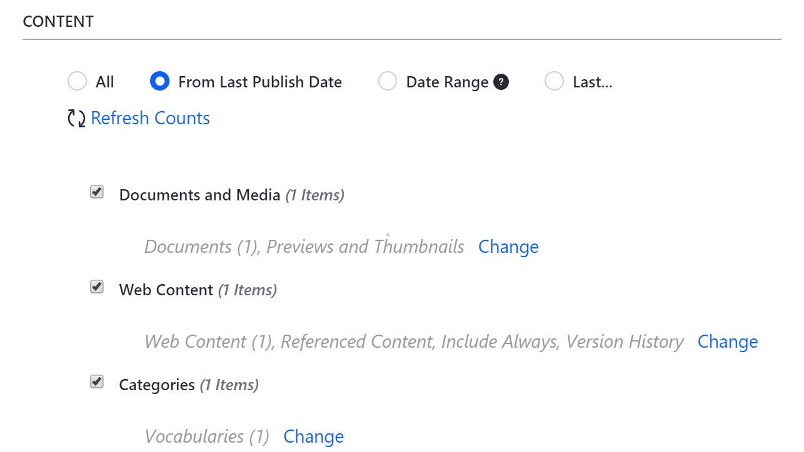

| Option | Description |
| --- | --- |
| *All* | Shows all the content available for publication. |
| *From Last Publish Date* | Only shows the content updated since the last publication. |
| *Date Range* | Shows the content updated during a specific period of time. |
| *Last* | Shows the content updated in the last hours or days. |

```note::
   After selecting your Content option, click *Refresh Counts* to update the number of results.
```

You can also click on *Change* for each content type to manage items and other settings included in each type, such as *version history*, *vocabularies*, and *previews and thumbnails*. See [Managing Data and Content Types in Staging](./managing-data-and-content-types-in-staging.md) for more information.

**Permissions**: Select whether to include permissions for the Pages and widgets when your changes are published.

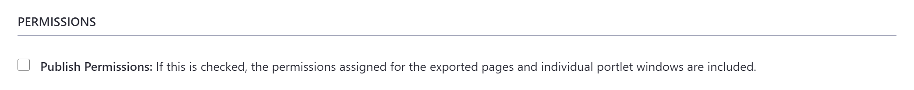

Instead of manually configuring advanced options every time you publish a Page or content, you can save your staging configuration as a [*publish template*](#publish-templates) for future use. To view and select a saved template for your publish process, click on the *Publish Templates* tab.

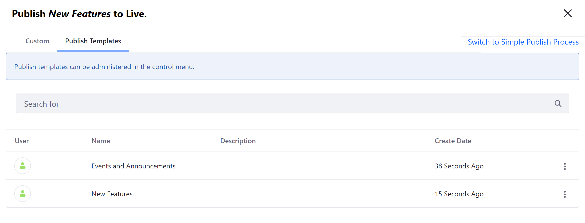

When ready, click on *Publish to Live* to initiate publishing.

## Staging Page

Once you've enabled Staging, the options available from the *Publishing* tab are modified. When in the Live environment, you can only access the *Export* feature. When in the Staging environment, you can only access the *Import* and *Staging* features.

You can also access new options in the Staging Page: view publishing *processes*, create and manage *publish templates*, and modify or disable Staging for your Site.

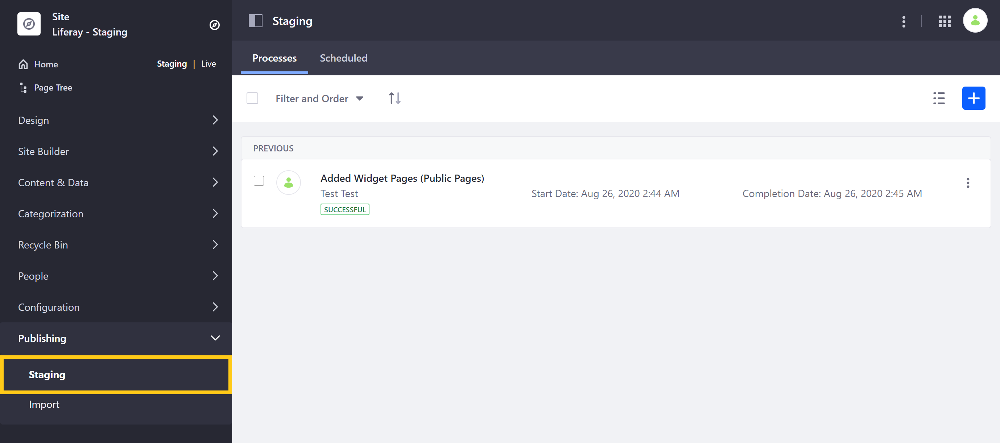

### Previous and Future Publishing Processes

When you publish with Staging, it's captured as a *process* and stored for future reference. To view and manage these processes, go to *Site Menu* &rarr; *Publishing* &rarr; *Staging*.

In the *Processes* tab is a list of staging processes that have been completed. From here, you can *relaunch*, *clear* or view a *summary* of any previous publications by clicking on a process's *Actions* button (  ).

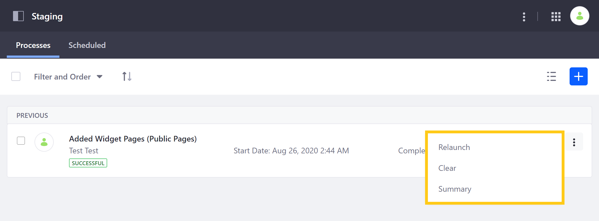

You can also click on the *Add* () button to create a new publish process using a custom configuration or pre-defined publishing template.

In the *Scheduled* tab, you can view all scheduled publishing processes.

### Publish Templates

If you regularly create similar staging configurations, you can create your own *publish templates* to save time. To create a template, click on the *Actions* button (  ) in the *Application* bar of the *Staging* Page. Then, select *Publish Templates*.

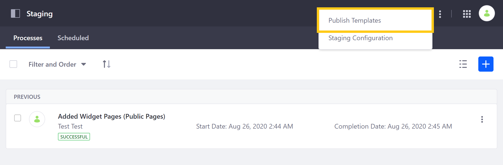

From here, you can create and manage templates for frequent publishing configurations. You can then use a template by clicking on its *Actions* button (  ) and selecting *Publish*.

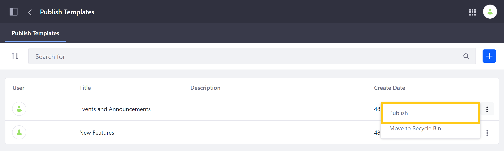

You can also use a template when publishing a Page or content using the *Publish to Live* button in the Staging bar. See [Advanced Publishing](#advanced-publishing) for more information.

### Staging Configuration

After setting up Staging, you can access the Staging Configuration Page by clicking on the *Actions* button (  ) in the *Application* bar of the *Staging* Page. Then, select *Staging Configuration*.

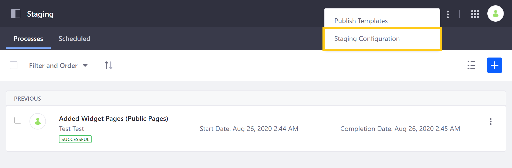

From here, you can disable Staging for your Site, or modify your [Page versioning](page-versioning.md) settings. However, *Staged Content* options cannot be modified after the initial setup.

## Additional Information

* [Staging Overview](./staging-overview.md)
* [Understanding the Publishing Process](./understanding-the-publishing-process.md)
* [Page Versioning](./page-versioning.md)
* [Managing Data and Content Types in Staging](./managing-data-and-content-types-in-staging.md)
