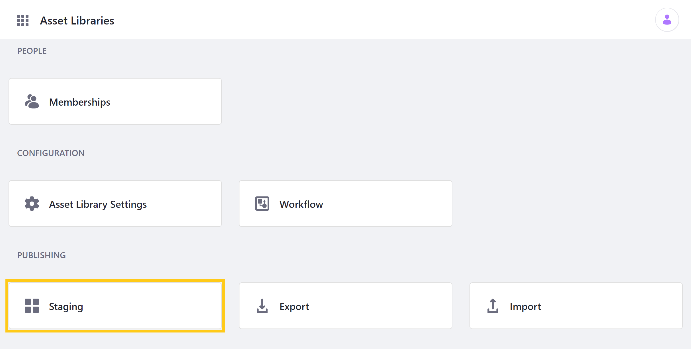
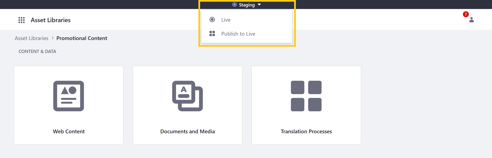

# Using Staging in Asset Libraries

> Staging is supported for Asset Libraries since Liferay DXP 7.4 and 7.3.10 FP1.

Liferay's Staging application is a publishing tool for managing changes on DXP. For Asset Libraries, Staging provides a working environment for adding, removing, and editing assets in the Web Content or Documents and Media applications before making those changes live. You can access the Staging application for an Asset Library via its menu page.



From here, you can enable [Local Live](./configuring-local-live-staging.md) or [Remote Live](./configuring-remote-live-staging.md) Staging for individual Asset Libraries following the same process as you would for a Site. The only difference is that staged content options are limited to the applications enabled for the Asset Library.

```{important}
Asset Libraries with Staging enabled can only be linked with Sites that also have Staging enabled. When Staging is enabled for an Asset Library, existing Site connections are automatically removed if the Site doesn't also have Staging enabled. 
```

Once Staging is enabled for an Asset Library, you can toggle between Live and Staging environments via the Staging bar at the top of the page. While in the Staging environment, you can also access *Publish to Live* to initiate a new publishing process.



Many editing options can only be accessed in the Staging environment. This is to maintain a clear development process and avoid data conflicts due to edits in the Live environment.

When changes are made in the Staging environment, they can then be published all at once, or one at a time. As with [Sites](./site-staging-ui-reference.md#publish-to-live), you can use [simple](./site-staging-ui-reference.md#simple-publishing) or [advanced](./site-staging-ui-reference.md#advanced-publishing) publishing options.

## Additional Information

* [Staging Overview](../staging.md)
* [Asset Libraries Overview](../../../content-authoring-and-management/asset-libraries/asset-libraries-overview.md)
* [Configuring Local Live Staging](./configuring-local-live-staging.md)
* [Configuring Remote Live Staging](./configuring-remote-live-staging.md)
