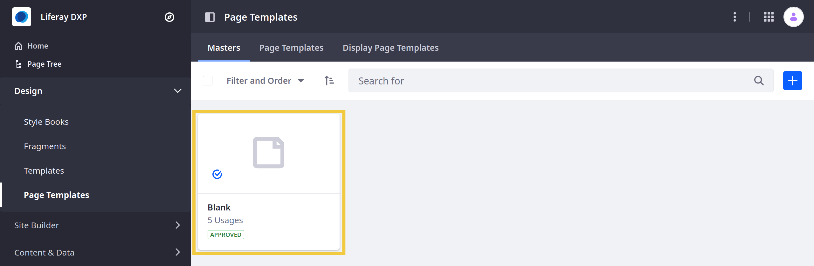
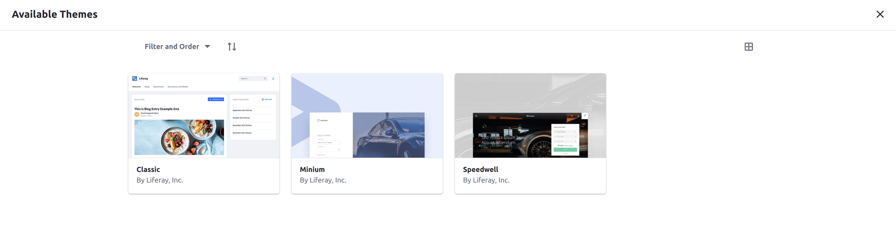

# Site Appearance

The design and functionality of a Liferay site can be adjusted and customized through a variety of complementary mechanisms. This table summarizes and contrasts which Liferay functions and tools can be used to achieve common tasks and goals:

| Features                                | Style Books | Master Page Templates | Themes |
|-----------------------------------------|:-----------:|:---------------------:|:------:|
| Embed common fragments/widgets          |             |           ✓           |    ✓   |
| Define common layouts for pages         |             |           ✓           |    ✓   |
| Managed through the UI                  |      ✓      |           ✓           |        |
| Customize styles, spacing, colors, etc. |      ✓      |                       |    ✓   |
| Add extra functionality                 |             |                       |    ✓   |

## Master Page Templates

[Master Page Templates](../creating-pages/defining-headers-and-footers/master-page-templates.md) allow you to define common elements for your pages using Fragments, especially headers and footers. You can use them to conform any number of pages on your Site to the look and feel you design.

## Style Books

[Style Books](./style-books/using-a-style-book-to-standardize-site-appearance.md) are sets of visual standards that apply to a Site, such as standard colors and spacing. This allows you to design every page's layout independently while maintaining a consistent experience between each of them.

<!--
TODO:

### Style Book Token Definitions

Note how they tie into themes as well (depending on them for definitions), possibly? And then maybe link to developer guide articles? (Unless maybe developer guide material is not good to go into for this overview... then perhaps it'd be better to just briefly reference their reliance on the theme and leave it as that, not even with an H3)
-->

## Widget/Fragment Appearance

Fragments and widgets are the building blocks of your Site. There are many ways to customize them to suit your Site's appearance.

* [Fragment customizations](../developer-guide/developing-page-fragments/developing-fragments-intro.md) can be used to tailor the look and feel of your Site's Fragment Pages
* Application Display Templates<!--Add link when available--> allow you to customize the appearance and behavior of the widgets on your Site

## Themes

[Themes](./themes/introduction-to-themes.md) are a highly flexible tool for customizing the default look and feel of your Site. They provide a foundation that your [Style Books](#style-books) and [Page Templates](../creating-pages/adding-pages/creating-a-page-template.md) build on top of. Widgets can also be embedded in the themes themselves to ensure a particular arrangement.

