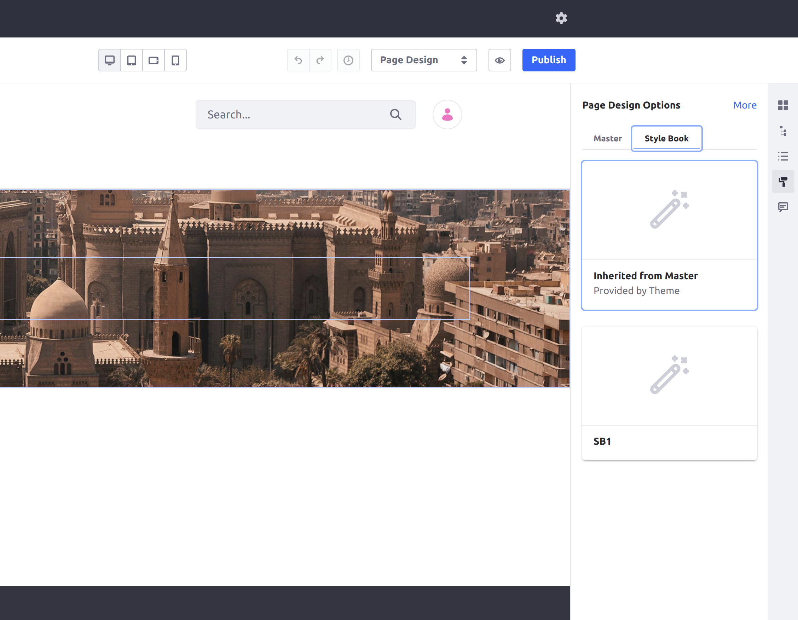
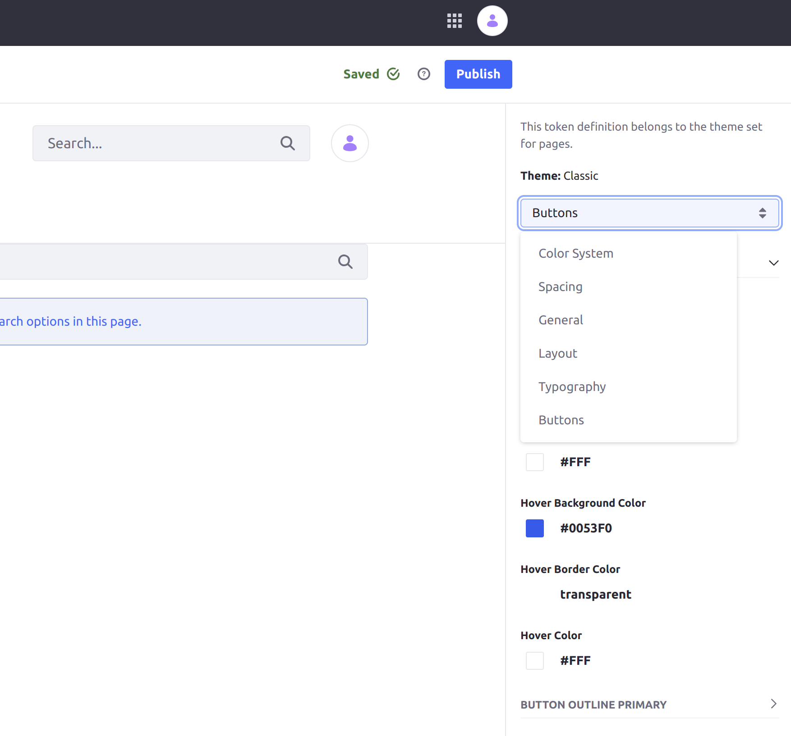
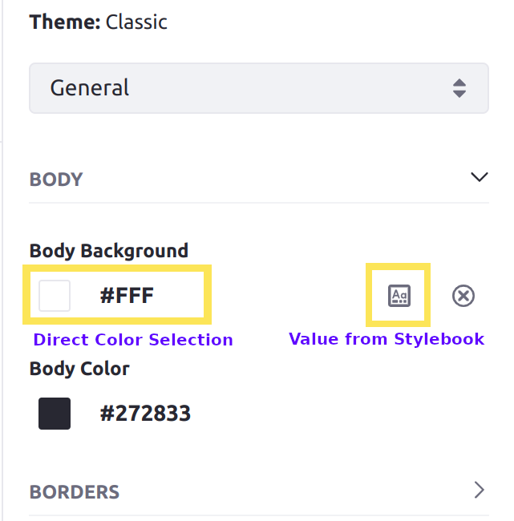
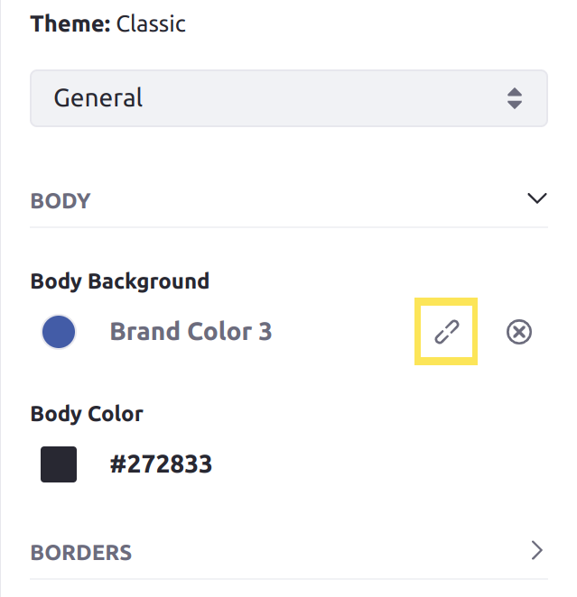

# Using a Style Book to Standardize Site Appearance

A *Style Book* is a set of visual rules that apply to a Site to provide a consistent experience across its pages. They determine various visual settings on the Site, including spacing between elements (such as widgets), colors, and fonts. Each of these settings applies equally to every page using the Style Book.

The theme you assign to your Site's Public Pages determines the categories of settings available to the Style Books for your Site. Developers can customize the categories with new options for configuring Style Books. See [Style Book Token Definitions](./developer-guide/style-book-token-definitions.md) for more information.

## Choosing a Style Book for a Page

If you do not choose a specific Style Book for a page, the page uses the Style Book for the [Master Page](../../creating-pages/defining-headers-and-footers/master-page-templates.md). If neither are set, the page uses the default Style Book for the Site. 

Follow these steps to set any page's Style Book: 

1. Click *Edit* () near the top of the page.

1. Click *Page Design Options* () on the sidebar.

1. Click to open the *Style Book* tab.

    

1. Select the desired Style Book from the list.

1. Click *Publish*.

The page is published using the new Style Book.

## Creating a New Style Book

1. Navigate to the *Site Menu* &rarr; *Design* &rarr; *Style Books*.

1. Click *Add* () near the top of the page.

1. Enter a name for the Style Book and click *Save*.

1. Change the options from the categories in the drop-down box in the menu on the right side of the screen.

   

   These options come from the theme being used for your Site. See the [default Classic theme categories](#default-classic-theme-categories) for more information on the categories available for the default Classic theme.

1. Click *Publish*.

The Style Book can now be selected as an option for any page when editing.

To make this Style Book the new default for your Site, open the Actions menu () beside the newly created Style Book and click *Mark as Default*.

## Default Classic Theme Categories

When you are editing a Style Book, the categories available from the drop-down box show different options for styling your pages.

```tip::
   You can place the ``Style Guide Sample`` widget on your pages to help test out the various options in your Style Book categories. This sample widget contains many different UI elements that leverage most of the features in the Classic theme, so you can use it to test your page styles. 
```

The categories listed here are available as options for the Classic theme.

### Color System

The colors used for fonts and visual elements defined in your theme are customizable in the Color System category. Generally, this means you can modify the body, background, and text colors on your pages.



```note::
   Changing the colors for alert-related elements (such as *Success* or *Warning*) may not affect the color of incoming alerts on your Site because each type of alert may use one of many colors. To fully customize the color of alerts, you must define customizable colors and use them in your own theme's categories.
```

### Spacing

Adjust the spacing between the main elements on your pages with the options in the Spacing category.

### General

These options modify color and spacing on elements that appear on every page of your Site. For example, the *Body Background* option changes the background color of all pages.



### Layout

These options modify the width of containers on your pages. For example, the default container on new Blank pages is configurable via the size of the Extra Large setting.

### Typography

These options define new fonts for your pages. You can also adjust the size of headers via the options in this category.

### Buttons

These options modify the style for the default types of buttons. You can customize the background, foreground, and border colors for each of the buttons used in the Classic theme.


## Additional Information

* [Style Book Token Definitions](./developer-guide/style-book-token-definitions.md)
* [Adding a New Token Set for Your Style Book](./developer-guide/adding-a-new-token-set-for-your-style-book.md)
