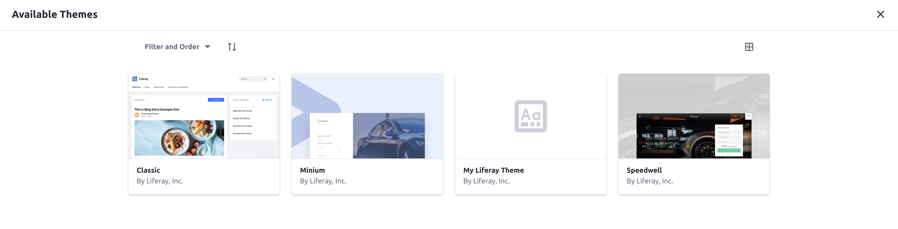
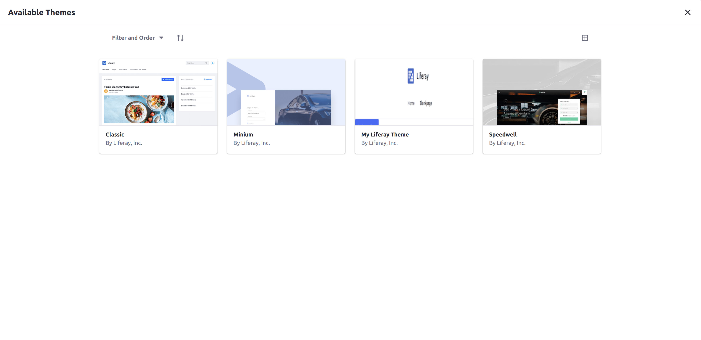

# Bundling a Thumbnail Preview into Your Theme

A theme's thumbnail is the visual representation of how the theme looks when it is applied to a Site. The thumbnail is shown in the theme selection menu when you choose a theme for a Site's Public Pages. A custom theme with no thumbnail set has a placeholder image.



## Adding the Thumbnail

Follow these steps to create a thumbnail and bundle it in your theme:

1. Take a screenshot of your theme to use for the thumbnail.

1. Save the image with the name `thumbnail.png` in your theme's `src/images/` folder. If this folder doesn't exist yet, create it.

1. Redeploy your theme:

    ```bash
    gulp deploy
    ```

1. Confirm the deployment in the liferay logs.

    ```
    STARTED my-liferay-theme_1.0.0
    ```

1. Once the theme is deployed, navigate to the Site Menu &rarr; *Site Builder* &rarr; *Pages*, then click on the configuration icon () to configure the Site's Public Pages.

1. Click the *Change Current Theme* button to view all available themes with their thumbnails and verify the change.



```note::
   You may need to clear your browser's cache for the new thumbnail to display on the screen.
```

The chosen file now displays in the theme selection screen as the thumbnail.
