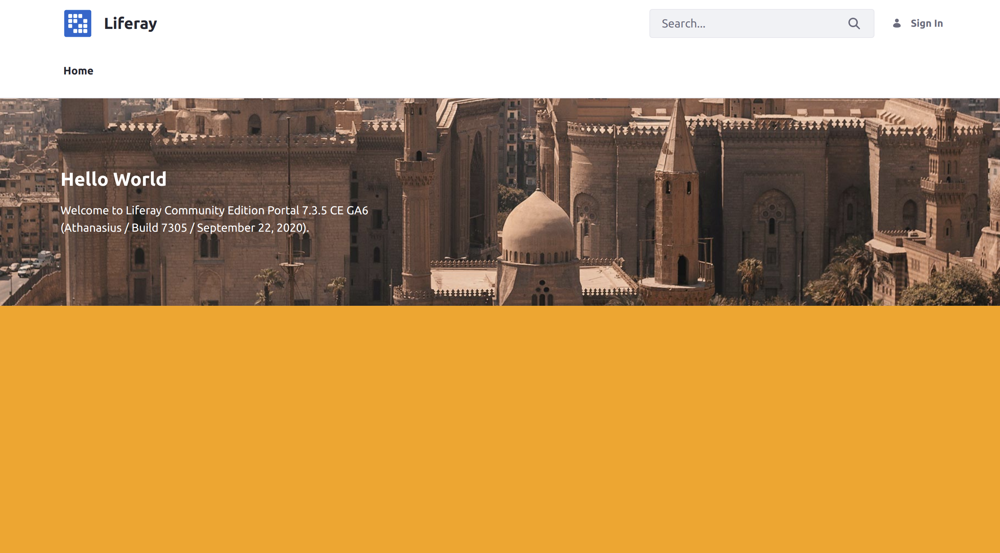

# Bundling Independent UI Resources via Theme Contributors

Theme contributors are modules that contain CSS and JavaScript resources and apply them to every page. They are independent from specific themes, and you can configure them to override specific styles from themes or even each other. Use [themelets](./bundling-and-installing-resources-into-your-theme-via-themelets.md) instead if you want to include separate UI resources on a page and include them in specific themes.

Many menus in Liferay Portal/DXP are packaged as theme contributors, such as the [Site Menu](../../../../../getting-started/navigating-dxp.md#site-menu).


If you want to edit or style standard UI components like the Site Menu, then you must deploy your changes with a theme contributor. You can also add new UI components or styles using theme contributors.

## Deploy a Simple Theme Contributor

Start by deploying the example theme contributor.

1. Download and unzip the example.

    ```bash
    curl https://learn.liferay.com/dxp/latest/en/site-building/site-appearance/themes/theme-development/bundling-resources/bundling-independent-ui-resources-via-theme-contributors/liferay-w9m6.zip -O
    ```

    ```bash
    unzip liferay-w9m6.zip
    ```

1. Start a [Liferay Docker container](../../../../../installation-and-upgrades/installing-liferay/using-liferay-docker-images.md).

    ```bash
    docker run -it -m 8g -p 8080:8080 [$LIFERAY_LEARN_DXP_DOCKER_IMAGE$]
    ```

1. Build and deploy the example.

    ```bash
    cd liferay-w9m6
    ```

    ```bash
    ./gradlew deploy -Ddeploy.docker.container.id=$(docker ps -lq)
    ```

    ```{note}
    This command is the same as copying module JARs to `/opt/liferay/osgi/modules` on the Docker container.
    ```

1. Confirm the deployment in the Docker container console.

    ```
    STARTED com.acme.w9m6.web_1.0.0
    ```

1. Verify that the theme contributor changed your Site's background color. Open your browser to `https://localhost:8080` and confirm that the Liferay home page's background is now blue.


Congratulations, you've successfully built and deployed a new theme contributor.

Next, you'll learn how a theme contributor looks with custom CSS changes.

## Examine the Example Theme Contributor

A theme contributor is an OSGi module, and must have properties in its `bnd.bnd` file. Customizations are then added in the `resources` folder. The example theme contributor uses a `custom.css` file to change each page's background color.

### Examine the Theme Contributor Properties

The theme contributor's project has the necessary properties added to its `bnd.bnd` file to configure it.

```{literalinclude} ./bundling-independent-ui-resources-via-theme-contributors/resources/liferay-w9m6.zip/w9m6-web/bnd.bnd
```

A theme contributor's `bnd.bnd` file must have these properties for it to function:

`Web-ContextPath`: sets the context for your theme contributor's resources. In the example module, the context path is `w9m6-web`.

`Liferay-Theme-Contributor-Type`: indicates that your module adds a theme contributor. This property can be any arbitrary value. The example module uses the value `CSS`.

`Liferay-Theme-Contributor-Weight`: configures the weight of your theme contributor's styles versus other contributors. Lower values are given higher priority to override styles from other contributors. The example module uses a weight of `1` to guarantee that the style has the highest priority of any theme contributor.

Once the `bnd.bnd` file has the necessary properties, the module needs only have the desired customizations.

### Examine the Style Customizations

Any desired CSS or JavaScript files must be added to subfolders within the module. CSS files belong in a `src/main/resources/META-INF/resources/css/` subfolder, and JavaScript files belong in a `src/main/resources/META-INF/resources/js/` subfolder.

The example theme contributor uses a simple CSS style change to make each page's background blue. This is done with a [`custom.css`](./bundling-independent-ui-resources-via-theme-contributors/resources/liferay-w9m6.zip/w9m6-web/src/main/resources/META-INF/resources/custom.css) file in `src/main/resources/META-INF/resources/`:

```css
body, #wrapper {
    background: blue;
}
```

Once all of the desired CSS or JavaScript files are added to the correct subfolders, deploying the module applies them to every page.

## Change the Background Color

Now to see how the theme contributor affects your pages, try changing the background color.

1. Open `src/main/resources/META-INF/resources/css/custom.css` in your project.

1. Change the `background` color property to another color, like `orange`:

    ```css
    body, #wrapper {
        background: orange;
    }
    ```

1. Build and deploy the example again to your running Docker container:

    ```bash
    ./gradlew deploy -Ddeploy.docker.container.id=$(docker ps -lq)
    ```

1. Confirm the deployment in the Docker container console.

    ```
    STARTED com.acme.w9m6.web_1.0.0
    ```

1. Verify that the theme contributor changed your Site's background to the new color. Open your browser to `https://localhost:8080` to confirm the change.



## Conclusion

Congratulations! You've created a theme contributor with a CSS style change. You can also apply specific style changes to your Site's pages with [Style Books](../../../style-books/using-a-style-book-to-standardize-site-appearance.md).

## Additional Information

* [Bundling and Installing Resources into Your Theme via Themelets](./bundling-and-installing-resources-into-your-theme-via-themelets.md)
* [Introduction to Themes](../../introduction-to-themes.md)
* [Using a Style Book to Standardize Site Appearance](../../../style-books/using-a-style-book-to-standardize-site-appearance.md)
