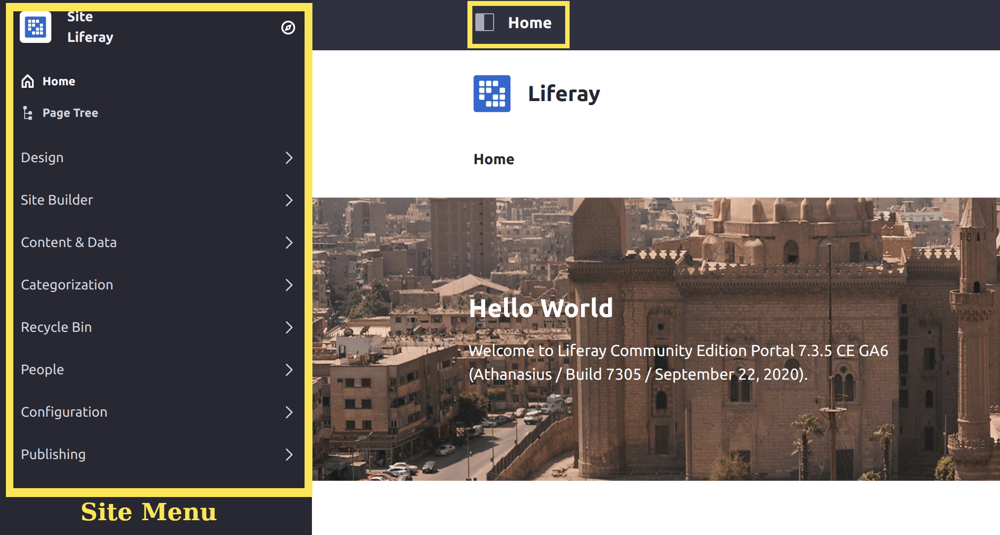
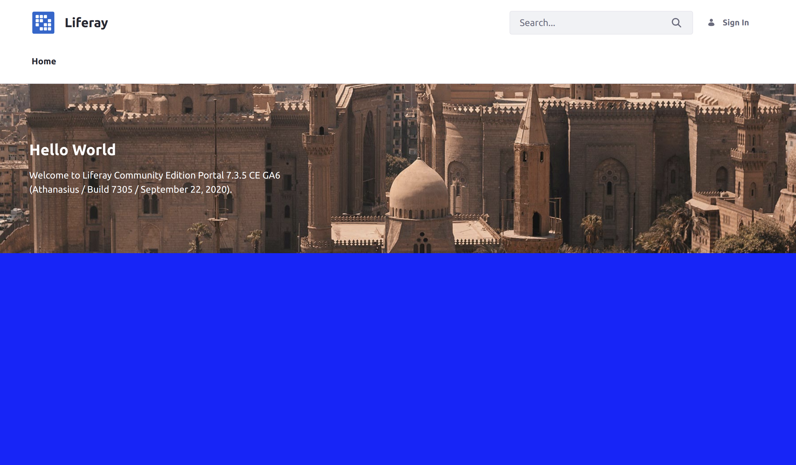

# Bundling Independent UI Resources via Theme Contributors

Theme contributors are modules that contain CSS and JS resources and apply them to every page. They are independent from specific themes, and you can configure them to override specific styles from themes or even each other. Use [themelets](./bundling-and-installing-resources-into-your-theme-via-themelets.md) instead if you want to include separate UI resources on a page and include them in specific themes.

Many menus in Liferay Portal/DXP are packaged as theme contributors, such as the [Site Menu](../../../../../getting-started/navigating-dxp.md#site-menu).



If you want to edit or style standard UI components like the Site Menu, then you must deploy your changes with a theme contributor. You can also add new UI components or styles using theme contributors.

## Deploy a Simple Theme Contributor

Start by deploying the example theme contributor.

1. Download and unzip the example.

    ```bash
    curl https://learn.liferay.com/dxp/latest/en/site-building/site-appearance/themes/theme-development/bundling-resources/bundling-independent-ui-resources-via-theme-contributors/liferay-w9m6.zip -O
    ```

    ```bash
    unzip liferay-w9m6.zip
    ```

1. Start a [Liferay Docker container](../../../../../installation-and-upgrades/installing-liferay-using-liferay-docker-images/docker-container-basics.md).

    ```bash
    docker run -it -m 8g -p 8080:8080 [$LIFERAY_LEARN_DXP_DOCKER_IMAGE$]
    ```

1. Build and deploy the example.

    ```bash
    cd liferay-w9m6
    ```

    ```bash
    ./gradlew deploy -Ddeploy.docker.container.id=$(docker ps -lq)
    ```

    ```{note}
    This command is the same as copying module JARs to `/opt/liferay/osgi/modules` on the Docker container.
    ```

1. Confirm the deployment in the Docker container console.

    ```bash
    STARTED com.acme.w9m6.web_1.0.0
    ```

1. Verify that the theme contributor changed your Site's background color. Open your browser to `https://localhost:8080` and confirm that the Liferay home page's background is now blue.



Congratulations, you've successfully built and deployed a new theme contributor.

Next, you'll learn how to create a theme contributor with custom CSS or JS changes.

## How to Create a Theme Contributor

To create a theme contributor, you must add properties to a module's `bnd.bnd` file, and then add your customizations to the module.

### Add Properties to Configure the Theme Contributor

In the project's `bnd.bnd` file, add the necessary properties to configure the theme contributor.

1. Add a `Web-ContextPath` value to set the context for your theme contributor's resources. In the example module, the context path is `w9m6-web`.

    ```
    Web-ContextPath: /w9m6-web
    ```

1. Add a `Liferay-Theme-Contributor-Type` value to indicate that your module adds a theme contributor. This property can be any arbitrary value.

    ```
    Liferay-Theme-Contributor-Type: CSS
    ```

1. Add a `Liferay-Theme-Contributor-Weight` value to configure the weight of your theme contributor's styles versus other contributors. Lower values are given higher priority to override styles from other contributors. The example module uses a weight of `1` to guarantee that the style has the highest priority.

    ```
    Liferay-Theme-Contributor-Weight: 1
    ```

Once you have added the necessary properties to your `bnd.bnd` file, you only need to add your desired customizations to the module.

### Add Your Style Customizations

Add any desired CSS or JS files to subfolders within your module. Add a `src/main/resources/META-INF/resources/css/` subfolder for any CSS files, and add a `src/main/resources/META-INF/resources/js/` subfolder for any JS files.

This example uses a simple CSS style change to make each page's background blue. This is done with a [`custom.css`](./bundling-independent-ui-resources-via-theme-contributors/resources/liferay-w9m6.zip/w9m6-web/src/main/resources/META-INF/resources/custom.css) file in `src/main/resources/META-INF/resources/`:

```css
body, #wrapper {
    background: blue;
}
```

Once you have added your changes with the desired styles or UI elements to the correct subfolders, deploying your module applies them to every page.

## Conclusion

Congratulations! You've created a theme contributor with a CSS style change. You can also apply specific style changes to your Site's pages with [Style Books](../../../style-books/using-a-style-book-to-standardize-site-appearance.md).

## Additional Information

* [Bundling and Installing Resources into Your Theme via Themelets](./bundling-and-installing-resources-into-your-theme-via-themelets.md)
* [Introduction to Themes](../../introduction-to-themes.md)
* [Using a Style Book to Standardize Site Appearance](../../../style-books/using-a-style-book-to-standardize-site-appearance.md)