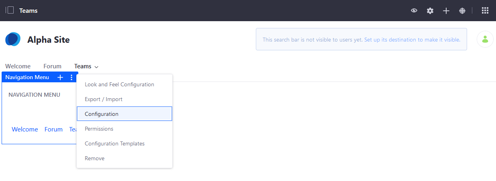
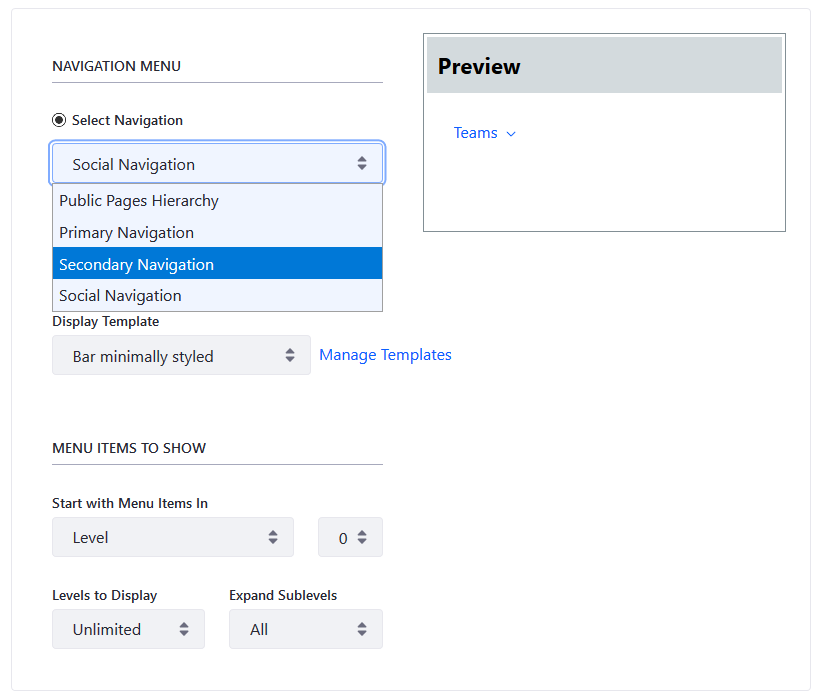
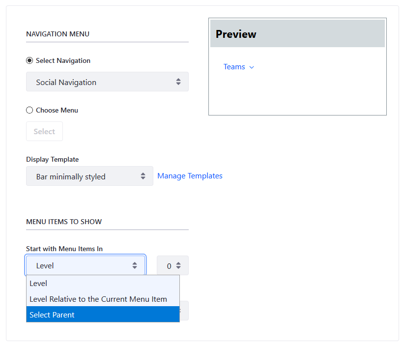

# Configuring Navigation Menus

Below are all the options possible in the Navigation Menu widget. To access the Configuration menu, click  at the top of the navigation menu widget.

## Navigation Menu

Select the desired navigation menu type; the desired navigation menu type appears in the Preview box.

| Navigation Menu Type | Description |
| --- | --- |
| **Public Pages Hierarchy** | Public Pages Hierarchy is based on the default hierarchy in the Site Builder. |
| **Primary Navigation** | Primary Navigation is the main navigation for a page. |
| **Secondary Navigation** | Secondary Navigation is a second level of navigation, possibly a sidebar or a separate menu within a page. |
| **Social Navigation** | Social Navigation is for menus that contain links for sharing content on social media or similar tasks. |

Alternately, you can choose a navigation menu by clicking the _Select_ button.

## Display Templates

You can select a [Widget Template](../displaying-content/additional-content-display-options/styling-widgets-with-widget-templates.md) for navigation menus:

| Display Template | Description |
| --- | --- |
| **List Menu** | Displays all the items in a vertical list. |
| **Pills Horizontal** | Displays the items horizontally and uses a button style for highlighting. |
| **Pills Justified** | Like Pills Horizontal, but pads the items to fill out the horizontal space. |
| **Pills Stacked** | A vertical version of the pills style. |
| **Tabs** | Displays the items like navigation tabs. |
| **Tabs Justified** | Navigation tabs that fill horizontal space. |
| **Bar Minimally Styled** | A lightweight version of the default display that you see in the embedded menu on your page. |
| **Bar Minimally Justified Styled** | Like Bar Minimally Styled with horizontal padding. |
| **Bar Default Styled** | The default embedded menu. |
| **Split Button Dropdowns** | Displays each item as a button with a dropdown  for multiple navigation levels. |

## Menu Items to Show

You can configure which pages at what level from the menu appear in the widget. You can choose the starting level, how many levels deep to display, and how to display sub-levels.

| Field | Description |
| --- | --- |
| **Start with Menu Items In** | Select the type of Level: _Level_, _Level Relative to the Current Menu Item_, or _Select Parent_.  |
| **Number of Levels** | Select the level number to display, from 0 to 4. Level 0 represents the parent page, Level 1 represents the first level child page, and so forth. |
| **Levels to Display:** | Select the number of levels to display in the navigation, from 1 down to Unlimited. |
| **Expand Sublevels:** | Select _Auto_ or _All_ from this dropdown menu; this determines if hovering the mouse over the navigation reveals navigation levels one at a time automatically or all the levels at once. |

## Additional Information

* [Using Navigation Menus](./using-navigation-menus.md)
* [Managing Site Navigation](./managing-site-navigation.md)
