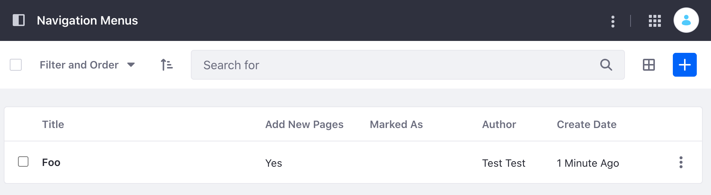

# Navigation Menu API Basics

Liferay's REST APIs provide services for Liferay's navigation menus. You can create and edit navigation menus with the API. Start by seeing an example of adding a new navigation menu.

## Adding a Navigation Menu

```{include} /_snippets/run-liferay-dxp.md
```

Then, follow these steps:

1. Download and unzip [Categories and Vocabulary API Basics](./liferay-p7s4.zip).

   ```bash
   curl https://learn.liferay.com/dxp/latest/en/site-building/site-navigation/developer-guide/liferay-p7s4.zip -O
   ```

   ```bash
   unzip liferay-p7s4.zip
   ```

2. [Find your site's ID](../../../headless-delivery/consuming-apis/consuming-rest-services.md#identify-the-site-containing-the-data). You'll use this in different service calls below.

3. Use the cURL script to add a new navigation menu to your Site. On the command line, navigate to the `curl` folder. Execute the `NavigationMenu_POST_ToSite.sh` script with your site ID as a parameter.

    ```bash
    ./NavigationMenu_POST_ToSite.sh 1234
    ```

    The JSON response shows a new navigation menu has been added:

    ```bash
    "creator" : {
    "additionalName" : "",
    "contentType" : "UserAccount",
    "familyName" : "Test",
    "givenName" : "Test",
    "id" : 20129,
    "name" : "Test Test"
    },
    "dateCreated" : "2021-09-09T21:41:31Z",
    "dateModified" : "2021-09-09T21:41:31Z",
    "id" : 40131,
    "name" : "Foo",
    "navigationMenuItems" : [ ],
    "siteId" : 20125

    ```

4. Go to the Navigation Menus application by navigating to *Administration Menu* &rarr; *Site Builder* &rarr; *Navigation Menus*. See that a new navigation menu has been added.

    

5. The REST service can also be called using the Java client. Navigate out of the `curl` folder and into the `java` folder. Compile the source files with the following command:

    ```bash
    javac -classpath .:* *.java
    ```

6. Run the `NavigationMenu_POST_ToSite` class with the following command. Replace the `siteId` value with your site's ID:

    ```bash
    java -classpath .:* -DsiteId=1234 NavigationMenu_POST_ToSite
    ```

## Examine the cURL Command

The `NavigationMenu_POST_ToSite.sh` script calls the REST service with a cURL command.

```{literalinclude} ./navigation-menu-api-basics/resources/liferay-p7s4.zip/curl/NavigationMenu_POST_ToSite.sh
    :language: bash
```

Here are the command's arguments:

| Arguments | Description |
| :--- | :--- |
| `-H "Content-Type: application/json"` | Indicates that the request body format is JSON. |
| `-X POST` | The HTTP method to invoke at the specified endpoint |
| `"http://localhost:8080/o/headless-delivery/v1.0/sites/${1}/navigation-menus"` | The REST service endpoint |
| `-d "{\"name\": \"Foo\"}"` | The data you are requesting to post |
| `-u "test@liferay.com:learn"` | Basic authentication credentials |

```{note}
Basic authentication is used here for demonstration purposes. For production, you should authorize users via `OAuth2 <../../../installation-and-upgrades/securing-liferay/configuring-sso/using-oauth2/introduction-to-using-oauth2.md>`_.
```

The other cURL commands use similar JSON arguments.

## Examine the Java Class

The `NavigationMenu_POST_ToSite.java` class adds a navigation menu by calling the navigation menu related service.

```{literalinclude} ./navigation-menu-api-basics/resources/liferay-p7s4.zip/java/NavigationMenu_POST_ToSite.java
   :dedent: 1
   :language: java
   :lines: 9-27
```

This class invokes the REST service using only three lines of code:

| Line (abbreviated) | Description |
| :----------------- | :---------- |
| `NavigationMenuResource.Builder builder = ...` | Gets a `Builder` for generating a `NavigationMenuResource` service instance. |
| `NavigationMenuResource navigationMenuResource = builder.authentication(...).build();` | Specifies basic authentication and generates a `NavigationMenuResource` service instance. |
| `NavigationMenu navigationMenu = navigationMenuResource.postSiteNavigationMenu(...);` | Calls the `navigationMenuResource.postSiteNavigationMenu` method and passes the data to post. |

Note that the project includes the `com.liferay.headless.delivery.client.jar` file as a dependency. You can find client JAR dependency information for all REST applications in the API explorer in your installation at `/o/api`.

```{note}
The ``main`` method's comment demonstrates running the class.
```

The other example Java classes are similar to this one, but call different `NavigationMenuResource` methods.

```{important}
See [NavigationMenuResource](https://github.com/liferay/liferay-portal/blob/[$LIFERAY_LEARN_PORTAL_GIT_TAG$]/modules/apps/headless/headless-delivery/headless-delivery-client/src/main/java/com/liferay/headless/delivery/client/resource/v1_0/NavigationMenuResource.java) for service details.
```

Below are examples of calling other `NavigationMenu` REST services using cURL and Java.

## Get Navigation Menus from Site

You can list a site's navigation menus by executing the following cURL or Java command. As above, replace `1234` with your site's ID.

### NavigationMenus_GET_FromSite.sh

Command:

```bash
./NavigationMenus_GET_FromSite.sh 1234
```

Code:

```{literalinclude} ./navigation-menu-api-basics/resources/liferay-p7s4.zip/curl/NavigationMenus_GET_FromSite.sh
   :language: bash
```

### NavigationMenus_GET_FromSite.java

Command:

```bash
java -classpath .:* -DsiteId=1234 NavigationMenus_GET_FromSite
```

Code:

```{literalinclude} ./navigation-menu-api-basics/resources/liferay-p7s4.zip/java/NavigationMenus_GET_FromSite.java
   :dedent: 1
   :language: java
   :lines: 11-25
```

The site's `NavigationMenu` objects are listed in JSON.

## Get a Navigation Menu

Get a specific navigation menu with the following cURL or Java command. Replace `1234` with the navigation menu's ID.

```{tip}
Use ``NavigationMenus_GET_FromSite.[java|sh]`` to get ``NavigationMenu`` IDs.
```

### NavigationMenu_GET_ById.sh

Command:

```bash
./NavigationMenu_GET_ById.sh 1234
```

Code:

```{literalinclude} ./navigation-menu-api-basics/resources/liferay-p7s4.zip/curl/NavigationMenu_GET_ById.sh
   :language: bash
```

### NavigationMenu_GET_ById.java

Command:

```bash
java -classpath .:* -DnavigationMenuId=1234 NavigationMenu_GET_ById
```

Code:

```{literalinclude} ./navigation-menu-api-basics/resources/liferay-p7s4.zip/java/NavigationMenu_GET_ById.java
   :dedent: 1
   :language: java
   :lines: 9-22
```

The `NavigationMenu` fields are listed in JSON.

## Put a Navigation Menu

Do a complete overwrite of an existing navigation menu with the following cURL and Java commands. Note, replace `1234` with your navigation menu's ID.

### NavigationMenu_PUT_ById.sh

Command:

```bash
./NavigationMenu_PUT_ById.sh 1234
```

Code:

```{literalinclude} ./navigation-menu-api-basics/resources/liferay-p7s4.zip/curl/NavigationMenu_PUT_ById.sh
   :language: bash
```

### NavigationMenu_PUT_ById.java

Command:

```bash
java -classpath .:* -DnavigationMenuId=1234 NavigationMenu_PUT_ById
```

Code:

```{literalinclude} ./navigation-menu-api-basics/resources/liferay-p7s4.zip/java/NavigationMenu_PUT_ById.java
   :dedent: 1
   :language: java
   :lines: 9-27
```

## Delete a Navigation Menu

Delete an existing navigation menu with the following cURL and Java commands. Note, replace `1234` with your navigation menu's ID.

### NavigationMenu_DELETE_ById.sh

Command:

```bash
./NavigationMenu_DELETE_ById.sh 1234
```

Code:

```{literalinclude} ./navigation-menu-api-basics/resources/liferay-p7s4.zip/curl/NavigationMenu_DELETE_ById.sh
   :language: bash
```

### NavigationMenu_DELETE_ById.java

Command

```bash
java -classpath .:* -DnavigationMenuId=1234 NavigationMenu_DELETE_ById
```

Code:

```{literalinclude} ./navigation-menu-api-basics/resources/liferay-p7s4.zip/java/NavigationMenu_DELETE_ById.java
   :dedent: 1
   :language: java
   :lines: 8-18
```

The [API Explorer](../../../headless-delivery/consuming-apis/consuming-rest-services.md) lists all of the `NavigationMenu` services and schemas and has an interface to try out each service.
