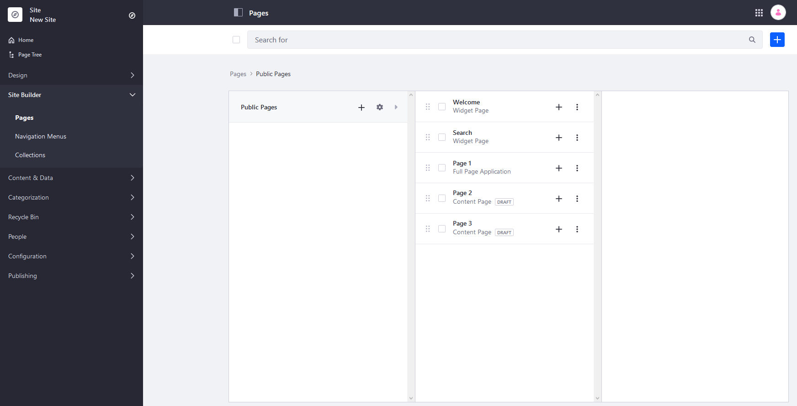
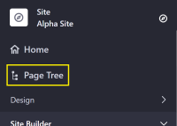
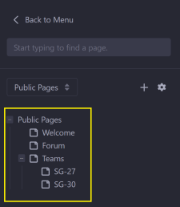

# Managing Site Navigation

Liferay provides powerful tools for creating and organizing pages. You can build everything from a simple, flat Site navigation to a complex hierarchical tree of sub-pages nested down many levels.

By default, there is a defined page hierarchy to organize your pages. However, you can also create a _Navigation Menu_ that is separate from your page hierarchy. Using these Navigation Menus, you can create a one-off landing page or even multiple navigation menus: a main menu, secondary menus, footer menus, and custom menus.

```{note}
In DXP 7.3+, if you want to create a Navigation Menu to use across multiple Sites, you can use Navigation Menus created in the Global Site. Note that Global Navigation Menus cannot include menu items that require Site-specific information (such as the "page" type).
```

Menus can differ by page: landing pages can show a simple list of frequently visited pages, and the rest can appear in secondary navigation. You can also create specific menus for different landing pages to direct visitors to relevant content.

The Site Builder menu is where you can create and organize your pages and Navigation Menus.

## Managing Pages

The hierarchy as displayed on _Site Builder_ &rarr; _Pages_ menu is the main reference for the organization of pages on that Site. While Navigation Menus are customized to show some of the pages, this menu is always the primary reference for the pages on your Site.



New pages are created on the _Site Builder_ &rarr; _Pages_ menu. See [Adding a Page to a Site](../creating-pages/adding-pages/adding-a-page-to-a-site.md) to learn how to add a Page.

## Using Navigation Menus

See [Using the Navigation Menu Application](./using-the-navigation-menus-application.md) to learn how to create Navigation Menus and deploy them on a Page. See [Configuring Menu Displays](./configuring-menu-displays.md) to learn more about how to configure the [Menu Display Fragment](../creating-pages/building-and-managing-content-pages/page-fragments-user-interface-reference.md#menu-display) (available in Liferay DXP 7.4+) and Menu Display Widget.

## Using the Page Tree

Another way to manage a Site's Page hierarchy is to use the _Page Tree_. Here, you can view and configure the pages in the current Site.

To access the page tree,

1. Click the _Product Menu_ (). 
1. Click _Page Tree_.

   

1. The left menu displays the Site's Page hierarchy:

    

1. You can choose your Navigation Menus from this drop-down control.

1. From here you can

   - Find pages in the tree by using the search bar (1).
   - Click on any Page for a Page preview.
   - Add Pages or configure Pages using the Add () and Configure () buttons, and the Actions menu () next to each Page's name (2).
   - Modify the order of Pages in the navigation menu by dragging and dropping the Pages in the tree (3).

   

## Additional Information

* [Adding a Page to a Site](../creating-pages/adding-pages/adding-a-page-to-a-site.md)
* [Using Navigation Menus](./using-the-navigation-menus-application.md)
* [Managing Page Hierarchies](./managing-page-hierarchies.md)
