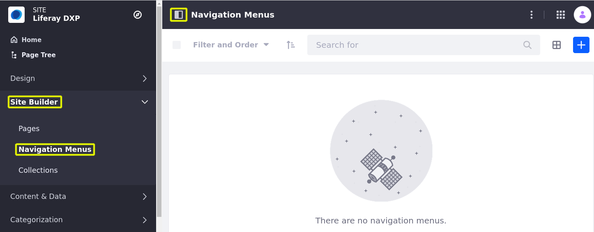
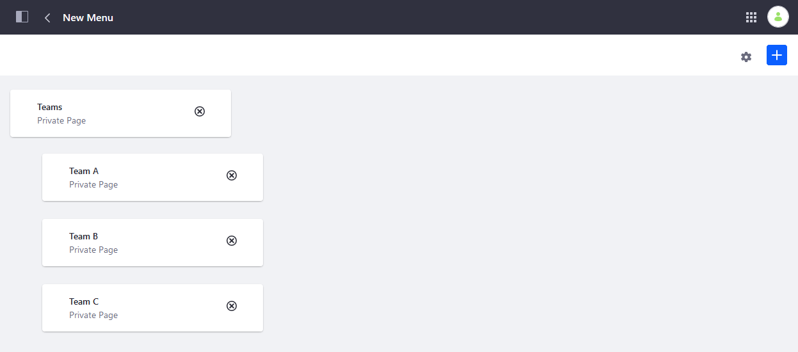

# Using Navigation Menus Application

Liferay provides the Navigation Menus application for creating custom menus for Site Pages and content. With it, you can determine which elements are included and how they're organized. Once created, you can display your custom menus using Page fragments and widgets.

```{note}
For Liferay 7.3 and earlier, Navigation Menus can only include Pages. As of Liferay DXP 7.4 U1+, Navigation Menus supports additional entities.
```


```{tip}
In DXP 7.3+, you can use Custom Fields to add more information to items in Navigation Menus (under `Site Navigation Menu Item` in the `Custom Fields` menu). You can then use Application Display Templates to use this information to further customize your navigation menus.
```

## Creating Navigation Menus

Follow these steps to create a Navigation Menu:

1. Open the _Site Menu_ () and go to _Site Builder_ &rarr; _Navigation Menus_.

   

1. Click the _Add_ button ().

1. Enter a _name_ for the Navigation Menu.

   

1. Click _Save_.

This redirects you to the new Navigation Menu where you can begin adding elements (e.g., Pages, Documents, Categories).

### Adding Elements to Navigation Menus

Follow these steps to add elements to a Navigation Menu:

1. Open the _Site Menu_ () and go to _Site Builder_ &rarr; _Navigation Menus_.

1. Select the desired _menu_ to begin editing.

1. Click the _Add_ button ().

1. Select the _type of element_ you want to add to the menu (e.g., Page, Document, Category). This opens an item selector window.

   If desired, you can add multiple types of elements to the same menu.

   

1. Select the elements you want to add and click _Select_.

1. (Optional) Drag and drop menu elements to reorganize them.

   ```{tip}
   When organizing menu elements, you can structure them into hierarchies. You can also use the _Submenu_ type to add subsections to a menu.
   ```

   

All changes to the menu are saved automatically.

## Using Menus During Page Creation

When creating Site Pages users can select from existing Navigation Menus by default. If desired, you can remove individual menus from the list of available menus.


Follow these steps to configure this behavior for a Navigation Menu:

1. Open the _Site Menu_ () and go to _Site Builder_ &rarr; _Navigation Menus_.

1. Select the desired _menu_.

1. Click the _Configuration_ button ().

1. Uncheck/Check the setting.

   

1. Click _Save_.

## Configuring Navigation Menu Type

Follow these steps to configure the Navigation Menu's type:

1. Open the _Site Menu_ () and go to _Site Builder_ &rarr; _Navigation Menus_.

1. Click on the Actions button () for the desired menu.

1. Select the desired navigation type: _Primary Navigation_, _Secondary Navigation_, or _Social Navigation_.

   

   Once selected, each menu's configuration appears in the _Marked As_ column.

| Navigation Menu Type | Usage |
| :--- | :--- |
| **Primary Navigation** | Primary Navigation is the main navigation for a page. |
| **Secondary Navigation** | Secondary Navigation is a second level of navigation, possibly a sidebar or a separate menu within a page. |
| **Social Navigation** | Social Navigation is for menus that contain links for sharing content on social media or similar tasks. |

## Deleting a Navigation Menu

1. Click the _Actions_ button () next to the desired navigation menu (for example, _New Menu_) then _Delete_.
1. Click _OK_ in the confirmation.

The Navigation Menu has been deleted.

## Additional Information

* [Managing Site Navigation](./managing-site-navigation.md)
* [Configuring Menus Display](./configuring-menus-display.md)