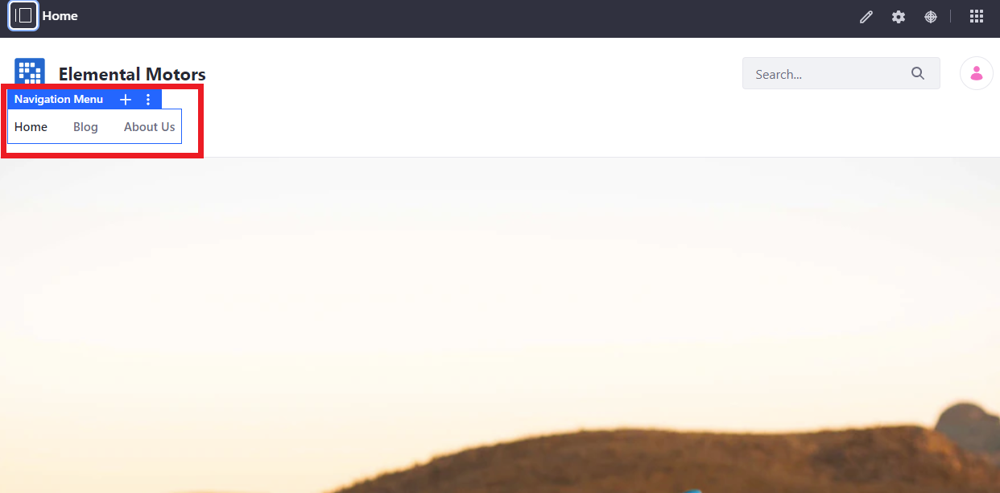
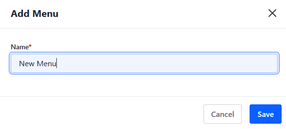
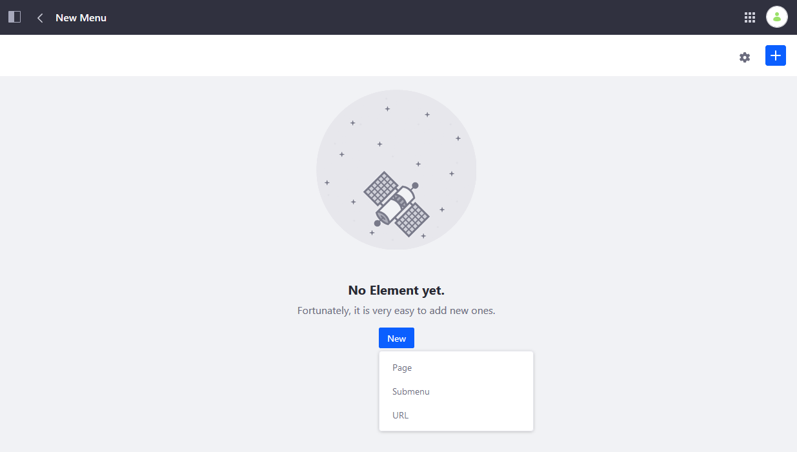
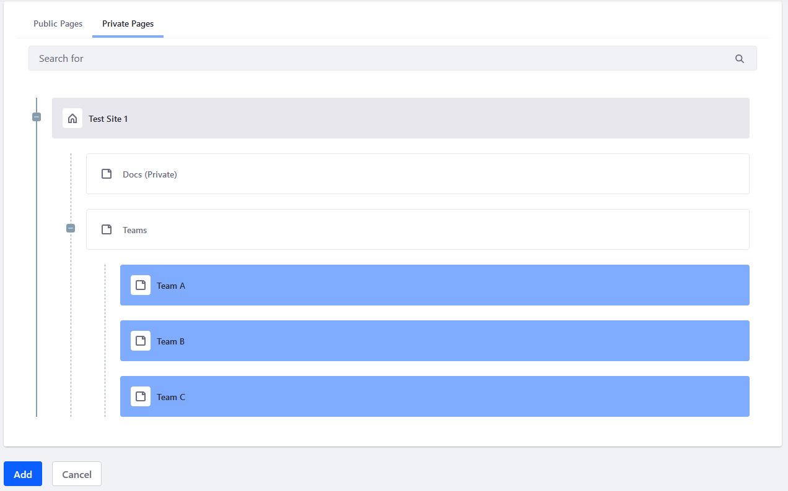
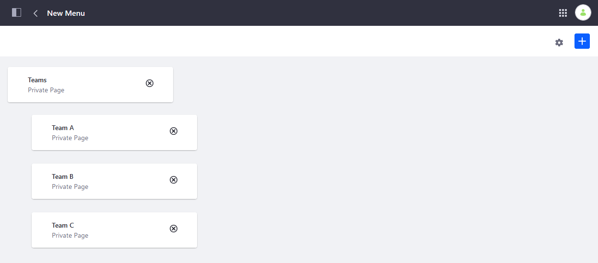
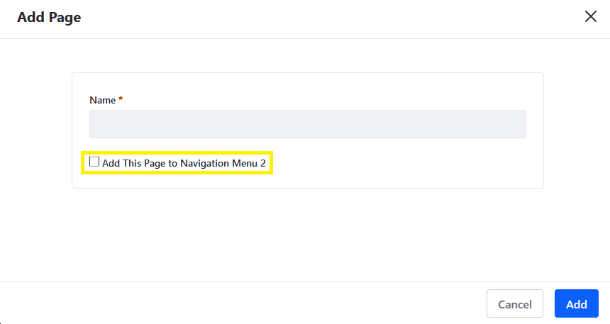
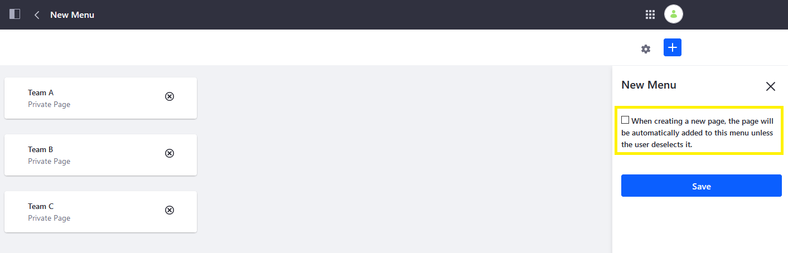
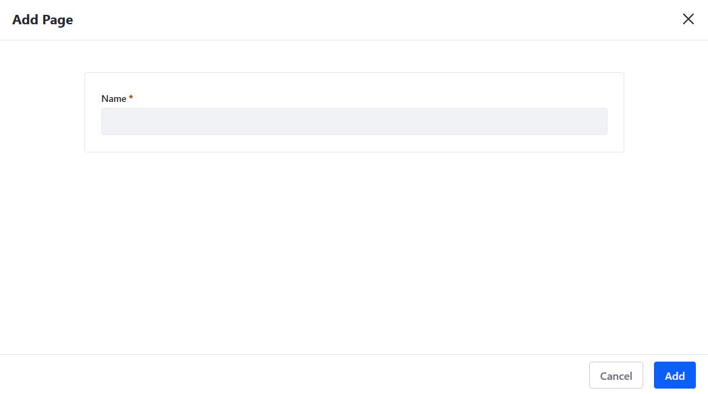
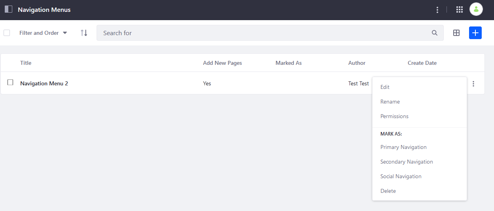

# Using Navigation Menus

By default, Sites start with a _Navigation Menu_ widget that is configured to display the site's [Public Pages](../creating-pages/understanding-pages/understanding-pages.md) hierarchy. In some cases, you may want more direct control or flexibility with how your site's navigation menu is defined and displayed when the default configuration is not sufficient. In these cases you can create and configure new navigation menus.

Getting started with Navigation Menus involves:

1. [Creating a Navigation Menu](#creating-navigation-menus)
1. Adding items to the menu like [existing pages](#assigning-pages-to-a-navigation-menu), adding links, or sub-menus
1. Optionally, [categorizing the navigation menu](#categorize-a-navigation-menu) to serve a particular function on your site
1. Adding the Navigation Menu widget (if it is not already present) to a page and [configuring it](./configuring-navigation-menus.md)

For example, a navigation menu can contain all child pages of a given page. You can display the menu using the Navigation Menu widget on the parent page. This creates a navigation that only displays the child pages selected, in effect creating a mini-site.



```tip::
   In DXP 7.3+, you can use Custom Fields to add more information to each item in your navigation menus (under `Site Navigation Menu Item` in the `Custom Fields` menu). You can then use Application Display Templates to use this information to further customize your navigation menus.
```
<!-- Add links to this annotation for Custom Fields and ADTs when available. -->

## Creating Navigation Menus

1. Click _Product Menu_ () &rarr; _Site Builder_ &rarr; _Navigation Menus_.
1. Click the _Add_ button () to add a new menu.
1. Enter a name: (for example: _New Menu_).

    

1. Click _Save_ when finished.

The new navigation menu has been created.

## Assigning Pages to a Navigation Menu

There are two main ways to assign existing pages to a navigation menu: click the _New_ button or the _Add_ button ().

1. Click _New_ &rarr; _Page_.

    

1. Select the pages to be included into this navigation menu; in this example, three child pages from the private pages are to be included.

    

1. Click _Add_ when finished.
1. Verify that the new navigation menu has been created.

    

### Assigning New Pages to a Navigation Menu

You don't have to [create any pages](../creating-pages/adding-pages/adding-a-page-to-a-site.md) before creating navigation menus. You can create a navigation menu first and then assign the pages later, when you create them. 



To disable automatically adding new pages to a navigation menu,

1. Click the () icon next to the desired _Navigation Menu_ (for example, _New Menu_) then _Edit_.
1. Click the () icon.
1. Uncheck the box.

    

1. Click _Save_ when finished.

Once disabled, you're not prompted to add the page to a navigation menu.



## Categorize a Navigation Menu

You can categorize a navigation menu in the following ways:

| Navigation Menu Type | Usage |
| --- | --- |
| **Primary Navigation** | Primary Navigation is the main navigation for a page. |
| **Secondary Navigation** | Secondary Navigation is a second level of navigation, possibly a sidebar or a separate menu within a page. |
| **Social Navigation** | Social Navigation is for menus that contain links for sharing content on social media or similar tasks. |

1. Click the () icon next to the desired navigation menu (for example, _New Menu_)
1. Click the desired navigation (for example, _Primary Navigation_).

   

The navigation menu type appears in the _Marked As_ field. For more information about each type, see the [Configuring Navigation Menus](./configuring-navigation-menus.md#navigation-menu).

## Deleting a Navigation Menu

1. Click the () icon next to the desired navigation menu (for example, _New Menu_) then _Delete_.
1. Click _OK_ in the confirmation.

The Navigation Menu has been deleted.

## Additional Information

* [Managing Site Navigation](./managing-site-navigation.md)
* [Configuring Navigation Menus](./configuring-navigation-menus.md)
