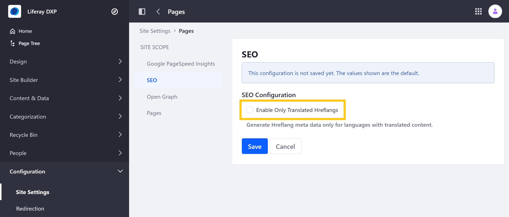

# Configuring Hreflang Meta Data

Hreflang tags are HTML attributes used to identify the language and geographic region targeted by alternative versions of a Site Page. In some cases, these attributes can help search engines serve the correct version of a Page to users and contribute to SEO. By default, Liferay DXP populates Page hreflang meta data with all available languages in the Site.

Beginning with Liferay 7.4, you can configure this behavior to only generate hreflang meta data for languages with translated content in a Page. This can be configured at both the instance and Site levels.

When hreflangs are limited in this way, Liferay's behavior can vary depending on Page type.

* **Widget Pages**: Languages used to translate a Widget Page's name are added to the hreflang tags.

* **Content Pages**/**Display Page Templates**: Languages used to translate a Page Fragment are added to the hreflang tags.

## Instance Settings

Follow these steps to configure hreflang behavior for your Liferay instances:

1. Open the *Global Menu* (), click the *Control Panel* tab, and go to *Instance Settings* &rarr; *Pages* &rarr; *SEO* (Virtual Instance Scope).

1. Check/Uncheck *Enable Only Translated Hreflangs*.

   

1. Click *Save*.

When enabled, hreflang meta data is only generated for languages with translated content in a Page. When disabled, Page hreflang tags are populated with all available languages in a Site.

## Instance Site Scope Settings

Follow these steps to configure hreflang behavior for all Sites in an instance using the Site Scope:

1. Open the *Global Menu* (), click the *Control Panel* tab, and go to *Instance Settings* &rarr; *Pages* &rarr; *SEO* (Site Scope).

1. Check/Uncheck *Enable Only Translated Hreflangs*.

   

1. Click *Save*.

When enabled, hreflang meta data is only generated for languages with translated content in a Page. When disabled, Page hreflang tags are populated with all available languages in a Site.

```{note}
By default, Site Scope instance settings are applied to all instance Sites. However, [individual Site configurations](#individual-site-settings) override configurations in the Global Menu. To restore the default behavior and synchronize changes between both menus, you must restore the individual Site's settings to default. 
```

## Individual Site Settings

Follow these steps to configure hreflang settings for individual Sites:

1. Navigate to the desired *Site*.

1. Open the *Site Menu* (), expand *Configuration*, and go to *Site Setting* &rarr; *Pages* &rarr; *SEO*.

1. Check/Uncheck *Enable Only Translated Hreflangs*.

   This configuration only affects Pages in the current Site.

   

1. Click *Save*.

When enabled, hreflang meta data is only generated for languages with translated content in a Page. This configuration affects all Pages in the current Site and overrides the instance configurations settings.

```{note}
By default, individual Site settings are inherited from [Site Scope instance settings](#instance-site-scope-settings). However, individual Site configurations override this behavior. To restore the default behavior and synchronize changes between both menus, you must restore the individual Site's settings to default. 
```

## Additional Information

* [Site Localization](./site-localization.md)
* [Exporting and Importing Translations](../../content-authoring-and-management/web-content/translating-web-content/exporting-and-importing-translations.md)
