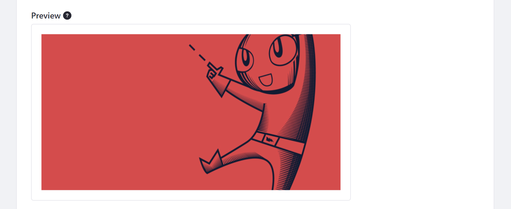

# Configuring Open Graph

[Open Graph](https://ogp.me/) meta tags are embedded on every page, so you can share content on applications that support it, such as Facebook, Twitter, Slack, etc. You can disable this behavior from your Site's General settings.
<!-- It'd be great to have a screenshot here of the practical application of this feature. -->
1. Open the Site Menu and go to *Configuration* &rarr; *Settings* (previously *Site Settings*)

1. Scroll down to the *Open Graph* sub-heading and expand it.

1. Check/uncheck the *Enable Open Graph* setting to enable/disable this feature, and optionally set an Open Graph image to act as the default for the Open Graph tags.


From here, you can enable/disable Open Graph and define default `og:image` properties used for your Site's Pages.

## Enabling and Disabling Open Graph

By default, Open Graph `<meta>` tags are embedded in every Page. You can customize how your content appears when shared in applications supporting Open Graph. To disable this behavior, simply uncheck *Enable Open Graph*.


## Configuring Open Graph Image

You can use the *Image* and *Image Alt Description* fields to define `og:image` properties for your Site.


When you select an image, DXP automatically adds a number of structured properties that determine how your selected image is displayed. The Image field defines the following `<meta>` tags.

```html
<meta property="og:image" content="http://example.com/ogp.jpg" />
<meta property="og:image:secure_url" content="https://secure.example.com/ogp.jpg" />
<meta property="og:image:type" content="image/jpeg" />
<meta property="og:image:width" content="400" />
<meta property="og:image:height" content="300" />
```

When you enter text into the Image Alt Description field, you determine the default text read by screen readers for your selected image. To create localized alt descriptions for your Open Graph image, click on the *Language Flag* button and select the language you want to set. Values entered here define the default `og:image:alt` tag.

```html
<meta property="og:image:alt" content="This is an example." />
```

Here, you can also preview how your Open Graph image appears in supported contexts. However, the image ratio may change depending on where your Page's URL is shared.



When finished, click on *Save* to apply your changes.

## Additional Information

* [Search Engine Optimization](./../optimizing_sites.html#search-engine-optimization)
* [Site Settings UI Reference](./site-settings-ui-reference.md)
* [Configuring Individual Pages](./../creating-pages/page-settings/configuring-individual-pages.md)
