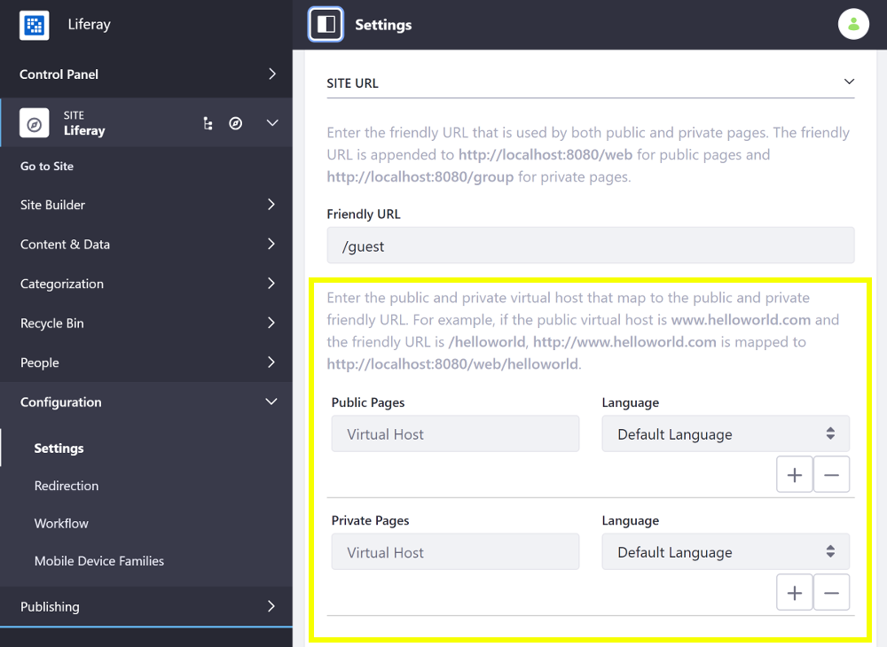
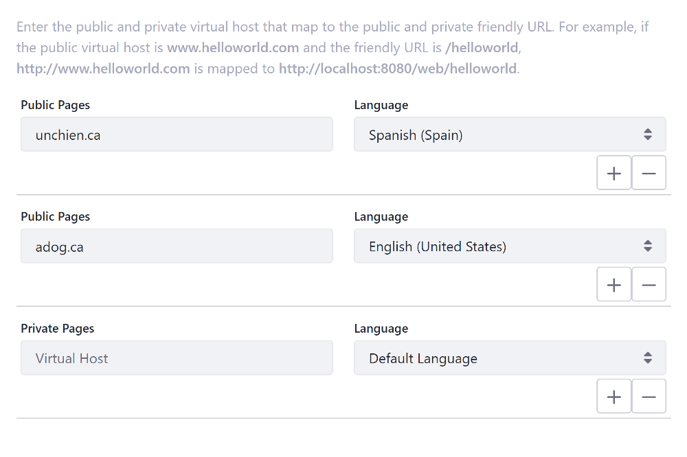
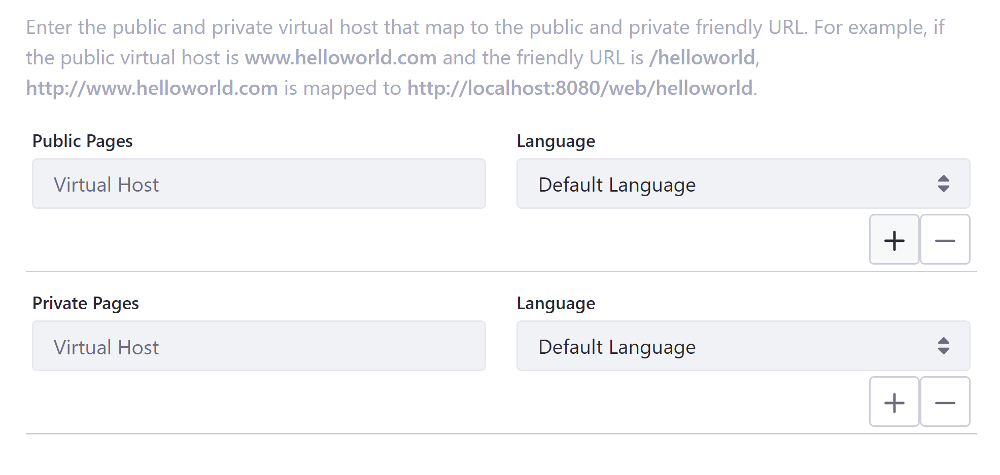

# Configuring Virtual Hosts Site URLs

A virtual host connects a domain name (i.e., `www.helloworld.com`) to a Site. This can be a full domain or a subdomain (e.g. `developers.helloworld.com`). You can use this to host a number of websites as separate Sites on one Liferay DXP server. Follow these steps to configure virtual hosts Site URLs:

1. With your provider, set the DNS name to point to your Liferay DXP instance's IP address. <!-- I think we can take this .5 step further by either linking to a often cited resource on how on a common domain name provider, a user would update the DNS name to point to a particular IP address. -->

1. Inside Liferay DXP, open the Site Menu (), expand *Configuration*, and go to *Site Settings* &rarr; *Site Configuration* &rarr; *Site URL*.

   

1. Enter the desired domain or subdomain in the *Virtual Host* field (e.g., `www.helloworld.com`, `http://developers.helloworld.com`).

   

   ```{important}
   A domain can only be applied to a single Site. You can't map a single domain to multiple Sites.
   ```

1. (Optional) Since Liferay 7.3 GA2, click the *Plus* button () for additional Virtual Host domains.

1. (Optional) Since Liferay 7.3 GA2, select a language for each virtual host. If you have a domain for each translation of a Site, you can add a virtual host for each domain.

   ```{note}
   Locales are constrained to the Site's available languages, if defined. If a locale isn't specified, the default locale for the Site is used. The locale applies to Sites for all associated domains.
   ```

   

1. Click *Save*.

Your site is now accessible using the configured domain.

## Additional Information

* [Configuring Your Site's Friendly URL](./configuring-your-sites-friendly-url.md)
* [Using the Redirection Tool](./using-the-redirection-tool.md)
