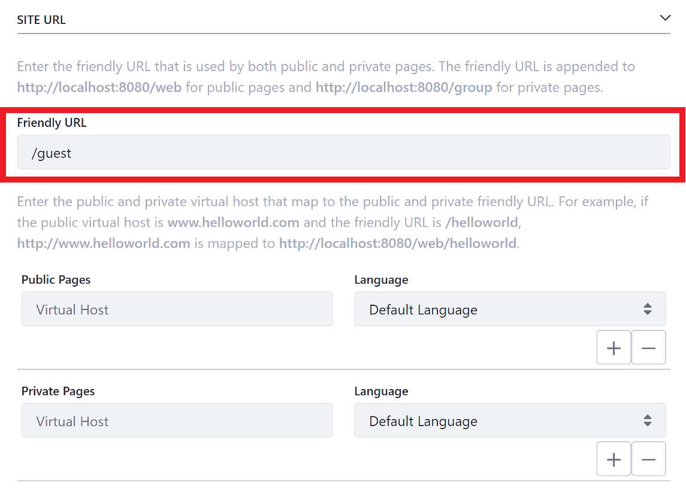
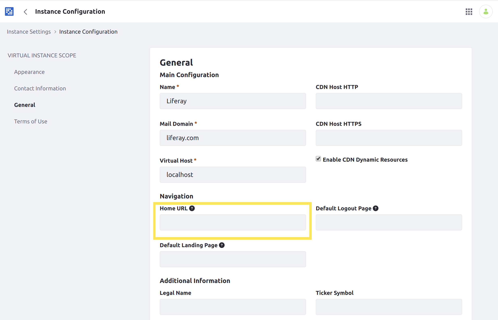

# Configuring Your Site's Friendly URL

Friendly URLs are readable URLs that can helps Users quickly access your Site. Each URL must be unique and is appended to `https://localhost:8080/web` (e.g., `https://localhost:8080/web/helloworld/`).

```{note}
When Private Pages are enabled, you can set friendly URLs for them as well. Once set, they are appended to `https://localhost:8080/group`.
```

## Setting a Site's Friendly URL

Follow these steps to set your Site's friendly URL:

1. Open the *Site Menu* (), expand *Configuration*, and go to *Site Settings* &rarr; *Site Configuration* &rarr; *Site URL*.

1. Enter a *Friendly URL*.

1. Click *Save*.



If you want to add a friendly URL for your Site's Home Page, follow the additional steps in the next section.

## Setting Your Instance's Home URL

If you add a friendly URL for your instance's Home Page, you should update your instance's Home URL field so that page requests to `http://localhost:8080` redirect properly: <!-- What is a Home URL? Do I HAVE to do this? What does it impact? -->

1. Open the [Global Menu](../../../getting-started/navigating-dxp.md) (  ), click the *Control Panel* tab, and go to *Instance Settings*.

1. Select *Instance Configuration* under the *Platform* heading and click the *General* link.

1. Under *Navigation*, enter your new friendly home URL into the *Home URL* field. For example, setting the friendly URL of your default Site to `/my-site` makes your Site's public Home Page's URL `https://localhost:8080/web/my-site/home`. So, you would enter `/web/my-site/home`.



Once you've entered this setting, page requests to `localhost:8080` redirect to the friendly URL of your Liferay DXP instance's new Home Page.
