# Using the Redirection Tool

{bdg-secondary}`Available 7.3+`

Maintaining URL integrity is important for any Site. Liferay DXP's *Redirection* tool provides a convenient and integrated way to manage HTTP redirects and track 404 errors. With this tool, you can easily avoid and fix broken links, improving both user experience and SEO.

To access it, open the Site Menu (), and go to *Configuration* &rarr; *Redirection*.

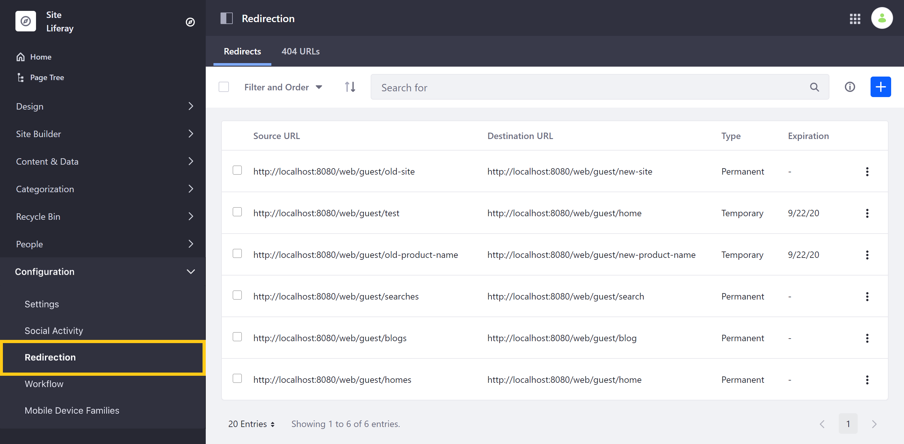

Here, the Redirection tool's functionalities are organized into two tabs: *Redirects* and *404 URLs*.

* [Redirects](#redirects)
* [404 URLs](#urls)

```{important}
For Liferay DXP/Portal 7.4+, 404 tracking is disabled by default. To use this feature, you must [enable 404 tracking](#enabling-404-tracking). This enables both 404 tracking and the 404 URLs tab in the Redirection application.
```

## Redirects

In the *Redirects* tab, you can create and manage both *Permanent* (301) and *Temporary* (302) URL redirects.

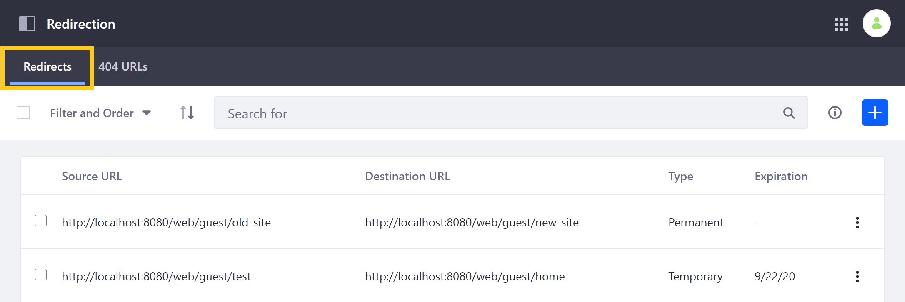

While both automatically direct users to a specified destination, they each have unique implications for your Site. Before creating a redirect, consider which type is best for your situation.

* **Permanent**: Use a 301 code to inform search engines and other tools accessing your Site that the requested resource has been permanently relocated. Search engines will replace the old URL with the new destination in search results, and browsers will cache the new destination for an indeterminate amount of time. A 301 code should only be used when you intend to use the destination URL indefinitely. This improves SEO and helps avoid unintended caching.
* **Temporary**: Use a 302 code to inform search engines and other tools accessing your Site that the requested resource is temporarily moved. A 302 code is useful when you want to conduct A/B testing or redirect traffic while fixing a problem, without impacting your Site ranking. DXP uses 302 codes by default.

See [Optimizing Sites](../../optimizing_sites.html) to learn more about the implications of each redirect type for SEO. Also, see [A/B Testing](../../optimizing-sites/ab-testing/ab-testing.md) to learn about using 302 codes when testing.

### Creating a Redirect

Follow these steps to create a redirect:

1. Click on the *Add* button (). This leads to the *New Redirect* screen.

   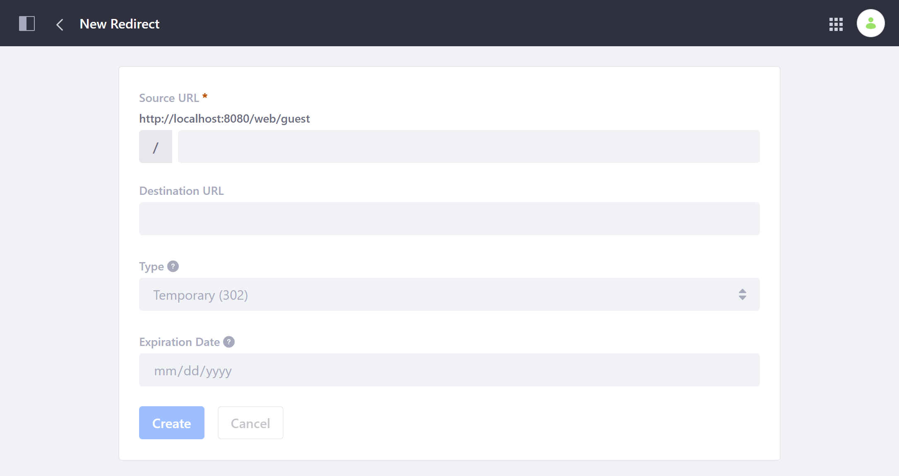

1. Enter a unique relative URL into the *Source URL* field to specify the link that triggers the redirect. The entered value is added to the base URL displayed above it.

   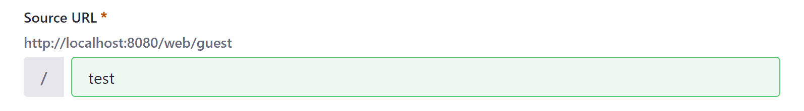

1. Enter an absolute URL into the *Destination URL* field to specify the link for your desired destination.

   This destination can be internal or external, but must always be entered as an absolute URL. You can also click on the *Shortcut* icon () to check the entered URL.

   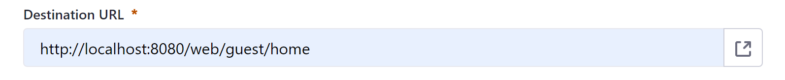

1. Use the *Type* drop-down menu to determine whether the redirect is permanent (301) or temporary (302).

   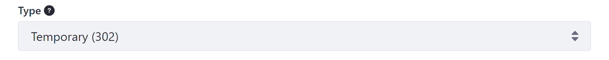

1. You can optionally set an automatic *Expiration Date* for the redirect. Leave this field empty to avoid expiration.

   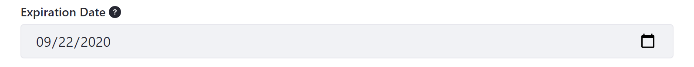

1. When finished, click on *Create* to save the redirect.

Once saved, Liferay DXP validates your configuration. If other redirects point to your specified source URL, DXP notifies you and asks whether you want to update the existing redirect to avoid a redirect chain.

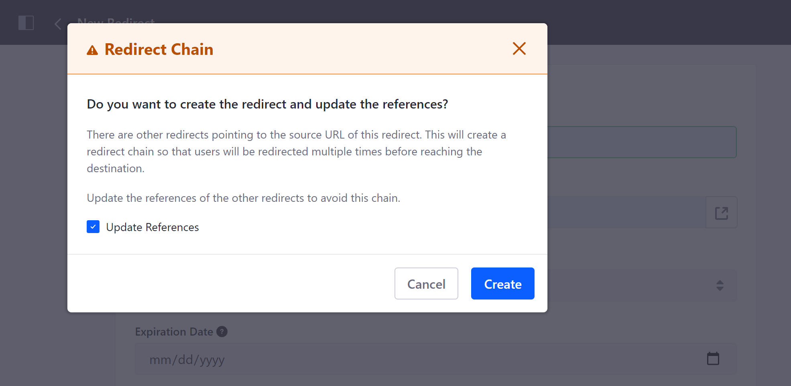

DXP also returns an error if you attempt to create multiple redirects for the same source URL, or if your specified source and destination URLs would result in a redirect loop.

### Editing and Removing Redirects

Once you've successfully added a URL redirect, you can edit or remove it at any time by clicking on its *Actions* button () and selecting *Edit* or *Delete*.

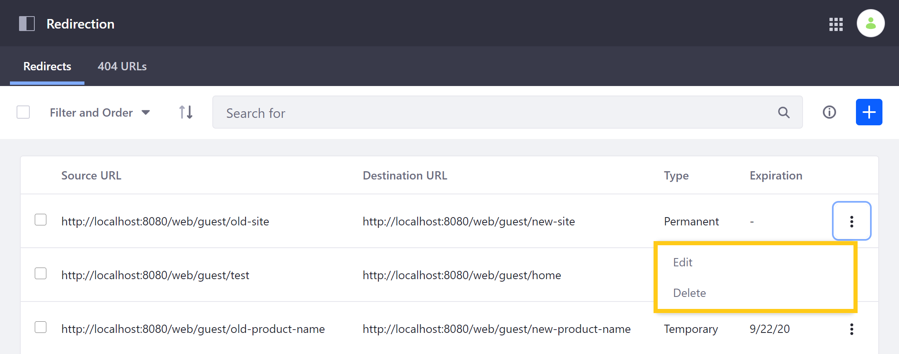

```{note}
Changes made to a redirect may not immediately display in browsers that have cached the old redirect configuration.
```

## 404 URLs

In the *404 URLs* tab, you can view and manage Site requests leading to 404 errors. DXP catalogs each error, so you can assess the cause of the errors and quickly resolve any issues.

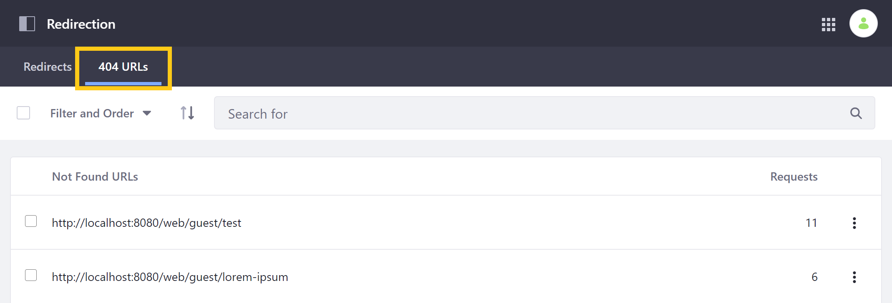

Here, you can search, filter, and order cataloged 404 URLs, as well as conveniently create redirects for them when desired. These URLs are preserved in your database according to your Redirection configurations in the Control Panel, where you can configure both how many and how long 404s are cataloged.

```{note}
To access the 404 URLs tab for Liferay DXP/Portal 7.4+, you must first [enable 404 tracking](#enabling-404-tracking).
```

### Viewing 404 URLs

You can filter cataloged requests by both *type* and *date*. When filtering by type, you can choose to display *Active*, *Ignored*, or *All* 404 URLs. When filtering by date, you can determine whether to view all URLs, or only those that have been requested within the last day, week, or month. You can also order cataloged requests by their *modified date* or *number of requests*.

By default, this page displays all active URLs by number in descending order.

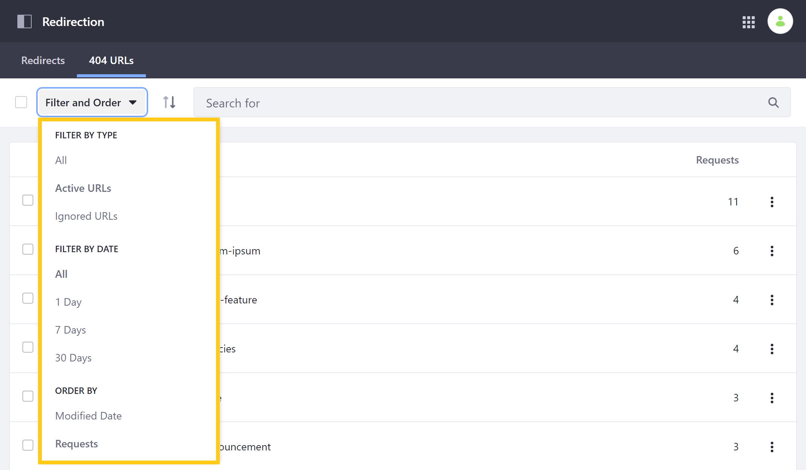

### Ignoring/Unignoring 404 URLs

You can determine whether a URL is active or ignored by clicking on its *Actions* button () and selecting *Ignore*/*Unignore*. When ignored, the URL is hidden in the default *Active* view, though you can change its status at any time.

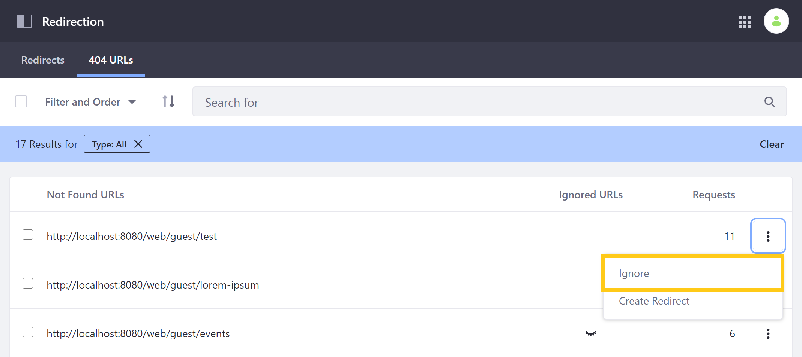

### Creating Redirects for 404 URLs

You can easily create a redirect for a 404 URL by clicking on its *Actions* button () and selecting *Create Redirect*. This directs you to a *New Redirect* screen where the source URL is prefilled with the selected 404.

Finish filling out the form, and click on *Create* to save the new redirect.

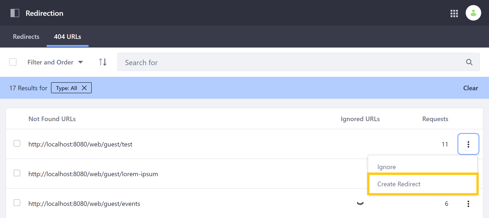

### Configuring 404 Settings

You can determine how long 404 URLs are retained between requests, the maximum number of 404 URLs stored in your database, and the interval between 404 URL checks.

To do so, open the Control Panel and go to *System Settings* (or *Instance Settings*) &rarr; *Pages* &rarr; *Redirection*, under Virtual Instance Scope.

By default, the *404 URL Maximum Age* is set to 30 days, the *Maximum Number of 404 URLs* is set to 1000 entries, and the system checks for 404 URLs every 24 hours.

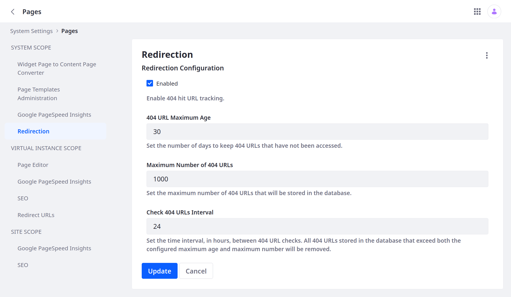

## Enabling 404 Tracking

{bdg-secondary}`Available 7.4+`

Follow these steps to enable background 404 tracking and activate the 404 URLs tab:

1. Open the *Global Menu* (), click the *Control Panel* tab, and go to *System Settings* &rarr; *Pages* &rarr; *Redirection*.

   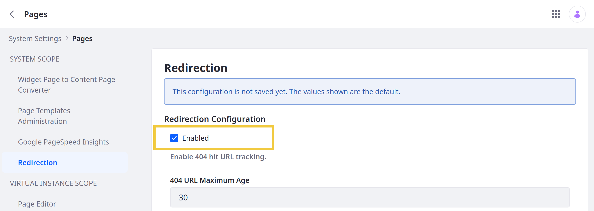

1. Check *Enabled*.

1. Click *Update*.

Once enabled, you can access the 404 URL management tab in the Redirection application.

```{important}
Enabling or disabling the application does not affect data stored in the database. If disabled, you can reenable the feature to access your data at any time.
```

## Additional Information

* [Configuring Virtual Hosts Site URLs](./configuring-virtual-hosts-site-urls.md)
* [Configuring Your Site's Friendly URLs](./configuring-your-sites-friendly-url.md)
