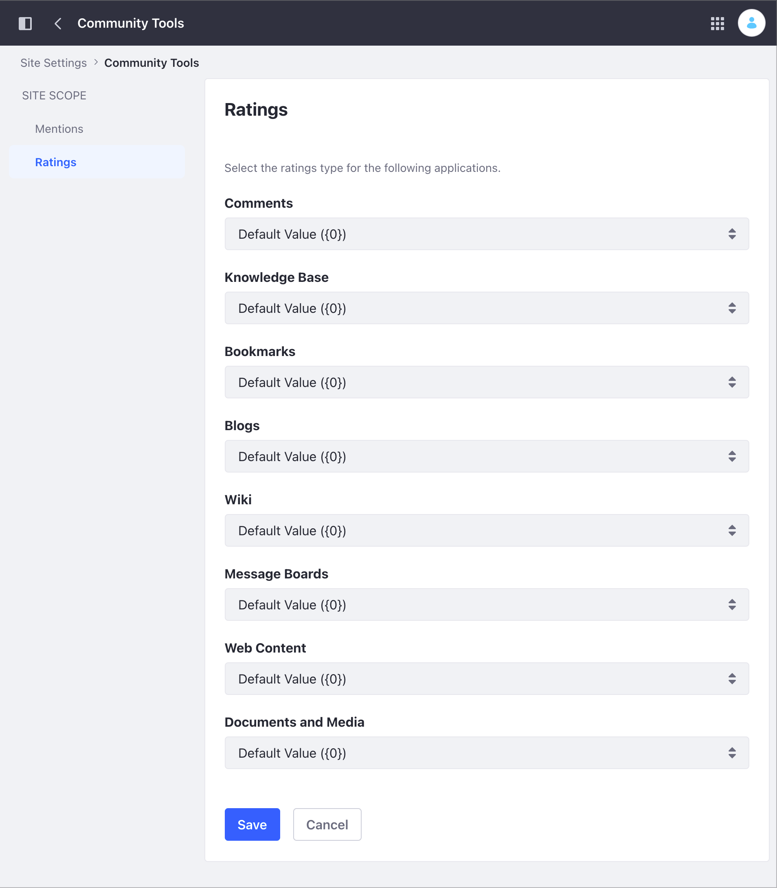

# Configuring Content Rating Type

[Ratings](../../../collaboration-and-social/social-tools/user-guide/using-the-ratings-system.md) can be represented by different types of icons/labels (like, stacked stars, stars, and thumbs ups). You can configure these rating types for the following applications:

- Blogs
- Comments
- Documents and Media
- Knowledge Base
- Message Boards
- Web Content
- Wiki

## Configuring Content Rating Types for Site Applications

To configure the rating type used by a Site application, follow these steps:

1. Access the Ratings option:

   - In Liferay DXP 7.4+

      1. From the Site Menu, go to *Configuration* &rarr; *Site Settings*.
      1. In the Content and Data section, click *Community Tolls* and then click *Ratings*.

   - In previous Liferay DXP versions

      1. From the Site Menu, go to *Configuration* &rarr; *Settings*.
      1. Under the Social area, expand the *Ratings* option.

1. Use the selector for each application to choose the desired rating type.

    

1. Click *Save*.

## Related Information

- [Configuring the Asset Recyle Bin for Sites](./configuring-the-asset-recycle-bin-for-sites.md)
- [Site Settings UI Reference](../site-settings-ui-reference.md)
