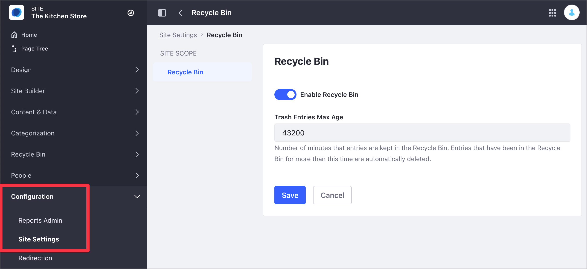
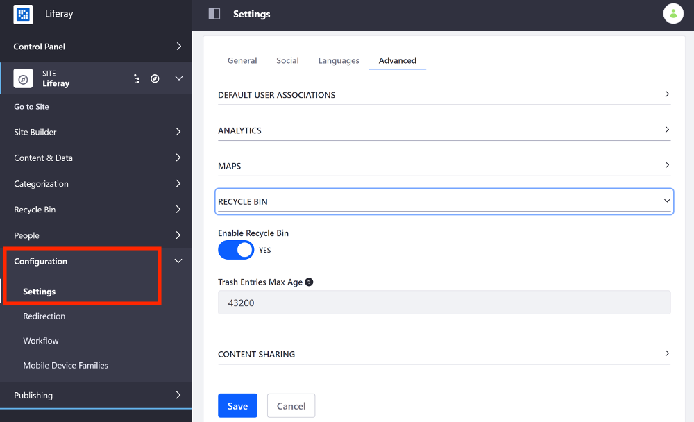

# Configuring the Asset Recycle Bin for Sites

The Recycle Bin stores content and assets that have been flagged for deletion, before they are permanently removed from the system. This functionality can be enabled globally by default and can be configured on a per-site basis. See the [Recycle Bin](../../../content-authoring-and-management/recycle-bin/recycle-bin-overview.md) section for more information on the Recycle Bin.

```{warning}
If you disable the Recycle Bin for a Site, the content and assets deleted in the Site are permanently deleted.
```

## Configuring the Recycle Bin for Sites

To enable or disable the Recycle Bin for a particular site, follow these steps:

1. Access the Recycle Bin option:

    - In Liferay DXP 7.4+

      1. From the Site Menu, go to *Configuration* &rarr; *Site Settings*.
      1. In the Content and Data section, click *Recycle Bin*.

         

    - In previous Liferay DXP versions

      1. From the Site Menu, go to *Configuration* &rarr; *Settings*.
      1. Under the Advanced area, expand the *Recycle Bin* section.

         

1. Toggle the *Enable Recycle Bin* to enable or disable the Recycle Bin for the Site.
1. Optionally, provide a value (in minutes) in the *Trash Entries Max Age* input to specify how long the recycled assets should remain in the Recycle Bin before permanent deletion.

1. Click *Save*.

## Related Information

- [Recycle Bin Overview](../../../content-authoring-and-management/recycle-bin/recycle-bin-overview.md)
- [Configuring the Recycle Bin](../../../content-authoring-and-management/recycle-bin/configuring-the-recycle-bin.md)
- [Site Settings UI Reference](../../site-settings/site-settings-ui-reference.md)
