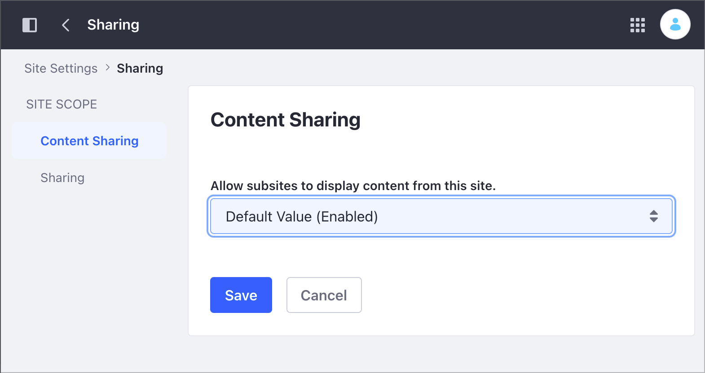

# Managing Content Sharing Across Sites

You can allow Liferay DXP child Sites to display content from parent Sites. This content includes

- Web Content Structures
- Web Content Templates
- Document Types
- Vocabularies and Categories
- Application Display Templates
- Data Definitions

You can configure the Content Sharing settings at the Instance or Site scope. The Instance scope configuration determines the default Site scope configuration. For example, if you disable Content Sharing at the Instance scope, the setting is disabled by default at the Site scope.

## Configuring Content Sharing at the Instance Scope

1. Open the Product Menu and go to *Control Panel* &rarr; *Configuration* &rarr; *Instance Settings*.
1. Under the Content and Data section, click *Sharing*.
1. Under the Virtual instance scope, click *Content Sharing*.
1. Check the *Allow site administrators to display content from other sites they administer* box to allow Site Administrators to share content between the Sites they administer.
1. [Configure the Content Sharing setting](#configure-the-content-sharing-setting-between-sites-and-subsites) between Sites and Subsites.

## Configuring Content Sharing at the Site Scope

```{note}
If you disable Content Sharing at the Instance scope, the option is unavailable at the Site scope.
```

1. Access the Content Sharing settings.

   - In Liferay DXP 7.4+

      1. From the Site Menu, go to *Configuration* &rarr; *Site Settings*.
      1. In the Content and Data section, click *Sharing*.

   - In previous Liferay DXP versions

      1. From the Site Menu, go to *Configuration* &rarr; *Settings*.
      1. Under the General area, expand the *Documents and Media* section.

1. [Configure the Content Sharing setting](#configure-the-content-sharing-setting-between-sites-and-subsites) between Sites and Subsites.

## Configure the Content Sharing Setting Between Sites and Subsites

In the *Allow subsites to display content from parent sites* drop-down menu, select one of the following options:

- **Enabled by Default**: Child Sites can display content from parent Sites by default. You can change this option at Site scope.
- **Disabled by Default**: Child Sites cannot display content from parent Sites. You can change this option at Site scope.
- **Disabled**: Child Sites cannot display content from parent Sites. You cannot change this option at Site scope.



## Related Content

- [Securing Site Documents Content](./securing-site-documents-content.md)
- [Site Settings UI Reference](../site-settings-ui-reference.md)
