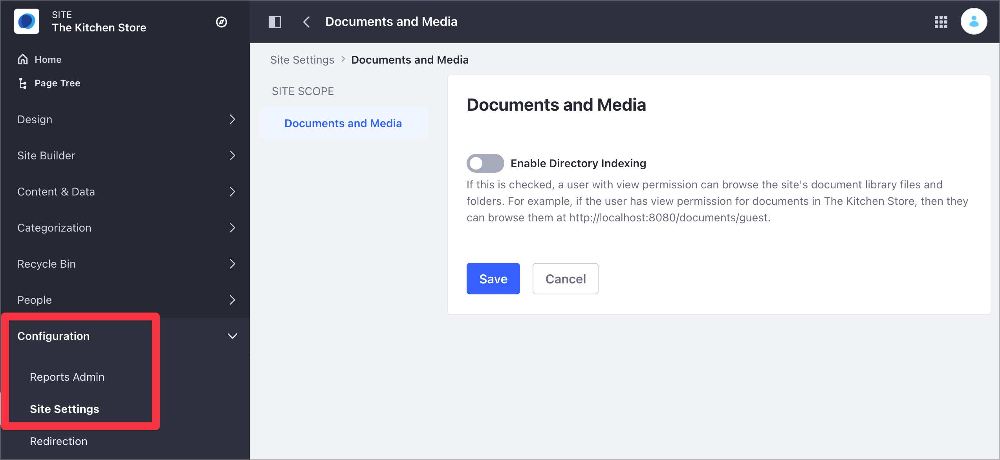
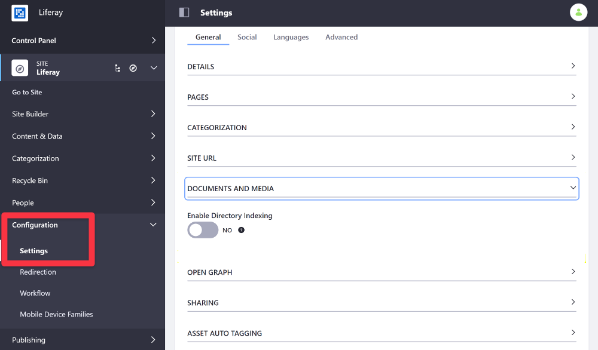

# Securing Site Documents Content

By default, your Site's Documents and Media files and folders are not visible in the web server directory index, so you can't view them through the browser. To enable browsing a Site's documents through the web server directory index, you can enable this setting for your Site.

Once enabled, your can browse your Site's Documents and Media files at `http://localhost:8080/documents/site-name` (e.g. `http://localhost:8080/documents/marketing` for a Site called *Marketing*).

## Configuring Document Visibility in the Web Server Directory Index

1. Access the Enable Directory Indexing option:

    - In Liferay DXP 7.4+

      1. From the Site Menu, go to *Configuration* &rarr; *Site Settings*.
      1. In the Content and Data section, click *Documents and Media*.

       

   - In previous Liferay DXP versions

      1. From the Site Menu, go to *Configuration* &rarr; *Settings*.
      1. Under the General area, expand the *Documents and Media* section.

       

1. Toggle the *Enable Directory Indexing* setting to enable or disable this setting.

    ```{important}
    Once enabled, only Administrators and Users with view permission can browse your Site's Documents and Media files in the web server directory index.
    ```

1. Click *Save*.

## Related Information

- [Managing Content Sharing Globally](./managing-content-sharing-across-sites.md)
- [Site Settings UI Reference](../site-settings-ui-reference.md)
