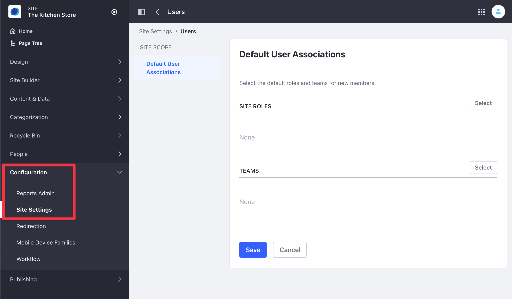
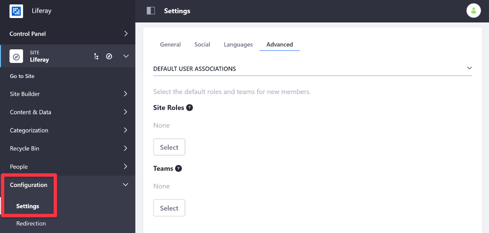

# Configuring Role and Team Defaults for Site Members

You can configure the default Roles and Teams you assign to new Site members.

1. Access the Default User Associations option:

    - In Liferay DXP 7.4+

      1. From the Site Menu, go to *Configuration* &rarr; *Site Settings*.
      1. In the Platform section, click *Users* and then click *Default User Associations*.

       

    - In previous Liferay DXP versions

      1. From the Site Menu, go to *Configuration* &rarr; *Settings*.
      1. Under the Advanced area, find the Default User Associations option.

       

1. In the Default User Associations area, click *Select* under either the *Site Roles* label to define default Roles or the *Teams* label to define default Teams (if any exist) for your Site members.

1. Choose the default Site Roles and Teams for new Site members.

1. Click *Save*.

```{note}
The default Site Roles and Teams you configure do not affect existing Site members.
```

## Related Information

- [Changing Site Membership Type](./changing-site-membership-type.md)
- [Site Settings UI Reference](../site-settings-ui-reference.md)
- [Roles and Permissions](../../../users-and-permissions/roles-and-permissions/understanding-roles-and-permissions.md)
- [Creating Teams for Advanced Site Membership Management](../../building-sites/site-membership/creating-teams-for-sites.md)
