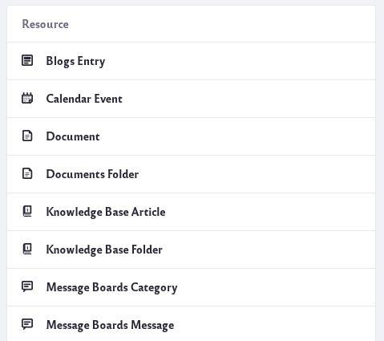
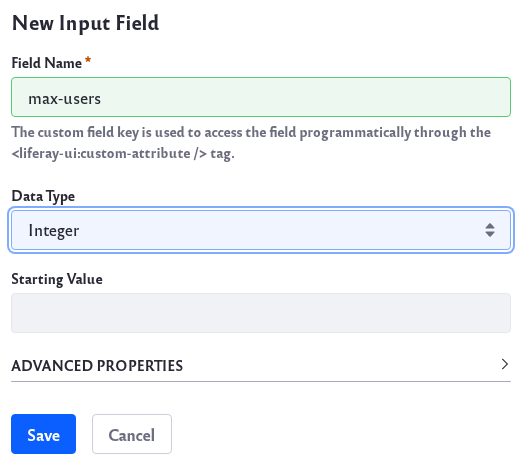
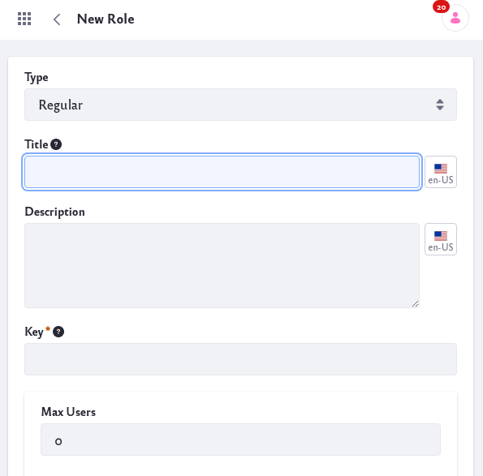
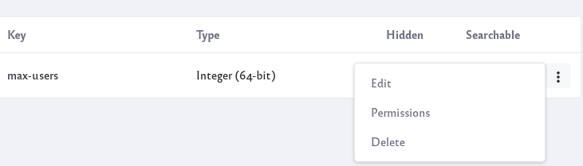

# Adding Custom Fields

Many of Liferay's assets and resources can be extended with custom fields. Adding custom fields can give you greater control and flexibility over your Site. Here are all the different places custom fields can be used:

* Blogs Entry
* Calendar Event
* Document
* Documents Folder
* Knowledge Base Article
* Knowledge Base Folder
* Message Boards Category
* Message Boards Message
* Organization
* Page
* Role
* Site
* Site Navigation Menu Item
* User
* User Group
* Web Content Article
* Web Content Folder
* Wiki Page

There are many reasons for using custom fields. Here's one example. 

**Max Role Use Case**: Suppose you want to limit the number of users that can be assigned to a particular Role on your Site. To accomplish this, you could create a *max-users* custom field for the Role. Then ask your developer to create logic to keep track and prevent more Users to be added once the set limit was reached.

## Adding Custom Fields

Follow these steps to see how a custom field can be created for the example use case above:

1. Navigate to Control Panel → Configuration → Custom Fields.

    

1. Scroll down and click on the link for *Role*.

1. Click the *Add* icon () to add a custom field.

1. There are several different field types you can choose.

    

    * **Text and Numbers**
        * **Text Area**: This field type can collect longer lines of text.
        * **Input Field**: This field type can collect a string of text, a decimal number, or an integer. 

    * **Selection**
        * **Dropdown**: This field type can provide a drop-down list of items to select. The list can be text, decimal numbers, or integers.
        * **Checkbox**: This field type shows a checkbox.
        * **Radio**: This field type shows a selection of two or more radio buttons.

    * **Others**
        * **Geolocation**: This field type collects geolocation information.
        * **Date**: This field type collects date and time information.
        * **True/False**: This field type shows a true or false choice. 

1. For the above use case, select *Input Field* as the field type. Input a *Field Name* and select the Data Type as Integer.

    

    Click the *Save* button to save your changes.

    **Note**: The Field Name is the identifier stored in your database and the name that is used by the developer to access the custom field. 

Once you have created a custom field, you can find it in the UI of the resource you created it for. Navigate to the resource, and the custom field is displayed in the UI.

For example, the *max-users* custom field is now visible for all Roles:

1. Navigate to Control Panel → Users → Roles.

1. Click the Options icon () for a Role and click Edit. 

    

    Notice the *Max Users* field at the bottom.

## Editing Custom Fields

Click the Options icon () next to the name of the custom field to edit. These options appear:

**Edit:** You can change different aspects of the custom field, but note that you cannot change the custom field name or custom field type.

The configuration options you have will also depend on the field type you choose.

**Permissions:** You can modify the permissions to allow other users to edit or view a custom field.

**Delete:** You can delete the custom field.

## Additional Information

* [Adding Custom Fields for Users](../../users-and-permissions/users/adding-custom-fields-to-users.md)
