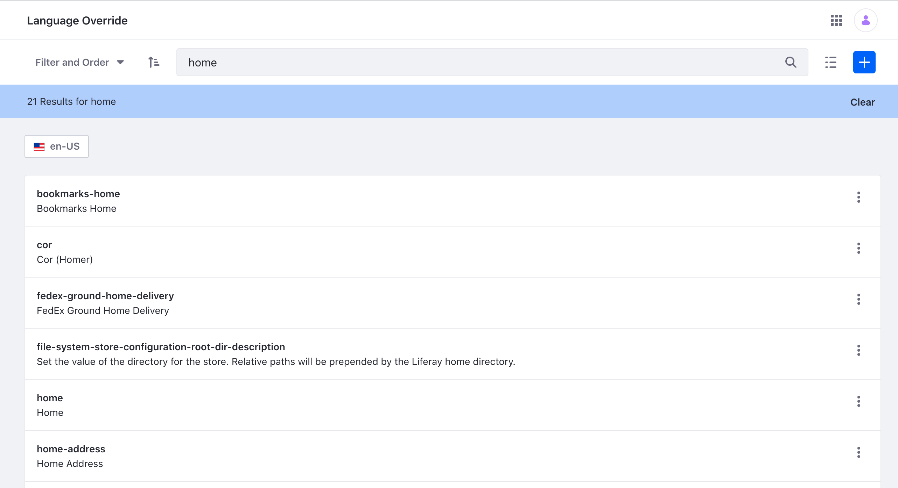
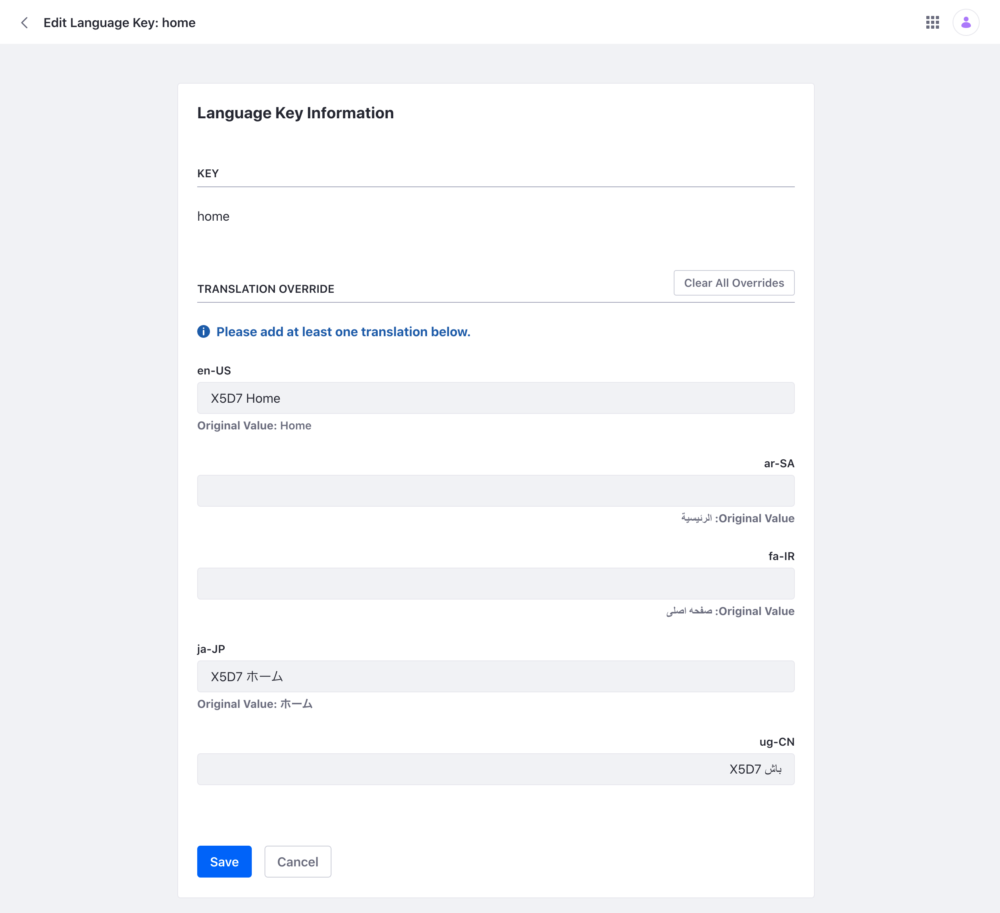
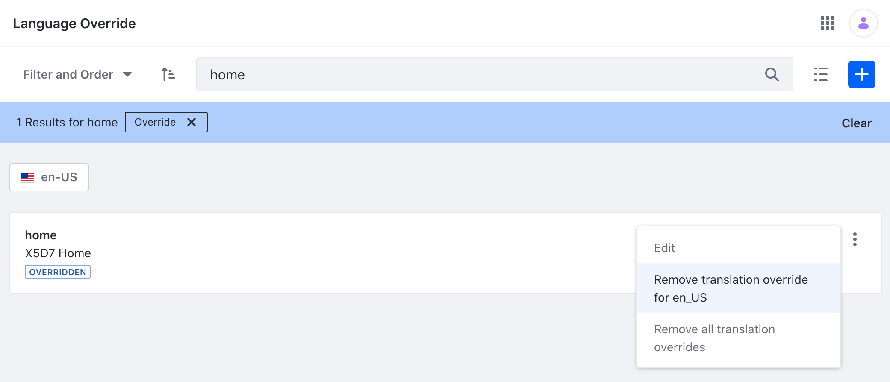

# Changing Language Translations

Use the Language Override tool to override existing translations or add new language keys and translations. This tool is available in Liferay DXP 7.4 U4 (Update 4) and above or Liferay Portal 7.4 GA8 and above. Note that these overrides take place at the Instance level of [Configuration Scope](./understanding-configuration-scope.md). For previous Liferay versions, see [Overriding Global Language Translations](../../liferay-internals/extending-liferay/overriding-global-language-translations.md).

## Overriding a Translation

1. Open the Global Menu (). Navigate to *Control Panel* &rarr; *Configuration* &rarr; *Language Override*.

2. Use the search bar to find the translation you wish to override. For example, if you want to override `home` found at the top of the Product Menu, search for the term `home`.

    

   Note, the search bar searches language keys for the selected locale's translations. Use the locale selector to switch between languages. For example, select `en-US` to search within US English translations. 

3. Locate and click on the translation. A new window opens. You can also click the *Actions* () &rarr; _Edit_ to the right of the translation. 

4. Enter a new translation for the locale you want to override. Click *Save* at the bottom of the page. 

   

5. The translation for `home` is now overridden.

   

## Modifying a Translation Override

1. Open the Global Menu (). Navigate to *Control Panel* &rarr; *Configuration* &rarr; *Language Override*.

2. Click *Filter and Order* and select *Override*. A list of overridden translations are displayed.

3. Select the translation you wish to modify. A new window opens. You can also click the *Actions* () &rarr; _Edit_ to the right of the translation. 

   If overrides exist, the *Actions* icon () also has an option to remove translation overrides. Click *Remove all translation overrides* and click *OK* in the pop-up window to remove all overrides. If an override exists in the locale you have selected, there's an additional option to remove just that locale's translation (e.g. *Remove translation override for en_US* if US English is selected).

   

4. Enter your changes and click *Save* at the bottom of the page. If you wish to remove all overrides and revert back to the original translations, click *Clear All Overrides*.

## Adding a Language Key and Translation

1. Open the Global Menu (). Navigate to *Control Panel* &rarr; *Configuration* &rarr; *Language Override*.

1. Click *Add* () and a new window opens.

1. Enter a key and at least one language translation. Note, the maximum length is 1,000 characters for the key. Click *Save* when finished.
