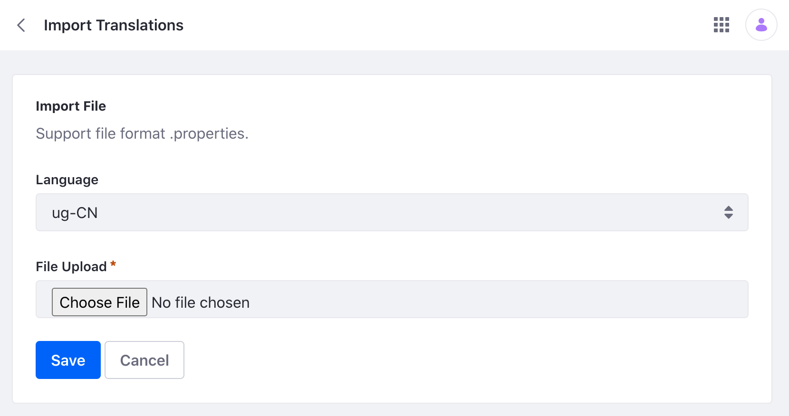

# Changing Language Translations

> Available: Liferay DXP 7.4 U4/Liferay Portal 7.4 GA8. 

```{note}
Import/Export and filtering functionality in Liferay DXP 7.4 U17/Liferay Portal 7.4 GA17
```

Use the Language Override tool to override existing translations or add new language keys and translations. Note that these overrides take place at the Instance level of [Configuration Scope](./understanding-configuration-scope.md). For previous Liferay versions, see [Overriding Global Language Translations](../../liferay-internals/extending-liferay/overriding-global-language-translations.md).

## Overriding a Translation

1. Open the Global Menu (). Navigate to *Control Panel* &rarr; *Configuration* &rarr; *Language Override*.

1. Use the search bar to find the translation you wish to override. For example, if you want to override `home` found at the top of the Product Menu, search for the term `home`.

    

   Note, the search bar searches language keys for the selected locale's translations. Use the locale selector to switch between languages. For example, select `en-US` to search within US English translations. 

1. Locate and click on the translation. A new window opens. You can also click the *Actions* () &rarr; _Edit_ to the right of the translation. 

1. Enter a new translation for each language you want to override. Click *Save* at the bottom of the page. 

   

1. The translation for `home` is now overridden.

   

## Modifying a Translation Override

1. Open the Global Menu (). Navigate to *Control Panel* &rarr; *Configuration* &rarr; *Language Override*.

1. Use the search bar to find the override you wish to modify. To filter the results for only the translations that have overrides, click *Filter and Order* and select *Any Language*. Or click *Selected Language* to only show overrides within the locale selected.

   Note existing overrides are indicated under each language key. For example, "Languages With Override: en_US, ja_JP".

1. Select the translation you wish to modify. A new window opens. You can also click the *Actions* () &rarr; _Edit_ to the right of the translation. 

   If overrides exist, the *Actions* icon () also has an option to remove translation overrides. Click *Remove all translation overrides* and click *OK* in the pop-up window to remove all overrides. If an override exists in the locale you have selected, there's an additional option to remove just that locale's translation (e.g. *Remove translation override for en_US* if US English is selected).

   

1. Enter your changes and click *Save* at the bottom of the page. If you wish to remove all overrides and revert back to the original translations, click *Clear All Overrides*.

## Adding a Language Key and Translation

1. Open the Global Menu (). Navigate to *Control Panel* &rarr; *Configuration* &rarr; *Language Override*.

1. Click *Add* () and a new window opens.

1. Enter a key and at least one language translation. Note, the maximum length is 1,000 characters for the key. Click *Save* when finished.

## Importing and Exporting Language Translations

Language overrides can be easily imported or exported with language properties files.

### Importing Language Translations

1. To import, click the *Actions* () to the left of the Global Menu icon. 

1. Select *Import Translations* and a new window will open.

   

1. Use the drop-down menu to select the language.

1. Click *Choose File* and select the `Language.properties` file that contains your overrides. Note, that you must supply a separate file for each language you wish to override. Each language has its own [language properties file](https://github.com/liferay/liferay-portal/tree/master/modules/apps/portal-language/portal-language-lang/src/main/resources/content) containing keys for its language. 

1. Click *Save* and the overrides are now saved.

### Exporting Language Translations

1. To export, click the *Actions* () to the left of the Global Menu icon. 

1. Select *Export* and a ZIP file containing `Language.properties` files for each language with overrides will begin downloading.